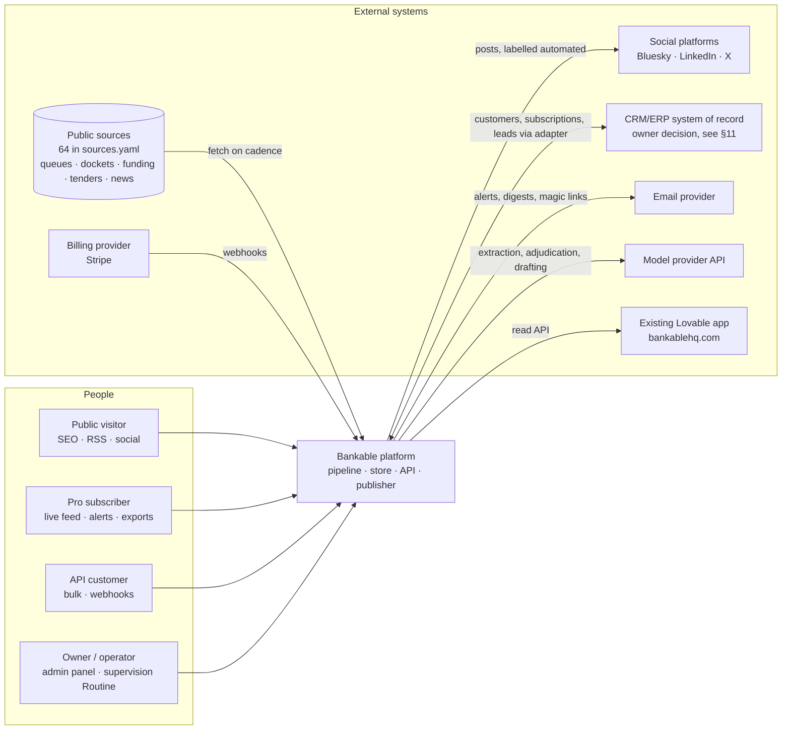
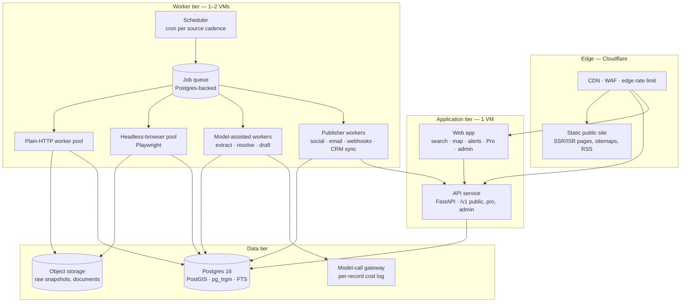
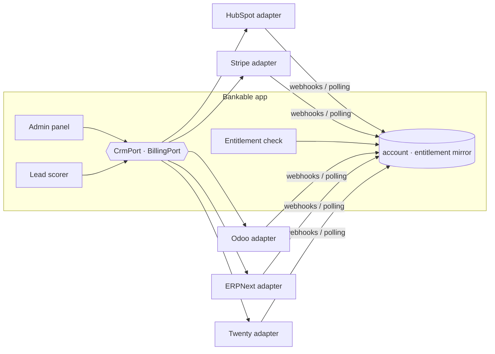

# System architecture

**Status:** Phase 2 draft v0 · 2026-09-12 · solutions-architect · reviewed by: owner (pending)
**Inputs:** `docs/00-PLAN.md` (principles, open questions), `docs/01-feasibility.md` §3.3–3.5, `docs/02-data-sources.md`
§4–§7, `docs/03-agent-operating-model.md` §1 and §3, `data/sources.yaml`, `scripts/probe_sources.py`.
**Companions:** `docs/21-data-model.md` (ERD), `docs/23-api-spec-outline.md` (API), `docs/adr/` (decisions).

This document specifies the run-time system: the conventional pipeline that the build-time agent team builds
(`docs/03` §1). It is deliberately small. The product is a feed of change events over a fused proposal graph, at a
scale of tens of thousands of records and a few hundred sources, run by one founder plus contractors with an
infrastructure ceiling in the low hundreds of USD per month (`docs/01` §3.4). Every choice below follows from
those three facts.

Assumptions carried from open owner questions (`docs/00-PLAN.md` "Open questions") are marked **[A-n]** and
listed in §16.

## 1. Context



Boundary rule: the platform owns proposals, opportunities, organisations, events, sources and everything derived
from them. It does **not** own customers, subscriptions or invoices; those live in the system of record and are
mirrored read-only (`docs/00-PLAN.md` principles; §11 below). The Lovable app is treated as a read-only API
consumer until the owner answers open question 1 **[A-1]**.

## 2. Components



| Component | Responsibility | Deployable | Owner (agent) |
|---|---|---|---|
| Connectors | One per `sources.yaml` id: fetch → parse → emit source records | `pipeline/connectors/*` | data-engineer |
| Snapshot store | Immutable raw fetch results in object storage + `snapshot` row | `pipeline/snapshot` | data-engineer |
| Diff | Snapshot n vs n−1 → raw change events | `pipeline/diff` | data-engineer |
| Normalise | Source columns → canonical schema; status vocabulary map | `pipeline/normalise` | data-engineer |
| Resolve | Source records → proposal/opportunity/organisation identities; merges | `pipeline/resolve` | data-scientist |
| Enrich | Document/news extraction with citations and confidence | `pipeline/enrich` | data-scientist |
| Store | Postgres schema, migrations, publication views | `services/store` | backend-developer |
| API / publisher | REST API, tier enforcement, pages, RSS, sitemaps | `services/api`, `web/` | backend, frontend |
| Alerts | Saved-search matching, digests, email/webhook delivery | `services/alerts` | backend-developer |
| Social | Post drafting, review queue, channel publishers | `services/social` | backend, content-social |
| CRM sync | Adapter to the system of record; entitlement mirror; lead push | `services/sor` | backend-developer |
| Model gateway | Single choke point for model calls; cost log; cache | `services/modelgw` | backend-developer |
| Admin | Source health, moderation, merges, posts, keys, costs | `web/admin` + `/admin/v1` | frontend, backend |

## 3. The pipeline and its module contracts

The always-on loop in `docs/03` §3 maps one-to-one onto these stages. Each stage is a pure function over
persisted inputs and writes its output before the next stage is enqueued; a stage can be re-run from its inputs
without side effects on earlier stages. Stages talk only through the database and object storage, never in-memory.

```mermaid
flowchart LR
  C[Connector] -->|SourceRecord[] + raw bytes| S[Snapshot store]
  S -->|snapshot_id| D[Diff]
  D -->|RawChange[]| N[Normalise]
  N -->|CanonicalRecord[]| R[Resolve]
  R -->|entity ids + Event[]| E[Enrich]
  E -->|Extraction[] + Event[]| ST[Store / publish]
  ST -->|published events| A[Alerts]
  ST --> P[Post drafting]
  ST --> X[API · pages · RSS]
  ST --> CRM[CRM lead sync]
```

### 3.1 Connector

```
class Connector(Protocol):
    source_id: str                      # must equal a sources.yaml id
    egress: Literal["plain","browser","residential","api_key"]   # see §4.3
    def fetch(self, ctx: RunContext) -> FetchResult      # bytes + content_type + url + http_status
    def parse(self, raw: bytes) -> Iterable[SourceRecord] # never touches the network
```

`SourceRecord = {source_id, source_record_id, source_url, retrieved_at, licence_id, payload: dict}`.
`source_record_id` must be stable across runs (queue id, docket number, notice id, or a content hash of the
identifying columns when the source has no id — recorded in the connector docstring). `parse` runs against
recorded fixtures in CI; `fetch` never runs in CI. Connectors are registered by scanning `data/sources.yaml`; a
source with no connector class is a manifest entry only and is reported as "unimplemented" in the admin panel.
gridstatus is wrapped, not replaced, for the seven ISO queues (`docs/02` §6 step 1).

### 3.2 Snapshot store

Input: `FetchResult`. Output: an immutable object at `raw/{source_id}/{yyyy}/{mm}/{dd}/{sha256}.{ext}` plus a
`snapshot` row (`docs/21` §4). If the SHA-256 equals the previous snapshot's, the run is recorded as `unchanged`
and the pipeline stops here (most daily sources change less than daily). Raw bytes are retained for 24 months
**[A-7]**, then compacted to monthly samples; the `snapshot` rows are kept forever. This store is what makes every
later stage reproducible and is the evidence base for licence disputes.

### 3.3 Diff

Input: two snapshots' parsed `SourceRecord[]`, keyed by `source_record_id`. Output: `RawChange[]` with kinds
`added | changed | removed`, each carrying the before/after payload and the list of changed keys. Removal from a
register is a signal in its own right (a queue withdrawal often shows up first as a missing row); it produces a
`removed` change, never a hard delete downstream. Diff is deterministic and needs no model call.

### 3.4 Normalise

Input: `RawChange[]`. Output: `CanonicalRecord[]` in the schema of `docs/21` §3 with a harmonised status
vocabulary (`docs/01` §3.3: ACTIVE/COMPLETED/WITHDRAWN/blank all map to one vocabulary; unmapped values are
stored verbatim in `status_raw` and raised as a data-quality warning). Mappings live in versioned YAML next to the
connector so that data-scientist can revise them without code changes. Units normalised to MW/MWh/USD; dates to
UTC dates; jurisdictions to ISO 3166-2.

### 3.5 Resolve

Input: `CanonicalRecord[]`. Output: links from source records to `proposal`, `opportunity`, `organization`
rows, plus `event` rows for every creation, link, merge and field change. Resolution keys in the order given in
`docs/02` §5 (EIA id → queue id+ISO → FERC docket → sponsor+county+capacity±10%+technology → fuzzy name).
Deterministic rules run first; only ambiguous candidates (score between configurable thresholds) go to the model
gateway for adjudication, with the candidate pair and the decision logged. Every merge is an event carrying
enough `before` state to reverse it (`docs/21` §6). Human overrides from the admin panel are events with
`actor_type = user` and win over later automated decisions for the same pair.

### 3.6 Enrich

Input: an entity plus linked documents (filings, PDFs, notices) and news hits. Output: `extraction` rows with a
typed JSON payload, a confidence, and citations (document id + page/span), plus proposed field updates that
become events only when confidence exceeds the per-field threshold or a human accepts them. Enrichment is the
main model-cost centre; it is budgeted per source (§6) and can be disabled per source from the admin panel.

### 3.7 Store / publish

Writes are transactional per entity: the entity update and its event rows commit together, and the outbound
jobs (alerts, post drafting, CRM sync, webhook fan-out) are enqueued in the same transaction (a Postgres-backed
queue makes this a plain insert; ADR 0004). Publication is a property of the event, not a separate copy of the
data: `event.published_at` is set at commit and the tier views in §5 are filters over it. Nothing is ever
deleted; unpublishing is an event.

### 3.8 API / publisher, alerts, social, CRM sync

Consumers of published events. Their contracts are: the API in `docs/23`; alerts match `saved_search.query`
against new events and write `alert` rows before any delivery; social writes `post` rows in `draft` state and a
human (or an owner-enabled channel) moves them to `approved` (`CLAUDE.md` guardrails); CRM sync pushes lead
signals through the adapter in §11 and never writes to the app's `account` table directly.

## 4. Run-time topology

### 4.1 Processes

| Process | Count (MVP) | Notes |
|---|---|---|
| `api` (FastAPI under uvicorn) | 2 replicas on one VM | Public, Pro and admin routes; admin routes bound to a separate hostname |
| `web` (server-rendered app) | 1 | Public pages are cached at the edge; Pro/admin are dynamic |
| `scheduler` | 1 (singleton, leader lock in Postgres) | Reads `sources.yaml` cadence, enqueues `fetch` jobs with jitter |
| `worker-plain` | 2 | HTTP connectors, diff, normalise, resolve, alerts, publishers |
| `worker-browser` | 1 | Playwright Chromium pool, max 3 pages, 2 GB RAM; only for `egress: browser` sources |
| `worker-model` | 1 | Enrichment and adjudication; concurrency capped by the gateway budget |

All processes are one container image with different entrypoints, deployed by Docker Compose on 2–3 small VMs
(ADR 0005). Nothing here needs Kubernetes; the scaling path in §15 says when that changes.

### 4.2 Scheduler and queue

- One Postgres-backed job queue (ADR 0004). Job types: `fetch`, `diff`, `normalise`, `resolve`, `enrich`,
  `alert`, `post_draft`, `publish_post`, `sor_sync`, `webhook`. Each job is idempotent on its `(type, key)`.
- Per-source cadence from `sources.yaml` (`daily`, `weekly`, `monthly`, `15-min`, `realtime` → polled at a
  floor of 15 min). Concurrency limits are per source **and** per host (FERC ≤ 0.5 rps, GDELT one per 5 s, PJM
  6 connections/min, `docs/02` §7) enforced by a token bucket keyed on the host, stored in Postgres.
- Retries with exponential backoff and jitter; five failures → dead-letter and a `source.health = failing`
  transition that pages the operator and the supervision Routine (`docs/03` §1).
- A single `fetch` may not run for more than 10 minutes; browser jobs 5 minutes.

### 4.3 Per-source egress policy

Each source declares one egress class; the scheduler routes the job to the matching pool and the policy is
enforced in code, not by convention. Proposed additional field in `data/sources.yaml`: `egress:` (data-engineer
to add; default derived from `access:` until then).

| Class | Used for | Identification | Rule |
|---|---|---|---|
| `api_key` | Keyed APIs (PJM, EIA v2, SAM.gov, NRC, regulations.gov) | Key from secrets store | Respect documented quotas; key never leaves the worker |
| `plain` | Files, JSON, CSV, RSS from datacentre IPs | Browser-like UA that names Bankable and a contact URL (`scripts/probe_sources.py` sets the pattern) | Honour `robots.txt` and DSM Art. 4 signals on news sources; one connection per host by default |
| `browser` | SPA-only and WAF-fronted sites (ISO-NE IRTT, BLM ePlanning, ENTSO-E, ferc.gov pages) | Same UA string | No CAPTCHA solving, no challenge bypass. If a challenge page is returned the run is marked `blocked` |
| `residential` | Sources whose terms permit access but whose CDN blocks datacentre IPs | Third-party residential proxy, allowlisted per source id | Off by default. Enabled per source only after legal-compliance records the terms in `sources.yaml` (MISO is the live case, `docs/02` §2). Never used for `reuse: restricted` sources |

Private aggregators (`us.gridtracker.interconnection_fyi` and the others named in `CLAUDE.md`) have no
connector and are excluded at manifest load: a connector whose `source_id` resolves to `category: aggregator`
with `reuse: restricted` fails to register.

### 4.4 Data tier

- **Postgres 16** (managed), extensions `postgis`, `pg_trgm`, `btree_gin`, `pgcrypto`. It holds the canonical
  store, the event log, the job queue, sessions, rate-limit counters and the search index. One database, one
  backup, one thing to understand (ADR 0003).
- **Search** is Postgres full-text (`tsvector` on names, sponsors, counties, titles) plus trigram indexes for
  fuzzy sponsor/name lookup and PostGIS for map bounding-box queries. At this scale (≈10⁵ rows) p95 under 100 ms
  is achievable without a separate engine; a dedicated search service is on the scaling path (§15).
- **Object storage** (S3-compatible, Cloudflare R2 by default for zero egress fees) for raw snapshots,
  fetched documents, exports and post media. Buckets are private; the API serves pre-signed URLs.

### 4.5 Model-call gateway

All model calls go through one internal module; workers cannot import the provider SDK directly (enforced by an
import-linter rule in CI). The gateway:

- takes a `purpose` (`extract`, `adjudicate`, `draft_post`, `score_lead`), a `subject` (`source_id`, entity
  type and id, snapshot id), a prompt-template id and version, and structured inputs;
- selects the model *alias* configured for that purpose (`fast`, `careful`, `batch`); aliases map to provider
  model ids in configuration only, never in code or logs shipped outside the system (`CLAUDE.md`);
- writes a `model_call` row before and after the call: purpose, subject, alias, prompt version, input/output
  tokens, cost in USD from a price table in config, latency, cache hit, error;
- caches by content hash so re-runs of the same snapshot are free, and uses the provider's batch mode for
  backfills where latency does not matter;
- enforces a per-source daily budget and a global daily budget; when exceeded, jobs park with status `budget`
  and the source is flagged for demotion (`docs/03` §6).

## 5. Tiering mechanics

Tiers are a property of the **reader**, not copies of the data. Every `event` and every entity carries
`published_at`. A request resolves to one of:

| Tier | Who | Sees | Enforced by |
|---|---|---|---|
| `public` | anonymous, or free account | Events with `published_at <= now() − lag`; derived fields only; restricted sources aggregated or linked out | Row-level predicate in the store layer applied to every query; page cache keyed by day |
| `pro` | account with entitlement `pro` (session or API key) | Everything as it commits; alerts; exports; saved searches | Entitlement check on session/key; `lag = 0` |
| `api` | account with entitlement `api` | As `pro`, plus bulk endpoints, webhooks, higher limits | API key scopes and quotas |
| `admin` | users with role `operator`/`owner` | Unpublished, dead-lettered, merge candidates, costs | Separate hostname, session + role, IP allowlist optional |

- `lag` is configuration, default **7 days** **[A-8]** (`docs/01` §3.4 gives a 7–30 day range). It can be set
  per source class so that slow sources (annual LBNL, quarterly GEM) carry no lag at all, since there is no
  freshness premium to protect (`docs/01` §7).
- Licence gating is orthogonal to tier and stricter: a `licence` row states whether derived fields, raw fields
  and API redistribution are allowed (`docs/21` §3.19). PJM rows (`reuse: restricted`) are therefore invisible to
  `public` and returned to `pro`/`api` only as derived aggregates with a link out until a licence exists;
  `reuse: unknown` (MISO, SPP, NYISO, ISO-NE) is treated as restricted until legal-compliance records the terms
  (`CLAUDE.md`).
- Public pages carry a visible "data as of *date*; live in Pro" line and a machine-readable `data_as_of` field.
- The delayed feed is served from a materialised view refreshed hourly; the live feed reads the base tables.
  This keeps public traffic cheap and cacheable and keeps one code path for both.

## 6. Cost metering

`source_run` aggregates cost per run (`model_calls`, `cost_usd`, worker seconds, egress class). The admin
dashboard shows USD per new or changed record by source over 30 days. A source above the configured threshold
(default USD 0.50 per changed record **[A-9]**) is flagged; the operator demotes it to weekly or disables
enrichment for it. This is the mechanism behind `docs/03` §6.

## 7. Authentication, API keys and rate limiting

- **Users**: passwordless email magic link plus Google sign-in; sessions in signed HTTP-only cookies, server-side
  session rows in Postgres so that they can be revoked. Roles: `viewer`, `member`, `operator`, `owner`.
- **Accounts**: a user belongs to one account; the account's entitlements come from the system-of-record mirror
  (§11). No entitlement row → `public`.
- **API keys**: `bk_live_` / `bk_test_` prefix + 32 random bytes, shown once, stored as SHA-256. Fields: account,
  name, scopes (`read:public`, `read:live`, `read:bulk`, `write:webhooks`, `admin:*`), tier, per-minute limit,
  daily quota, expiry, last-used, revoked-at. Keys are sent as `Authorization: Bearer`.
- **Rate limiting** in two layers: Cloudflare edge rules for anonymous traffic and abuse (per IP), and an
  application sliding-window counter per key or per session stored in Postgres (`rate_bucket` table with
  `UNLOGGED` storage). Defaults in `docs/23` §6. Redis is not needed until sustained request rates exceed roughly
  50 requests per second across the fleet (§15).
- **Admin surface** is served on `admin.` subdomain, requires role `operator` or `owner`, enforces a second
  factor via the identity provider **[A-10]**, and every write is audit-logged as an `event` with `actor_type = user`.

## 8. Admin surface

Minimum viable admin, all reading the same API (`/admin/v1`, `docs/23` §4):

1. **Source health**: last run, status, rows seen/new/changed/gone, blocked/failing flags, cost per record,
   licence status, "run now", "pause", egress class, unimplemented connectors.
2. **Records**: search any entity; view provenance and event history; publish/unpublish; edit with reason
   (creates an event); merge/unmerge with preview.
3. **Resolution queue**: ambiguous candidate pairs awaiting a human decision; the model's rationale shown.
4. **Extraction review**: low-confidence extractions awaiting accept/reject.
5. **Posts**: review queue per channel, edit, approve, schedule, withdraw; per-channel "auto-publish enabled" toggle
   that only the owner can set (`CLAUDE.md`).
6. **Customers**: read-only view of accounts and entitlements from the system of record, with a "open in CRM"
   link; API keys issue/revoke; user roles.
7. **Costs**: model spend by purpose and source; infrastructure line items entered by hand.
8. **Audit log**: the `event` table filtered to `actor_type = user`.

## 9. CRM/ERP integration pattern

The system of record (SoR) for customers, subscriptions and invoices is external and replaceable
(`docs/00-PLAN.md` principle 5; open question 4). The app talks to it through an **anti-corruption layer**: two
narrow ports defined in the app's own vocabulary, one adapter per vendor, and a read-model mirror in the app
database that is authoritative for nothing.



**Ports** (`services/sor/ports.py`):

- `CrmPort`: `upsert_company`, `upsert_contact`, `create_lead(signal)`, `log_activity`, `get_company(ref)`,
  `list_changes(since)`.
- `BillingPort`: `create_checkout(account, plan)`, `get_subscription(ref)`, `list_invoices(account)`,
  `open_portal(account)`, `handle_webhook(payload) -> EntitlementChange[]`.

**Rules**: the app never stores a vendor-specific field outside the adapter; every entity mirrored in the app
carries `sor_kind` and `sor_ref`; the mirror is refreshed by webhook and by a nightly reconciliation job that
reports drift; conflicts resolve SoR-wins; the admin panel's customer screens are read-mostly and every write goes
through a port. Switching vendor is a data migration of `sor_ref` values plus a new adapter, not a schema change.

**Candidate comparison** (list prices as published in 2026; verify before deciding):

| Option | What it covers | Integration | Cost at MVP | Fit for a solo operator | Main risk |
|---|---|---|---|---|---|
| **HubSpot CRM + Stripe Billing** | CRM, pipeline, email sequences (HubSpot); subscriptions, invoices, tax, customer portal (Stripe) | Both have mature REST APIs, webhooks and Python SDKs; the sales-bd workflows map directly | HubSpot free tier; Stripe 2.9 % + 30 ¢ (US card) plus Billing fee | Highest: no hosting, well-known, fastest to first invoice | Two systems, so "one SoR" is really two; HubSpot upgrade cliffs (Starter per seat, Professional from ~USD 800/mo) |
| **Odoo** (Online or self-hosted CE) | CRM + subscriptions + invoicing + accounting in one app | JSON-RPC/XML-RPC API, less ergonomic; webhooks via automated actions; Stripe still used as payment gateway | Odoo Online ≈ USD 25–30 per user per month; CE self-hosted ≈ one VM | Good if the owner wants accounting in the same place; admin overhead is real | Heaviest to learn; API churn between major versions; self-hosting is another system to run |
| **ERPNext** (Frappe Cloud or self-hosted) | Same breadth as Odoo, fully open source (GPL) | Clean REST API; webhooks; Python-friendly | Frappe Cloud from ≈ USD 25–50/mo; self-hosted ≈ one VM | Strong accounting; smaller US ecosystem and fewer contractors know it | Fewer integrations (email, LinkedIn); UI is dated for a sales workflow |
| **Twenty + Stripe Billing** | Modern open-source CRM (GraphQL/REST); Stripe for money | Good API; self-host or cloud ≈ USD 9–20 per seat | Cheapest with a modern UI | Young project (2023), API still moving; no email sequences; two systems as with HubSpot | Maturity and long-term support |

**Recommendation (owner decision, ADR 0006, status proposed):** **HubSpot free CRM + Stripe Billing** for the
MVP, because it is the fastest route to a first paying customer, both APIs are stable, and the adapter layer makes
a later move to Odoo or ERPNext a bounded task if accounting consolidation becomes worth it. Stripe should be
adopted whichever CRM is chosen, so it is not on the critical path of the decision. If the owner prefers one
open-source system with accounting, ERPNext over Odoo on API quality and licence simplicity **[A-4]**.

## 10. Observability

- **Logs**: structured JSON to stdout, shipped to a hosted log store with 14-day retention (Grafana Cloud free
  tier or Better Stack; devops-engineer decides). Every log line carries `job_id`, `source_id`, `run_id`.
- **Metrics** (Prometheus exposition from each process; Grafana dashboards): per-source success rate, latency,
  rows seen/new/changed/gone, blocked/failing, queue depth and age, job duration by type, model tokens and USD by
  purpose and source, API requests by tier and status, alert delivery latency, post publish success.
- **Traces**: OpenTelemetry with sampling on the API and full tracing on pipeline jobs, exported to the same
  vendor. Optional at MVP.
- **Errors**: Sentry (free tier suffices at MVP).
- **Alerts**: source failing > 2 cycles; queue age > 2× cadence; model daily budget at 80 %; API 5xx rate > 1 %;
  backup age > 26 h; certificate expiry. Delivered to the owner (email + one chat channel) and, for source
  breakage, to the supervision Routine which opens a triage PR (`docs/03` §1).
- **Data-quality checks** run at the end of each run (row count vs previous run ± 30 %, status vocabulary drift,
  null spikes, duplicate keys — data-engineer's brief) and write `source_run.dq` with warnings that surface in
  the admin panel.

## 11. Security and privacy

- **Secrets**: environment variables injected at deploy from the host's secret store (SOPS-encrypted files in the
  repo with age keys, decrypted in CI; ADR 0005). No credentials in code or fixtures; CI runs a secret scanner.
- **Network**: only the edge proxy is public; VMs accept SSH from the owner's key only and HTTP only from the
  edge; Postgres and object storage accept connections only from the VM network and CI runners with a
  short-lived token. Admin hostname optionally behind Cloudflare Access.
- **Least privilege**: separate Postgres roles for `api` (read canonical, write user/alert/session), `worker`
  (write canonical/event/snapshot), `admin_api`, `readonly` (analytics). Object storage keys scoped per bucket.
- **Egress control**: workers may only reach hosts listed for their source (allowlist from `sources.yaml`
  compiled into the egress proxy); the residential proxy credential is present only on the pool that needs it.
- **Personal data** (`docs/02` §4 last row): filer contacts in dockets are stored only as `organization_alias`
  and a `document` reference, never as a contact record, unless sales-bd deliberately creates a CRM contact from
  a public professional source (which then lives in the SoR, not here). User records hold email, name, consent
  flags, and login times. Deletion request: user row is anonymised, sessions and API keys revoked, alerts
  suppressed, SoR deletion issued through the port; the `event` rows referencing the user keep an opaque id.
  Retention: sessions 30 days, alerts 12 months, model-call prompts 90 days (outputs kept), raw snapshots per §3.2.
- **Licence enforcement** is in the store layer, not the UI: a query without a tier and licence predicate cannot
  be constructed from the public API code path (tested in CI with a fixture containing a `restricted` source).
- **Outbound messages** (`CLAUDE.md`): the publisher will not send on a channel whose `auto_publish` flag is false;
  the flag can only be set by the owner role, and the change is an audited event. Posts carry the platform's
  automation label where required. Email alerts have one-click unsubscribe and List-Unsubscribe headers.
- **Supply chain**: pinned dependencies with lockfile, Dependabot, image scanning in CI, Chromium in its own
  container with no secrets other than the residential proxy credential when that pool is enabled.
- **Backups**: managed Postgres daily snapshot plus point-in-time recovery; object storage is versioned; a monthly
  restore drill into a scratch database is a DevOps runbook item.

## 12. Failure modes and responses

| Failure | Detection | Response |
|---|---|---|
| Source layout change (new columns, renamed status) | Parser exception or DQ vocabulary drift | Run marked `failing`; last good snapshot stays published; supervision Routine drafts a fixture and parser fix |
| Source blocked (403, challenge page) | `classify()` result as in `scripts/probe_sources.py` | Mark `blocked`; no retries beyond schedule; escalate egress class only with legal sign-off |
| HTTP 200 with error body (FERC `success:false`, EIA index HTML) | Connector-level validation | Treated as error; backoff retry (`docs/02` §7) |
| Silent partial file (row count drops > 30 %) | DQ check | Snapshot stored, diff **not** applied, run flagged; human confirms before `removed` events are emitted |
| Bad merge | Human report or later contradicting evidence | `unmerge` event reverses it from `before` state (`docs/21` §6) |
| Model provider outage or budget exhausted | Gateway errors / budget counter | Jobs park; deterministic stages continue; enrichment resumes later; nothing published depends on a live model call |
| Queue backlog | Queue age metric | Scale worker replicas (Compose `--scale`), then §15 |
| Postgres unavailable | Health checks | API serves cached public pages from the edge; workers pause; PITR restore if needed |
| Object storage unavailable | Fetch stage errors | Runs fail closed; nothing downstream is corrupted because snapshot rows commit only after the object write |
| Social API change or rejection (X pricing, LinkedIn approval) | Publisher errors | Posts stay `approved`, retried later; owned RSS/email are unaffected (`docs/01` §3.5) |
| SoR webhook missed | Nightly reconciliation drift report | Mirror re-synced; entitlements fail *open* for 24 h then fail closed |
| Licence dispute | Human | Source set to `reuse: restricted`; store predicate hides raw fields immediately; raw snapshots prove what was fetched and when |

## 13. Scaling path

The MVP sizing is ~10⁵ entities, ~10⁶ events per year, ~100 sources, single-digit requests per second. Each step
below is triggered by a measured signal, not planned in advance.

1. More sources or slower runs → add `worker-plain` replicas; the Postgres queue handles thousands of jobs per
   minute before it becomes the bottleneck.
2. Browser-heavy Tier-2 sources (state boards, OASIS) → second `worker-browser` VM.
3. Sustained API > 50 rps or cache hit rate falls → Redis for rate limits and hot reads; read replica.
4. Search latency p95 > 300 ms or facet demand → Meilisearch/OpenSearch fed from the event log (the log makes any
   derived index rebuildable).
5. Event table > 10⁸ rows → monthly partitioning (schema already keyed by `observed_at`).
6. Multiple operators or SLAs → move Compose to a managed container platform; the single image and
   twelve-factor configuration make this a deployment change only.

## 14. MVP cost estimate (USD per month)

Approximate list prices, September 2026, to be verified by devops-engineer before Sprint 1 (**[A-11]**). The
core stack sits inside the "low hundreds" ceiling (`docs/01` §3.4); X posting is the single line that could
double it and is capped separately.

| Line item | Choice | Est. USD/mo |
|---|---|---|
| Compute: 1 app VM (4 vCPU/8 GB) | Hetzner Cloud or equivalent, US region | 15 |
| Compute: 2 worker VMs (one with Chromium, 4 vCPU/8 GB each) | same | 30 |
| Managed Postgres with PITR and PostGIS (smallest production tier) | Neon / Crunchy Bridge / provider-managed | 35–70 |
| Object storage 200 GB + operations | Cloudflare R2 | 5 |
| Edge: DNS, CDN, WAF, rate limiting, static hosting | Cloudflare free/Pro | 0–20 |
| Transactional email (alerts, magic links, digests) ~50k/mo | Resend or Postmark | 20–40 |
| Error tracking + logs/metrics | Sentry free tier + Grafana Cloud free tier | 0–30 |
| CI/CD | GitHub Actions (free minutes, one self-hosted runner optional) | 0 |
| CRM | HubSpot free tier (assumption [A-4]) | 0 |
| Billing | Stripe, usage-based; ~3 % of revenue | — |
| Model calls (extraction, adjudication, drafting) ≈ 5,000 assisted records/mo at ≈ USD 0.02 | provider API via gateway; batch mode for backfills | 60–150 |
| Residential egress (only if enabled for ≤ 20 % of sources after terms) | pay-per-GB provider | 0–50 |
| Domain, certificates, secrets tooling | — | 5 |
| **Core total** | | **≈ 195–415** |
| X posting at 50 link posts/day (`data/sources.yaml` `social.x`) | optional, capped | 300 |
| **Total with X** | | **≈ 495–715** |

Not included: contractor time, PJM Redistribution License (price unknown; owner enquiry), data partnerships,
LinkedIn (free once approved), ad spend.

## 15. Technology recommendations

Each choice has an ADR where it is material. "Boring" here means: at least five years old, a large user base,
a Python-first story, and a well-trodden migration away from it.

| Concern | Recommendation | Why (one line) | Alternatives considered |
|---|---|---|---|
| Language / runtime | **Python 3.12** | `CLAUDE.md` convention; gridstatus, pandas, openpyxl, Playwright and every model SDK are Python-first; the team's agents are briefed for it | TypeScript (better for the web app, worse for data work); Go (fast, but the data ecosystem is thin) — ADR 0002 |
| Web / API framework | **FastAPI + Pydantic v2** | Generates the OpenAPI spec from code, so `docs/23` and the running API cannot drift; async fits I/O-bound connectors | Django + DRF (admin for free, but the admin is bespoke anyway and DRF's OpenAPI is weaker); Flask (no typing story) |
| Web app | **Server-rendered pages from the same FastAPI app (Jinja2 + htmx)** for public pages and admin; a JS framework only if product-designer's flows need it | SEO-clean public pages with minimal JS; one deployable; Core Web Vitals are easy | Next.js on Cloudflare Pages (viable if the Lovable app is replaced with a React front end — owner question 1) |
| ORM / migrations | **SQLAlchemy 2.0 + Alembic** | The standard; typed 2.0 API; Alembic autogenerate with review | Django ORM (tied to Django); SQLModel (thin, less mature); raw SQL (no migration story) |
| Queue / scheduler | **Postgres-backed queue (Procrastinate) with its built-in periodic tasks** | Transactional enqueue with the data write; no Redis/RabbitMQ; visible in SQL; fits the scale | Celery + Redis (proven, but another service and no transactional enqueue); Temporal/Prefect/Dagster (heavier than the problem) — ADR 0004 |
| Database | **Postgres 16 with PostGIS, pg_trgm** | One store for canonical data, events, queue, search, geo; managed PITR | MySQL (no PostGIS parity); document stores (the data is relational) — ADR 0003 |
| Search | **Postgres FTS + trigram** at MVP | No extra service at 10⁵ rows; rebuildable from the event log when a search engine is warranted | Meilisearch (nice facets, small ops burden — first upgrade); OpenSearch (overkill now) |
| Object storage | **Cloudflare R2** (S3 API) | Zero egress fees for public documents and exports; Cloudflare already fronts bankablehq.com (`infra/cloudflare/lovable-proxy-worker.js`, moved from `.github/workflows/blank.yml` on 2026-09-15) | AWS S3 (fine if hosting moves to AWS) |
| Hosting | **2–3 small cloud VMs + Docker Compose + managed Postgres + Cloudflare edge** | Cheapest reliable shape for one operator; everything in the repo; a clear path to a container platform later | AWS ECS Fargate + RDS (boring, ~2× cost, NAT gateway tax); Fly.io/Render (simple, but Chromium workers and egress control are awkward) — ADR 0005 |
| IaC | **OpenTofu** (Terraform-compatible) for cloud resources; **Docker Compose** files per environment; **SOPS + age** for secrets | Declarative, reviewable, no vendor console clicking | Pulumi (fine, more code); Ansible (procedural) |
| CI/CD | **GitHub Actions**: lint (ruff), types (mypy), tests (pytest with connector fixtures), image build, deploy over SSH to Compose; preview environment per PR for the web app | Repo already lives on GitHub; free tier suffices | GitLab CI, Drone |
| Observability | **Sentry + Grafana Cloud (Prometheus/Loki/Tempo) + OpenTelemetry** | Free tiers cover MVP; standard exporters | Datadog (cost), self-hosted Grafana (ops) |
| Billing | **Stripe Billing** (Checkout, Customer Portal, webhooks) | Owner decision on CRM does not change this; entitlements derive from Stripe subscription state through the `BillingPort` | Paddle/Lemon Squeezy (merchant of record, higher fee; consider for EU VAT later) — ADR 0006 |
| Email | **Resend** for transactional and alert email (Python SDK, webhooks, broadcasts); **RSS/Atom** generated by the API | Cheap, simple, deliverability tooling | Postmark (excellent deliverability, similar price); Amazon SES (cheapest, most setup) |
| Social publishing | **`atproto` (Bluesky)**; **LinkedIn REST via `httpx`** with a scheduler bridge (Buffer) until MDP approval; **`tweepy` v2 (X)** behind a per-day spend cap | Bluesky is free and stable; LinkedIn has no maintained Python client worth depending on; X needs metering (`data/sources.yaml` §J) | Third-party schedulers only (less control, another subscription) |
| Headless browser | **Playwright for Python** in a dedicated container | Maintained, deterministic waits, tracing for debugging blocked runs | Selenium (older API); Scrapy + Splash (extra service) |
| HTTP client | **httpx** with `tenacity` for retries | Async, HTTP/2, testable | requests (sync only; fine for gridstatus which uses it) |
| Data parsing | **pandas + openpyxl + pyarrow**; **pdfplumber** then model extraction for PDFs | Already used via gridstatus; pdf text first, model only where needed | polars (faster, less compatible with gridstatus) |

## 16. Assumptions and owner decisions needed

| Id | Assumption made here | Depends on | Effect if wrong |
|---|---|---|---|
| A-1 | Lovable app stays as front door for now and consumes the read API | Open question 1 | If rebuilt on this stack, the web app row in §15 becomes the primary front end and product-designer's IA drives the framework choice |
| A-2 | One founder plus contractors; no dedicated ops person | Open question 2 | Hosting shape (§4, ADR 0005) is chosen for one operator; a funded build could go straight to a container platform |
| A-3 | US legal entity; data hosted in a US region | Open question 3 | EU customers may need a data-processing addendum; hosting region change is a Tofu variable |
| A-4 | HubSpot + Stripe as SoR (§9) | Open question 4 | Adapter changes; admin customer screens re-mapped; no schema change |
| A-5 | No GridTracker/Cleanview partnership at MVP | Open question 5 | A partner feed becomes one more connector with `reuse: restricted` licence gating |
| A-6 | International feeds limited to TED, FTS, NESO at MVP | Decision log 2026-09-12 | More connectors; no architectural change |
| A-7 | Raw snapshot retention 24 months, then monthly samples | none | Storage line item |
| A-8 | Public delay 7 days by default, per-source-class override | Pricing work in Phase 1 | Configuration only |
| A-9 | Cost-per-changed-record demotion threshold USD 0.50 | Phase 1 unit economics | Configuration only |
| A-10 | Second factor for admin via identity provider (Google) rather than a bespoke TOTP flow | none | Add TOTP later if non-Google operators are needed |
| A-11 | Prices in §14 are list prices at time of writing | devops-engineer verification | Budget line changes, not architecture |

Decisions requested from the owner: A-1, A-2, A-3, A-4 (which also settles ADR 0006), and acceptance of ADRs
0002–0005 so they can be recorded in the `docs/00-PLAN.md` decisions log.
