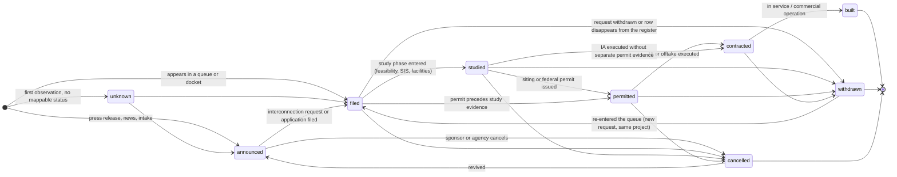
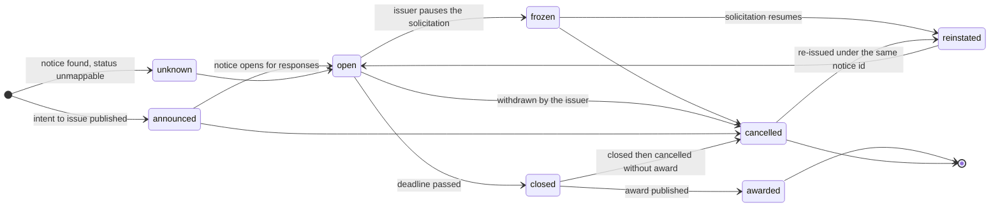

# Domain model and ERD

**Status:** Phase 2 draft v0 · 2026-09-12 · solutions-architect · reviewed by: owner (pending)
**Inputs:** `docs/20-architecture.md` (§2 components, §3 module contracts, §5 tiering, §7 auth, §9 CRM/ERP, §15
technology, §16 assumptions), `docs/02-data-sources.md` §4 (legal register) and §5 (schema seed),
`docs/10-prd-mvp.md` §4 (44 user stories), `data/sources.yaml` (64 sources, field guide).
**Companions:** `docs/20-architecture.md` (system), `docs/23-api-spec-outline.md` (API), `docs/adr/` (decisions).

This is the logical model. Physical DDL lives in Alembic migrations (ADR 0002/0003); the migration is the
executable twin of this document and must not diverge silently. Types below are Postgres 16 types.

Three rules govern everything here:

1. **Provenance is not optional.** Every row that originates outside the platform carries `source_id`,
   `source_url`, `retrieved_at`, `licence_id` (`CLAUDE.md`; `docs/02` §4). Fused entities carry the same four
   fields *per field value* in `field_provenance`, because a proposal is assembled from several sources with
   different licences and the gate has to work at field granularity, not record granularity (§8).
2. **The event log is the product.** Entity tables are a materialised fold of `event`. Anything derived
   (search index, feeds, matches, public views) is rebuildable from `event` + `snapshot` (`docs/20` §3.7, §13).
3. **Nothing is deleted.** Withdrawal, unmerge, unpublish, takedown and correction are all events (§6). The only
   destructive operation in the system is the personal-data redaction procedure (§6.6), which is itself an event.

## 1. Conventions

| Convention | Rule |
|---|---|
| Primary keys | `uuid` (v7, time-ordered) for domain entities; natural text keys for `source` (the `sources.yaml` id) and `licence`. `event` additionally has `seq bigint` identity for cursors. |
| Public identifiers | `public_id` (`prop_01JB…`, `opp_01JB…`) is what the API and URLs expose; internal `uuid` never leaves the store. `slug` gives the human-readable URL (US-201 AC3). |
| Timestamps | `timestamptz`, UTC. `*_at` = system time, `observed_at` = time in the world as the source states it, `*_date` = a date the source gives with no time. |
| Money | `numeric(18,2)` plus `currency char(3)`. Never float. |
| Capacity | `numeric(12,3)` MW / MWh, normalised in `pipeline/normalise` (`docs/20` §3.4). |
| Geography | PostGIS `geography(Point,4326)`; jurisdictions are ISO 3166-2 (`US-TX`, `GB-ENG`). |
| Enums | Postgres `text` + `CHECK` constraint, not native enum types — adding a vocabulary value must not need a lock-taking migration. Vocabularies are listed in §7 and mirrored in a `vocabulary` config table. |
| Raw payloads | `jsonb`. Raw is stored always, exposed conditionally (§8). |
| Nullability | Stated per field. "No" means `NOT NULL` in the migration. |
| Soft state | `merged_into_id`, `publish_state`, `revoked_at`, `anonymised_at`. No `DELETE` grants outside the redaction procedure. |

## 2. Entity-relationship diagram


Relationships the diagram flattens, stated precisely:

- `document`, `extraction` and `event` use a **polymorphic subject** (`subject_type` + `subject_id`) rather than
  one nullable FK per entity type. Referential integrity is enforced by a trigger plus a nightly orphan check,
  not by a foreign key. The trade-off is accepted because the alternative (one `event` table per subject type)
  breaks the single global feed that the product sells.
- `match` is the only many-to-many between the two object families, and it is an entity, not a join table,
  because it carries a score, a rationale and its own lifecycle (US-401, US-402).
- `account` ↔ `subscription` is a **mirror**, authoritative for nothing (`docs/20` §9). The system of record is
  external and replaceable; `sor_kind` + `sor_ref` are the only vendor-shaped values allowed outside the adapter.

## 3. Entities: field-level definitions

Every table below also has `created_at timestamptz NOT NULL DEFAULT now()` and, where rows are mutable,
`updated_at timestamptz NOT NULL`. They are omitted from the tables to keep them readable.

### 3.1 `proposal` — a supply-side object (one real-world project)

| Field | Type | Null | Meaning | Example |
|---|---|---|---|---|
| `id` | uuid | No | Internal key | `018f3c…` |
| `public_id` | text | No | API/URL identifier, immutable | `prop_01JBQ7Z8KD` |
| `slug` | text | No | Human-readable URL segment; regenerated on rename, old slug kept in `slug_history` | `gemini-solar-bess-clark-nv` |
| `kind` | text | No | `generation \| storage \| load \| transmission \| pipeline \| lng \| nuclear \| ccs \| hydrogen \| other` (`docs/02` §5) | `storage` |
| `name_canonical` | text | No | Chosen display name after resolution | `Gemini Solar + Storage` |
| `sponsor_org_id` | uuid | Yes | FK `organization` — developer/IPP behind it | `018f3d…` |
| `technology` | text | Yes | Normalised technology token | `bess_li_ion` |
| `technology_raw` | text | Yes | Verbatim source value kept for audit | `Battery Energy Storage` |
| `capacity_mw` | numeric(12,3) | Yes | Nameplate/requested MW | `690.000` |
| `storage_mwh` | numeric(12,3) | Yes | Energy capacity where applicable | `1380.000` |
| `jurisdiction` | text | No | ISO 3166-2 | `US-NV` |
| `iso` | text | Yes | Market operator token where one applies | `CAISO` |
| `location_id` | uuid | Yes | FK `location` | `018f3e…` |
| `lifecycle_state` | text | No | §7.1 vocabulary; `unknown` when unmappable | `studied` |
| `status_raw` | text | Yes | Verbatim source status, unmapped values raise a DQ warning (`docs/20` §3.4) | `ACTIVE` |
| `identifiers` | jsonb | No | Resolution keys: `{eia_plant_id, eia_generator_id, queue_ids:[{iso,id}], ferc_dockets:[], nrc_dockets:[]}` | `{"queue_ids":[{"iso":"CAISO","id":"Q1234"}]}` |
| `proposed_online_date` | date | Yes | Source-stated commercial operation date | `2028-06-30` |
| `first_seen` | timestamptz | No | First observation across all sources | `2026-03-04T00:00:00Z` |
| `last_changed` | timestamptz | No | Latest event that changed a canonical field | `2026-09-11T06:12:00Z` |
| `publish_state` | text | No | `pending_review \| ingest_only \| api_only \| public \| unpublished` (US-905, US-1001 AC2) | `public` |
| `published_at` | timestamptz | Yes | When the record became visible to the live tier | `2026-03-04T07:00:00Z` |
| `public_at` | timestamptz | Yes | Materialised `published_at + lag`; the only column the public predicate reads (§5.4) | `2026-03-18T07:00:00Z` |
| `min_reuse_class` | text | No | Most restrictive `licence.reuse_class` across linked sources; drives §8 | `attribution` |
| `field_provenance` | jsonb | No | Per-field `{source_id, licence_id, retrieved_at, snapshot_id}` — the record-level provenance contract at field granularity | `{"capacity_mw":{"source_id":"us.iso.caiso.gen_queue",…}}` |
| `overrides` | jsonb | No | Fields pinned by a human decision: `{field:{value,event_id,set_at,user_id}}`; the normaliser skips them (§6.4) | `{"sponsor_org_id":{…}}` |
| `source_count` | int | No | Number of active `proposal_source` rows; shown in lists (US-101 AC1) | `3` |
| `created_by` | text | No | `pipeline \| user \| import` (US-1001 AC2) | `pipeline` |
| `resolution_confidence` | numeric(4,3) | Yes | Confidence of the weakest link that formed this entity | `0.94` |
| `merged_into_id` | uuid | Yes | Set when this record was absorbed by another; the row survives (§6.3) | `null` |
| `search_tsv` | tsvector | No | Generated column over name, sponsor, county, identifiers (US-103) | — |

### 3.2 `proposal_source` — one source's observation of a proposal

| Field | Type | Null | Meaning | Example |
|---|---|---|---|---|
| `id` | uuid | No | Internal key | `018f40…` |
| `proposal_id` | uuid | No | FK `proposal` | `018f3c…` |
| `source_id` | text | No | FK `source` = `sources.yaml` id | `us.iso.caiso.gen_queue` |
| `source_record_id` | text | No | Stable id in the source; content hash where the source has none (`docs/20` §3.1) | `Q1234` |
| `source_url` | text | No | Deep link to the row or its nearest addressable page | `https://www.caiso.com/…` |
| `retrieved_at` | timestamptz | No | Fetch time of the snapshot this came from | `2026-09-11T05:00:00Z` |
| `licence_id` | text | No | FK `licence` at time of retrieval | `caiso-tou` |
| `snapshot_id` | uuid | Yes | FK `snapshot` — the exact bytes this row was parsed from | `018f41…` |
| `raw` | jsonb | No | Parsed source row verbatim. **Gated by reuse class (§8)** | `{"Queue ID":"Q1234",…}` |
| `normalised` | jsonb | No | Canonical projection before fusion | `{"capacity_mw":690}` |
| `status_raw` | text | Yes | Source status string | `ACTIVE` |
| `first_seen` | timestamptz | No | First run in which this source record appeared | `2026-03-04T05:00:00Z` |
| `last_seen` | timestamptz | No | Last run in which it was present | `2026-09-11T05:00:00Z` |
| `gone_at` | timestamptz | Yes | Set when the row disappeared from the register (a signal, never a delete, `docs/20` §3.3) | `null` |
| `link_method` | text | No | `deterministic_key \| rule \| model \| user` | `deterministic_key` |
| `link_confidence` | numeric(4,3) | No | 1.0 for deterministic keys | `1.000` |
| `link_event_id` | uuid | No | FK `event` — the `source_linked` event that created this row | `018f42…` |
| `active` | boolean | No | False after an unlink/unmerge; the row is retained | `true` |

`opportunity_source` (§3.4) is the same shape with `opportunity_id`. They are separate tables rather than one
polymorphic table because they carry different normalised projections and are indexed differently.

### 3.3 `opportunity` — a demand-side object

| Field | Type | Null | Meaning | Example |
|---|---|---|---|---|
| `id` | uuid | No | Internal key | `018f45…` |
| `public_id` | text | No | API/URL identifier | `opp_01JBQ8A2M0` |
| `slug` | text | No | URL segment | `apsc-2027-all-source-rfp` |
| `kind` | text | No | `rfp \| foa \| tender \| auction \| loan_program \| procurement_notice \| program` (`docs/02` §5) | `rfp` |
| `issuer_org_id` | uuid | Yes | FK `organization` — utility, agency, MDB | `018f46…` |
| `title` | text | No | Notice title as issued | `2027 All-Source Request for Proposals` |
| `summary` | text | Yes | Derived summary; never a copied article body (`docs/02` §4) | `Up to 1,200 MW…` |
| `jurisdiction` | text | No | ISO 3166-2 or `US` for federal | `US-AZ` |
| `technologies` | text[] | No | Normalised tokens; empty array for all-source | `{solar_pv,bess,wind}` |
| `capacity_sought_mw` | numeric(12,3) | Yes | Where stated | `1200.000` |
| `budget_amount` | numeric(18,2) | Yes | Programme value where stated | `35000000.00` |
| `budget_currency` | char(3) | Yes | ISO 4217 | `USD` |
| `open_at` | date | Yes | Opening date | `2026-10-01` |
| `due_at` | timestamptz | Yes | Deadline with time zone where the notice gives one | `2026-12-15T22:00:00Z` |
| `status` | text | No | §7.2 vocabulary | `open` |
| `status_raw` | text | Yes | Verbatim source status | `Active` |
| `location_id` | uuid | Yes | FK `location` — service territory or delivery point | `018f47…` |
| `identifiers` | jsonb | No | `{grants_gov_number, ted_notice_id, sam_notice_id, solicitation_number}` | `{"ted_notice_id":"2026/S 174-…"}` |
| `first_seen`, `last_changed` | timestamptz | No | As §3.1 | — |
| `publish_state`, `published_at`, `public_at`, `min_reuse_class`, `field_provenance`, `overrides`, `source_count`, `created_by`, `merged_into_id`, `search_tsv` | — | — | Identical semantics to §3.1 | — |

### 3.4 `opportunity_source`

Identical to §3.2 with `opportunity_id uuid NOT NULL` in place of `proposal_id`. Same provenance quartet, same
`raw` gating, same `active`/`gone_at` semantics. A closed RFP disappearing from an issuer page sets `gone_at` and
produces a `closed` event only after the DQ partial-file check passes (`docs/20` §12).

### 3.5 `organization`

| Field | Type | Null | Meaning | Example |
|---|---|---|---|---|
| `id` | uuid | No | Internal key | `018f3d…` |
| `public_id` | text | No | API/URL identifier | `org_01JBQ8C4X1` |
| `slug` | text | No | URL segment | `nextera-energy-resources` |
| `name_canonical` | text | No | Preferred name | `NextEra Energy Resources, LLC` |
| `name_normalised` | text | No | Case/punctuation/suffix-stripped key for fuzzy matching | `nextera energy resources` |
| `type` | text | No | `developer \| ipp \| utility \| coop \| cca \| agency \| lender \| investor \| epc \| oem \| offtaker \| other` | `developer` |
| `country` | char(2) | No | ISO 3166-1 | `US` |
| `jurisdiction` | text | Yes | Home state/province | `US-FL` |
| `ids` | jsonb | No | `{lei, sam_uei, eia_utility_id, cik, duns}` (`docs/02` §5) | `{"lei":"5493…"}` |
| `website` | text | Yes | Primary domain | `https://www.nexteraenergyresources.com` |
| `is_curated_issuer` | boolean | No | True when this organisation is on the 50-issuer RFP list (US-303) | `false` |
| `first_seen`, `last_changed`, `publish_state`, `merged_into_id`, `search_tsv` | — | — | As §3.1 | — |

Organisations hold **no personal data**. Named individuals in filings are stored as `organization_alias` rows or
document references only (`docs/20` §11; `docs/02` §4 last row).

### 3.6 `organization_alias`

| Field | Type | Null | Meaning | Example |
|---|---|---|---|---|
| `id` | uuid | No | Internal key | `018f4a…` |
| `organization_id` | uuid | No | FK `organization` | `018f3d…` |
| `alias` | text | No | Spelling as it appeared | `NextEra Energy Resources LLC` |
| `alias_normalised` | text | No | Match key; unique per organisation | `nextera energy resources` |
| `kind` | text | No | `legal_name \| trade_name \| filing_spelling \| abbreviation \| former_name \| subsidiary` | `filing_spelling` |
| `source_id` | text | No | FK `source` where the spelling was seen | `us.ferc.elibrary` |
| `source_url` | text | No | Evidence link | `https://elibrary.ferc.gov/…` |
| `retrieved_at` | timestamptz | No | Fetch time | `2026-08-02T11:04:00Z` |
| `licence_id` | text | No | FK `licence` | `us-public-domain` |
| `confidence` | numeric(4,3) | No | Resolver confidence for the alias link | `0.87` |
| `created_by` | text | No | `pipeline \| model \| user` | `model` |

### 3.7 `location`

| Field | Type | Null | Meaning | Example |
|---|---|---|---|---|
| `id` | uuid | No | Internal key | `018f3e…` |
| `kind` | text | No | `point \| county \| state \| region \| service_territory` | `county` |
| `geom` | geography(Point,4326) | Yes | Representative point; **never a raw restricted-source coordinate on public surfaces** (US-104 AC3, §8) | `POINT(-115.0 35.8)` |
| `precision` | text | No | `exact \| county_centroid \| state_centroid \| unknown` — what `geom` actually means | `county_centroid` |
| `county_fips` | char(5) | Yes | US county key | `32003` |
| `county_name` | text | Yes | Display name | `Clark` |
| `state_code` | text | Yes | ISO 3166-2 subdivision | `US-NV` |
| `country` | char(2) | No | ISO 3166-1 | `US` |
| `raw_place` | text | Yes | Verbatim place string from the source. **Gated (§8)** | `Sec 12 T24S R61E` |
| `source_id`, `source_url`, `retrieved_at`, `licence_id` | — | No | Provenance of the geocode | — |
| `geocoder` | text | Yes | `source_provided \| census_tiger \| manual` — never a commercial geocoder whose terms forbid storage | `census_tiger` |

### 3.8 `document`

| Field | Type | Null | Meaning | Example |
|---|---|---|---|---|
| `id` | uuid | No | Internal key | `018f4c…` |
| `subject_type` | text | No | `proposal \| opportunity \| organization \| none` | `proposal` |
| `subject_id` | uuid | Yes | Polymorphic subject | `018f3c…` |
| `source_id`, `source_url`, `retrieved_at`, `licence_id` | — | No | Provenance quartet | — |
| `snapshot_id` | uuid | Yes | FK `snapshot` when the document itself was snapshotted | `018f41…` |
| `title` | text | No | Document title or headline | `Order Issuing Certificate` |
| `doc_type` | text | No | `filing \| order \| notice \| rfp_document \| news_article \| press_release \| report \| other` | `order` |
| `published_date` | date | Yes | Date the issuer gives | `2026-07-18` |
| `identifiers` | jsonb | No | `{accession_number, docket_id, adams_id}` | `{"docket_id":"CP24-12"}` |
| `storage_policy` | text | No | `stored \| link_only \| headline_only` — news is never `stored` (`docs/02` §4) | `stored` |
| `object_key` | text | Yes | Object-storage path when `storage_policy = stored` | `docs/us.ferc.elibrary/2026/07/ab…pdf` |
| `content_type` | text | Yes | MIME | `application/pdf` |
| `byte_size` | bigint | Yes | Size | `2481032` |
| `sha256` | char(64) | Yes | Content hash | `9f2c…` |
| `page_count` | int | Yes | For citation spans | `34` |
| `text_extracted` | boolean | No | Whether pdfplumber/OCR text exists | `true` |
| `personal_data_flag` | boolean | No | Set when the document is known to contain filer contact details; drives redaction and retention (US-910) | `true` |
| `robots_opt_out` | boolean | No | DSM Art. 4 / robots signal observed at fetch; true blocks text extraction | `false` |

### 3.9 `extraction`

| Field | Type | Null | Meaning | Example |
|---|---|---|---|---|
| `id` | uuid | No | Internal key | `018f4e…` |
| `document_id` | uuid | Yes | FK `document` — null for extractions from a structured payload | `018f4c…` |
| `subject_type`, `subject_id` | text/uuid | No | Entity the extraction is about | `proposal` / `018f3c…` |
| `purpose` | text | No | Gateway purpose (`docs/20` §4.5): `extract \| adjudicate` | `extract` |
| `field_path` | text | Yes | Canonical field this proposes to set | `lifecycle_state` |
| `payload` | jsonb | No | Typed extraction result | `{"lifecycle_state":"permitted"}` |
| `confidence` | numeric(4,3) | No | Model or rule confidence | `0.91` |
| `citations` | jsonb | No | `[{document_id, page, span_start, span_end, quote}]` — required, an extraction without a citation is rejected | `[{"document_id":"018f4c…","page":3}]` |
| `model_alias` | text | Yes | `fast \| careful \| batch` — alias only, never a provider model id (`CLAUDE.md`) | `careful` |
| `prompt_template_id` | text | Yes | Template identifier | `extract.lifecycle` |
| `prompt_version` | text | Yes | Template version | `v3` |
| `model_call_id` | uuid | Yes | FK `model_call` (§4.4) for cost attribution | `018f4f…` |
| `status` | text | No | `proposed \| accepted \| rejected \| superseded` | `accepted` |
| `accepted_by_user_id` | uuid | Yes | Set when a human accepted below threshold | `null` |
| `applied_event_id` | uuid | Yes | FK `event` created when applied | `018f50…` |
| `source_id`, `licence_id` | text | No | Inherited from the document; gates the extracted value (§8) | — |

### 3.10 `event` — the append-only log

| Field | Type | Null | Meaning | Example |
|---|---|---|---|---|
| `id` | uuid | No | Stable event identifier exposed in the API | `018f50…` |
| `seq` | bigint | No | Identity column; the API cursor and the alert watermark | `4812993` |
| `subject_type` | text | No | `proposal \| opportunity \| organization \| match \| document \| source \| post \| user \| account \| api_key` | `proposal` |
| `subject_id` | uuid | No | Polymorphic subject | `018f3c…` |
| `event_type` | text | No | §7.3 vocabulary | `status_change` |
| `observed_at` | timestamptz | No | When it happened per the source; the partition key | `2026-09-10T00:00:00Z` |
| `recorded_at` | timestamptz | No | When the platform wrote it | `2026-09-11T05:04:12Z` |
| `published_at` | timestamptz | Yes | Live-tier visibility time; null while gated or unpublished | `2026-09-11T05:04:12Z` |
| `public_at` | timestamptz | Yes | Materialised `published_at + lag(source, event_type)`; the public predicate reads this column only (§5.4) | `2026-09-25T05:04:12Z` |
| `source_id`, `source_url`, `retrieved_at`, `licence_id` | — | Yes | Provenance quartet; null only for `actor_type = user` events | `us.iso.caiso.gen_queue` |
| `snapshot_id` | uuid | Yes | Evidence for machine-generated events | `018f41…` |
| `before` | jsonb | Yes | Prior values of the changed keys, or the full absorbed entity for a merge (§6.3) | `{"lifecycle_state":"filed"}` |
| `after` | jsonb | Yes | New values | `{"lifecycle_state":"studied"}` |
| `changed_keys` | text[] | Yes | Keys present in `before`/`after`, for cheap filtering | `{lifecycle_state}` |
| `actor_type` | text | No | `pipeline \| model \| user \| system` | `pipeline` |
| `actor_user_id` | uuid | Yes | FK `user` for human actions (the audit log, US-901 AC2) | `null` |
| `reason` | text | Yes | Required when `actor_type = user` (US-905 AC3) | `Duplicate of Q1234` |
| `confidence` | numeric(4,3) | Yes | For model-originated events | `0.88` |
| `reverses_event_id` | uuid | Yes | Set on `unmerge`, `unpublish`, correction (§6.3) | `018f4b…` |
| `run_id` | uuid | Yes | FK `source_run` | `018f39…` |
| `job_id` | text | Yes | Queue job identifier for tracing | `resolve:018f39…` |
| `idempotency_key` | text | No | `(source_id, source_record_id, event_type, hash(after))` — unique, makes re-runs free | `caiso:Q1234:status_change:9f2c…` |

### 3.11 `match`

| Field | Type | Null | Meaning | Example |
|---|---|---|---|---|
| `id` | uuid | No | Internal key | `018f52…` |
| `proposal_id` | uuid | No | FK `proposal` | `018f3c…` |
| `opportunity_id` | uuid | No | FK `opportunity` | `018f45…` |
| `score` | numeric(4,3) | No | 0–1 | `0.82` |
| `rationale` | jsonb | No | `{rules_passed:[…], rules_failed:[…], features:{…}}` (US-402 AC1) | `{"rules_passed":["technology","jurisdiction"]}` |
| `rationale_text` | text | No | Rendered plain-language explanation | `storage, TX, 50–500 MW, due in 45 days` |
| `rule_set_version` | text | No | Version of the versioned config that produced it (US-401 AC1) | `match-rules@v2` |
| `created_by` | text | No | `rule \| model \| user` | `rule` |
| `status` | text | No | `active \| removed \| superseded` | `active` |
| `first_matched_at` | timestamptz | No | When first emitted | `2026-09-11T05:06:00Z` |
| `last_evaluated_at` | timestamptz | No | Last recompute | `2026-09-12T05:06:00Z` |
| `removed_at` | timestamptz | Yes | Set with a `match_removed` event | `null` |
| `crm_lead_ref` | text | Yes | CRM lead id when routed (US-403 AC1); the only lead data the app stores | `hs-lead-88213` |

Per-user dismissals (US-402 AC2) live in the supporting table `match_dismissal (user_id, match_id, dismissed_at)`
so that a personal action never mutates global data.

### 3.12 `user`

| Field | Type | Null | Meaning | Example |
|---|---|---|---|---|
| `id` | uuid | No | Internal key | `018f55…` |
| `account_id` | uuid | No | FK `account` — a user belongs to exactly one account (`docs/20` §7) | `018f54…` |
| `email` | citext | Yes | Login identity; null after anonymisation | `ana@example.com` |
| `email_verified_at` | timestamptz | Yes | Magic-link or OAuth verification | `2026-09-01T10:00:00Z` |
| `name` | text | Yes | Display name; optional, minimum personal data (`CLAUDE.md`) | `Ana Ruiz` |
| `role` | text | No | `viewer \| member \| operator \| owner` (`docs/20` §7) | `member` |
| `status` | text | No | `active \| disabled \| anonymised` | `active` |
| `auth_provider` | text | No | `magic_link \| google` | `google` |
| `mfa_enforced` | boolean | No | True for `operator`/`owner` (**[A-10]**) | `false` |
| `marketing_consent` | boolean | No | Separate from transactional email | `false` |
| `consent_version` | text | Yes | Privacy notice version accepted | `privacy-2026-09` |
| `tos_version` | text | Yes | Terms version accepted | `tos-2026-09` |
| `last_login_at` | timestamptz | Yes | For US-901 AC1 | `2026-09-12T08:31:00Z` |
| `anonymised_at` | timestamptz | Yes | Deletion request completed (US-910) | `null` |
| `sor_kind` | text | Yes | `hubspot \| odoo \| erpnext \| twenty` (**[A-4]**) | `hubspot` |
| `sor_ref` | text | Yes | Contact id in the system of record | `hs-contact-4471` |

Personal data inventory columns: `email`, `name`, `last_login_at`, `sor_ref`. Any new column holding personal
data must be added to the inventory or the schema check fails (US-910 AC2).

### 3.13 `account` — the entitlement mirror

| Field | Type | Null | Meaning | Example |
|---|---|---|---|---|
| `id` | uuid | No | Internal key | `018f54…` |
| `name` | text | No | Customer name as shown in admin | `Meridian Capital` |
| `kind` | text | No | `personal \| organization` | `organization` |
| `organization_id` | uuid | Yes | FK `organization` when the customer is also in the graph | `null` |
| `entitlement` | text | No | `public \| pro \| api \| admin` — the resolved tier (`docs/20` §5) | `pro` |
| `entitlement_source` | text | No | `sor \| manual_grant \| trial` | `sor` |
| `entitlement_checked_at` | timestamptz | No | Cache stamp; TTL ≤ 15 min (US-602 AC1) | `2026-09-12T08:30:00Z` |
| `entitlement_stale` | boolean | No | Set when the adapter is unavailable; fails open 24 h then closed (`docs/20` §12) | `false` |
| `seats` | int | No | Purchased seats | `3` |
| `seats_used` | int | No | Active sessions/logins (US-602 AC2) | `2` |
| `sor_kind` | text | Yes | Vendor of the system of record | `hubspot` |
| `sor_ref` | text | Yes | Company id in the CRM | `hs-company-9912` |
| `billing_ref` | text | Yes | Customer id in the billing provider (Stripe) | `cus_QX…` |
| `status` | text | No | `active \| suspended \| closed` | `active` |

**Authoritative for nothing.** Every field above is a read model refreshed by webhook and by the nightly
reconciliation job (`docs/20` §9). Conflicts resolve system-of-record-wins.

### 3.14 `subscription` — mirror of the commercial record

| Field | Type | Null | Meaning | Example |
|---|---|---|---|---|
| `id` | uuid | No | Internal key | `018f56…` |
| `account_id` | uuid | No | FK `account` | `018f54…` |
| `sor_kind` | text | No | `stripe \| odoo \| erpnext` | `stripe` |
| `sor_ref` | text | No | Subscription id in the provider | `sub_1PX…` |
| `plan_code` | text | No | Provider plan identifier | `pro_seat_monthly` |
| `plan_tier` | text | No | `free \| pro \| team \| api` — maps to `account.entitlement` | `pro` |
| `status` | text | No | `trialing \| active \| past_due \| paused \| canceled` | `active` |
| `seats` | int | No | Seats on the plan | `3` |
| `current_period_start` / `_end` | timestamptz | No | Billing period | `2026-09-01` / `2026-10-01` |
| `cancel_at` | timestamptz | Yes | Scheduled cancellation | `null` |
| `mrr_amount` | numeric(18,2) | Yes | For metric M-13 | `450.00` |
| `currency` | char(3) | No | ISO 4217 | `USD` |
| `mirrored_at` | timestamptz | No | Last successful sync | `2026-09-12T03:00:00Z` |
| `drift_flag` | boolean | No | Set by reconciliation when local and remote disagree | `false` |

### 3.15 `saved_search`

| Field | Type | Null | Meaning | Example |
|---|---|---|---|---|
| `id` | uuid | No | Internal key | `018f58…` |
| `user_id` | uuid | No | FK `user` — owner | `018f55…` |
| `account_id` | uuid | No | FK `account` — for quota and entitlement | `018f54…` |
| `name` | text | No | User label; unique per user | `TX storage 50–500 MW` |
| `entity` | text | No | `proposal \| opportunity \| event \| match` | `proposal` |
| `query` | jsonb | No | Filter definition, not results (US-501 AC2) | `{"kind":["storage"],"jurisdiction":["US-TX"]}` |
| `query_hash` | char(64) | No | Dedupe and cache key | `3f1a…` |
| `delivery_mode` | text | No | `immediate \| daily \| weekly \| none`; default `daily` (US-502 AC1) | `daily` |
| `channels` | text[] | No | `{email}`, `{email,webhook}`, `{rss}` | `{email}` |
| `rss_token` | text | Yes | Unguessable token for a private feed URL | `rt_9f2c…` |
| `last_run_at` | timestamptz | Yes | Last matcher pass | `2026-09-12T06:00:00Z` |
| `watermark_seq` | bigint | No | Highest `event.seq` already considered; makes alerting exactly-once | `4812993` |
| `last_match_count` | int | No | For US-504 AC1 | `7` |
| `status` | text | No | `active \| paused` | `active` |

Quota: 25 per user, configurable (US-501 AC1).

### 3.16 `alert`

| Field | Type | Null | Meaning | Example |
|---|---|---|---|---|
| `id` | uuid | No | Internal key | `018f5a…` |
| `saved_search_id` | uuid | No | FK `saved_search` | `018f58…` |
| `user_id` | uuid | No | FK `user` — recipient | `018f55…` |
| `channel` | text | No | `email \| webhook` | `email` |
| `mode` | text | No | `immediate \| daily \| weekly` | `daily` |
| `window_start` / `window_end` | timestamptz | No | Event window covered | `2026-09-11T06:00Z` / `2026-09-12T06:00Z` |
| `event_seqs` | bigint[] | No | Events included; the join to content without copying it | `{4812990,4812993}` |
| `recipient` | text | Yes | Address at send time; redacted on deletion | `ana@example.com` |
| `subject` | text | Yes | Rendered subject | `7 new storage proposals in TX` |
| `provider_message_id` | text | Yes | Email provider id (US-502 AC4) | `re_9f…` |
| `status` | text | No | `queued \| sent \| bounced \| failed \| suppressed` | `sent` |
| `sent_at` | timestamptz | Yes | Delivery time; the metric M-5 source | `2026-09-12T06:02:00Z` |
| `unsubscribe_token` | text | No | One-click unsubscribe (US-502 AC3) | `ut_4a…` |
| `error` | text | Yes | Provider error | `null` |

Retention 12 months (`docs/20` §11), then rows are aggregated into counts and the recipient column is dropped.

### 3.17 `api_key`

| Field | Type | Null | Meaning | Example |
|---|---|---|---|---|
| `id` | uuid | No | Internal key | `018f5c…` |
| `account_id` | uuid | No | FK `account` | `018f54…` |
| `created_by_user_id` | uuid | No | FK `user` | `018f55…` |
| `name` | text | No | User label | `production-etl` |
| `prefix` | text | No | `bk_live` or `bk_test` (`docs/20` §7) | `bk_live` |
| `last4` | char(4) | No | Display aid; the secret is never stored | `f31a` |
| `key_hash` | bytea | No | SHA-256 of the full key; unique | `\x9f2c…` |
| `scopes` | text[] | No | `read:public`, `read:live`, `read:bulk`, `write:webhooks`, `admin:*` | `{read:live,read:bulk}` |
| `tier` | text | No | `public \| pro \| api` — inherited from the plan (US-701 AC3) | `api` |
| `rate_limit_per_hour` | int | No | Plan default, overridable per key (`docs/23` §6) | `6000` |
| `daily_quota` | int | Yes | Daily request cap | `50000` |
| `expires_at` | timestamptz | Yes | Optional expiry | `2027-09-01T00:00:00Z` |
| `last_used_at` | timestamptz | Yes | Updated at most once per minute | `2026-09-12T08:40:00Z` |
| `last_used_ip` | inet | Yes | Truncated to /24 (v4) or /48 (v6) | `203.0.113.0` |
| `revoked_at` | timestamptz | Yes | Revocation takes effect ≤ 60 s (US-701 AC1) | `null` |
| `licence_accepted_version` | text | No | API licence version accepted (US-704 AC2) | `api-licence-1.0` |
| `licence_accepted_at` | timestamptz | No | Acceptance time | `2026-09-05T14:22:00Z` |

### 3.18 `post`

| Field | Type | Null | Meaning | Example |
|---|---|---|---|---|
| `id` | uuid | No | Internal key | `018f5e…` |
| `channel` | text | No | `bluesky \| linkedin \| x` | `bluesky` |
| `event_id` | uuid | No | FK `event` — the change that justified the post (US-801 AC1) | `018f50…` |
| `subject_type`, `subject_id` | text/uuid | No | Denormalised for the review queue | `proposal` / `018f3c…` |
| `template_id` / `template_version` | text | No | Editorial template from `docs/32` | `status_change.permitted` / `v2` |
| `body` | text | No | Rendered text within channel limits | `Permit issued: Gemini…` |
| `link_url` | text | No | Detail page with UTM parameters (US-803 AC2) | `https://…?utm_source=bluesky` |
| `credit_line` | text | No | Source attribution rendered into the post (US-801 AC2) | `Source: CAISO` |
| `disclosure_label` | text | Yes | Automation label where the platform requires it (US-803 AC3) | `Automated post` |
| `state` | text | No | `draft \| approved \| scheduled \| published \| rejected \| withdrawn \| failed` | `draft` |
| `gate_checked_at` | timestamptz | No | Proof the licence/publish gate was evaluated before drafting (US-801 AC3) | `2026-09-11T05:07:00Z` |
| `approved_by_user_id` | uuid | Yes | Human approver; null only if the channel's `auto_publish` is on | `018f55…` |
| `auto_published` | boolean | No | True when published without human review | `false` |
| `scheduled_for` | timestamptz | Yes | Scheduled time | `2026-09-12T13:00:00Z` |
| `published_at` | timestamptz | Yes | Actual publish time | `null` |
| `external_post_id` | text | Yes | Id on the platform | `at://did:plc:…` |
| `reject_reason` | text | Yes | Required on reject (US-802 AC3) | `null` |
| `metrics` | jsonb | No | `{impressions, clicks, likes, reposts, fetched_at}` (US-803 AC2) | `{"clicks":14}` |
| `cost_usd` | numeric(10,4) | No | Per-post cost where the channel charges (X) | `0.2000` |

### 3.19 `licence`

The gate. One row per distinct licence or terms-of-use document, referenced by `source`, and copied onto every
observation row so that a later licence change cannot retroactively rewrite what was permitted at fetch time.

| Field | Type | Null | Meaning | Example |
|---|---|---|---|---|
| `id` | text | No | Stable key | `pjm-data-miner-restricted` |
| `name` | text | No | Display name | `PJM Data Miner 2 Terms of Use` |
| `url` | text | Yes | Canonical terms URL | `https://dataminer2.pjm.com/terms` |
| `reuse_class` | text | No | `open \| attribution \| restricted \| unknown` (`sources.yaml` field guide) | `restricted` |
| `attribution_required` | boolean | No | Whether a credit line must render | `true` |
| `attribution_text` | text | Yes | Exact credit string the product renders (`docs/02` §4) | `Source: PJM Interconnection LLC` |
| `requires_link_back` | boolean | No | Whether a link to the source page is mandatory | `true` |
| `allows_derived_publication` | boolean | No | May normalised/derived fields be published | `false` |
| `allows_raw_publication` | boolean | No | May the raw row be rendered | `false` |
| `allows_api_redistribution` | boolean | No | May the data leave over the API | `false` |
| `allows_bulk_export` | boolean | No | May it appear in CSV/bulk exports | `false` |
| `allows_commercial_use` | boolean | No | Commercial reuse permitted | `false` |
| `share_alike` | boolean | No | Copyleft obligation on derived datasets | `false` |
| `gate_flag` | boolean | No | An unmet gate (G-PJM, G-MISO, G-SPP, G-NYISO, G-ISONE; PRD §3.3) | `true` |
| `gate_name` | text | Yes | Which gate | `G-PJM` |
| `gate_cleared_at` / `gate_cleared_by` | timestamptz / uuid | Yes | Only a user with the `legal` role may set these (US-905 AC1) | `null` |
| `evidence_url` | text | Yes | Where the terms were read | `https://…` |
| `evidence_retrieved_at` | timestamptz | Yes | When they were read | `null` |
| `evidence_object_key` | text | Yes | Stored PDF/screenshot capture of the terms | `null` |
| `classified_by` | text | Yes | Reviewer (legal-compliance) | `null` |
| `contract_ref` | text | Yes | Signed licence reference where one exists | `null` |
| `expires_at` | timestamptz | Yes | Renewal date for paid licences | `null` |
| `notes` | text | Yes | Free text | `Redistribution License enquiry opened 2026-09-12` |

**Invariant L1:** a `source` may not move to `publish_state` `public` or `api_only` unless its licence has
`reuse_class IN ('open','attribution')`, `gate_flag = false`, and non-null `evidence_url`,
`evidence_retrieved_at`, `classified_by` (US-905 AC1). Enforced by a `CHECK` plus a trigger, not by the UI.

**Invariant L2:** `licence_id` on an observation row is immutable. Re-classifying a source writes a new `licence`
row and future observations point at it; historical rows keep the licence that applied when they were fetched.

## 4. Operational entities

These carry the pipeline's own state. They are as much a part of the product as the graph: source health,
cost per record and snapshot evidence are admin surfaces (`docs/20` §8) and licence-dispute evidence (§3.2).

### 4.1 `source` — the runtime mirror of `data/sources.yaml`

`data/sources.yaml` remains the editable manifest and the connector registry (`docs/20` §3.1). This table is
its loaded form plus mutable runtime state. A manifest load is idempotent: fields marked *manifest* are
overwritten from YAML on every boot, fields marked *runtime* are never touched by the loader.

| Field | Type | Null | Origin | Meaning | Example |
|---|---|---|---|---|---|
| `id` | text | No | manifest | `sources.yaml` id, primary key | `us.iso.caiso.gen_queue` |
| `name` | text | No | manifest | Display name | `CAISO Public Queue Report` |
| `jurisdiction` | text | Yes | manifest | ISO 3166-2 | `US-CA` |
| `category` | text | No | manifest | `generation_queue \| load_queue \| permit \| regulatory_docket \| funding \| procurement \| registry \| planning \| news \| aggregator \| social_channel` | `generation_queue` |
| `operator` | text | Yes | manifest | Publishing body | `California ISO` |
| `url` | text | No | manifest | Entry point | `https://www.caiso.com/…` |
| `access` | text | No | manifest | `api \| bulk_file \| html \| js_app \| pdf \| rss \| email \| wsdl` | `bulk_file` |
| `format` | text | Yes | manifest | Payload format | `xlsx` |
| `cadence` | text | No | manifest | `15-min \| daily \| weekly \| twice_weekly \| monthly \| quarterly \| annual \| realtime \| continuous` | `weekly` |
| `tier` | int | No | manifest | 1 = MVP, 2, 3 | `1` |
| `effort` | text | Yes | manifest | `S \| M \| L` | `S` |
| `egress` | text | No | manifest | `plain \| browser \| residential \| api_key` (`docs/20` §4.3; new YAML field proposed there) | `plain` |
| `connector` | text | Yes | manifest | Dotted path or gridstatus symbol | `gridstatus.CAISO.get_interconnection_queue` |
| `implemented` | boolean | No | runtime | False = manifest entry only, shown as "unimplemented" in admin | `true` |
| `licence_id` | text | No | manifest | FK `licence` | `caiso-tou` |
| `publish_state` | text | No | runtime | `ingest_only \| api_only \| public` (US-905 AC1) | `public` |
| `lag_days` | int | Yes | runtime | Override of the global public lag (US-601 AC2) | `null` |
| `lag_overrides` | jsonb | No | runtime | Per-event-type lag, e.g. `{"withdrawn":0}` | `{}` |
| `schedule_cron` | text | No | runtime | Derived from cadence, editable in admin | `0 6 * * 1` |
| `next_run_at` | timestamptz | Yes | runtime | Scheduler state | `2026-09-14T06:00:00Z` |
| `paused` | boolean | No | runtime | Operator pause (US-904 AC2) | `false` |
| `health` | text | No | runtime | `ok \| degraded \| failing \| blocked \| paused` | `ok` |
| `consecutive_failures` | int | No | runtime | Flag at 3 (US-904 AC3), dead-letter at 5 (`docs/20` §4.2) | `0` |
| `last_success_at` | timestamptz | Yes | runtime | Last `ok`/`unchanged` run | `2026-09-11T05:00:00Z` |
| `last_error` / `last_error_at` | text / timestamptz | Yes | runtime | Latest failure | `null` |
| `host` | text | No | manifest | Rate-limit bucket key | `www.caiso.com` |
| `max_rps` | numeric(6,3) | No | manifest | Host politeness limit (`docs/02` §7) | `0.500` |
| `max_concurrency` | int | No | manifest | Parallel fetches allowed | `1` |
| `enrichment_enabled` | boolean | No | runtime | Model enrichment on/off per source (`docs/20` §3.6) | `true` |
| `model_budget_usd_daily` | numeric(10,2) | Yes | runtime | Per-source daily budget (`docs/20` §4.5) | `2.00` |
| `cost_per_changed_record_30d` | numeric(10,4) | Yes | runtime | Rolling metric; threshold default USD 0.50 **[A-9]** | `0.0312` |
| `attribution_text` | text | Yes | manifest | Overrides `licence.attribution_text` where a source demands its own wording | `null` |
| `manifest_hash` | char(64) | No | runtime | Hash of the YAML entry; a change is an audited `source` event | `4b1e…` |

Guard: a connector whose source resolves to `category = aggregator` with `reuse = restricted` fails to register
(`docs/20` §4.3). Private aggregators therefore cannot be ingested even by accident.

### 4.2 `source_run`

| Field | Type | Null | Meaning | Example |
|---|---|---|---|---|
| `id` | uuid | No | Run identifier, carried on every log line and event | `018f39…` |
| `source_id` | text | No | FK `source` | `us.iso.caiso.gen_queue` |
| `trigger` | text | No | `schedule \| manual \| backfill \| retry` | `schedule` |
| `started_at` / `finished_at` | timestamptz | No / Yes | Wall clock | `2026-09-11T05:00:00Z` |
| `status` | text | No | `running \| ok \| unchanged \| partial \| failed \| blocked \| budget` (`docs/20` §3.2, §4.5, §12) | `ok` |
| `snapshot_id` | uuid | Yes | FK `snapshot` produced by this run | `018f41…` |
| `http_status` | int | Yes | Final HTTP status | `200` |
| `bytes` | bigint | Yes | Payload size | `1842019` |
| `egress_class` | text | No | Which pool ran it | `plain` |
| `rows_seen` / `rows_new` / `rows_changed` / `rows_gone` | int | No | Diff outcome (US-904 AC1) | `2278 / 12 / 31 / 4` |
| `events_emitted` | int | No | Events written downstream | `43` |
| `model_calls` | int | No | Gateway calls attributed to the run | `6` |
| `cost_usd` | numeric(10,4) | No | Model cost for the run (`docs/20` §6) | `0.1240` |
| `worker_seconds` | numeric(10,2) | No | Compute attribution | `41.20` |
| `dq_status` | text | No | `pass \| warn \| fail` | `pass` |
| `dq` | jsonb | No | Warning list: row-count delta, vocabulary drift, null spikes, duplicate keys (`docs/20` §10) | `{"row_delta_pct":-0.4}` |
| `error` / `error_class` | text | Yes | Failure detail and classification | `null` |
| `attempt` | int | No | Retry counter | `1` |
| `dead_lettered` | boolean | No | Five failures (`docs/20` §4.2) | `false` |

### 4.3 `snapshot`

| Field | Type | Null | Meaning | Example |
|---|---|---|---|---|
| `id` | uuid | No | Snapshot identifier | `018f41…` |
| `source_id` | text | No | FK `source` | `us.iso.caiso.gen_queue` |
| `source_run_id` | uuid | No | FK `source_run` | `018f39…` |
| `object_key` | text | No | `raw/{source_id}/{yyyy}/{mm}/{dd}/{sha256}.{ext}` (`docs/20` §3.2) | `raw/us.iso.caiso.gen_queue/2026/09/11/9f2c….xlsx` |
| `sha256` | char(64) | No | Content hash; equal to previous ⇒ run recorded `unchanged` | `9f2c…` |
| `byte_size` | bigint | No | Size | `1842019` |
| `content_type` | text | No | MIME as served | `application/vnd.openxmlformats-…` |
| `fetched_url` | text | No | Final URL after redirects | `https://www.caiso.com/…` |
| `http_status` | int | No | Status | `200` |
| `retrieved_at` | timestamptz | No | Fetch time — the `retrieved_at` copied onto every derived row | `2026-09-11T05:00:00Z` |
| `licence_id` | text | No | Licence in force at fetch time | `caiso-tou` |
| `parser_version` | text | Yes | Connector/parser version that read it | `caiso@1.4.0` |
| `record_count` | int | Yes | Parsed record count | `2278` |
| `previous_snapshot_id` | uuid | Yes | Diff baseline | `018f2f…` |
| `retention_class` | text | No | `full \| sampled \| expired` — 24 months full, then monthly samples **[A-7]** | `full` |
| `expires_at` | timestamptz | Yes | Object-storage lifecycle date | `2028-09-11` |

`snapshot` rows are kept forever even when the object is compacted; the row is the evidence that a fetch
happened, under which licence, and what it contained (`docs/20` §3.2, §12 licence dispute).

### 4.4 Supporting tables (named here, specified in the migration)

| Table | Purpose | Key fields |
|---|---|---|
| `job` | Postgres-backed queue (ADR 0004) | `id, type, key, payload, run_after, attempts, status, locked_by` |
| `model_call` | One row per gateway call (`docs/20` §4.5, US-909) | `id, purpose, subject_type, subject_id, source_id, alias, prompt_template_id, prompt_version, input_tokens, output_tokens, cost_usd, latency_ms, cache_hit, error` |
| `rate_bucket` | `UNLOGGED` sliding-window counters per key/IP (`docs/20` §7) | `bucket_key, window_start, count` |
| `session` | Revocable server-side sessions | `id, user_id, created_at, expires_at, revoked_at, ip_prefix` |
| `task` | Admin work queue (US-907, US-204, US-910, US-1001) | `id, type, subject_type, subject_id, status, assignee_user_id, notes` |
| `match_dismissal` | Per-user match dismissal (US-402 AC2) | `user_id, match_id, dismissed_at` |
| `webhook_endpoint` / `webhook_delivery` | API-tier webhooks (`docs/23` §9) | `url, secret_hash, events[], status` / `attempt, response_status` |
| `export` | CSV export jobs and their audit trail (US-603 AC3) | `id, user_id, query, row_count, object_key, expires_at` |
| `slug_history` | Old slugs → surviving entity, for 301s (US-201 AC3) | `slug, subject_type, subject_id` |
| `vocabulary` | Editable enum vocabularies and source-status mappings (§7.4) | `domain, value, label, sort_order, active` |

## 5. Keys, indexes and constraints

### 5.1 Uniqueness

| Constraint | Rationale |
|---|---|
| `proposal_source (source_id, source_record_id) WHERE active` | One live link per source record; the resolver's idempotency anchor |
| `opportunity_source (source_id, source_record_id) WHERE active` | Same |
| `event (idempotency_key)` | Re-running a stage cannot duplicate history (`docs/20` §3) |
| `snapshot (source_id, sha256)` | Unchanged fetches do not create new objects |
| `organization_alias (organization_id, alias_normalised)` | Alias set stays clean |
| `match (proposal_id, opportunity_id) WHERE status = 'active'` | One active match per pair |
| `api_key (key_hash)`, `user (email) WHERE status <> 'anonymised'`, `saved_search (user_id, name)` | Obvious |
| `proposal (public_id)`, `opportunity (public_id)`, `organization (public_id)`, and each `slug` | Stable URLs |

### 5.2 Indexes that the product depends on

| Index | Serves |
|---|---|
| `GIN (search_tsv)` on `proposal`, `opportunity`, `organization` | Free-text search, US-103 AC3 (< 500 ms p95) |
| `GIN (name_normalised gin_trgm_ops)` on `organization`, `organization_alias` | Fuzzy sponsor resolution (`docs/02` §5 key 5) |
| `GIN (identifiers jsonb_path_ops)` on `proposal`, `opportunity` | Exact queue-id / docket / EIA-id lookup, US-103 AC1 |
| `GIST (geom)` on `location` | Map bounding box, US-104 |
| `BTREE (publish_state, public_at DESC)` on `proposal`, `opportunity` | The public list query, US-101 |
| `BTREE (subject_type, subject_id, observed_at DESC)` on `event` | Detail-page timeline, US-202 |
| `BTREE (seq)` on `event` | API cursor and alert watermark, US-703 AC1 |
| `BTREE (public_at) WHERE published_at IS NOT NULL` on `event` | Public feed and RSS, US-503 |
| `BTREE (source_id, started_at DESC)` on `source_run` | Source health, US-904 |
| `BTREE (state, channel, created_at)` on `post` | Review queue, US-802 |

### 5.3 Partitioning

`event` is range-partitioned monthly on `observed_at` from day one (`docs/20` §13 step 5 assumes the key is
already there; creating the partitioned table later is a rewrite). `model_call` and `webhook_delivery` are
partitioned monthly on `created_at` and dropped by retention policy.

### 5.4 The visibility predicate

One function, used by every read path (US-601 AC1). Pseudocode over an entity or event row `r` for tier `t`:

```
visible(r, t, now) :=
      r.publish_state = 'public'                                    -- record-level gate (US-905)
  AND source_permits(r.source_id, t)                                -- source.publish_state ⊇ t
  AND licence_permits(r.licence_id, t, field_class)                 -- §8
  AND (t = 'public' ? r.public_at IS NOT NULL AND r.public_at <= now
                    : r.published_at IS NOT NULL AND r.published_at <= now)
```

`public_at` is materialised at write time from `lag(source_id, event_type)` so that the public query is an index
scan on one column rather than a join against configuration. Changing a lag value is a configuration change
(US-601 AC2) that enqueues a `relag` job to recompute `public_at` for that source; no deploy, no schema change.
The trade-off — a lag change is not instantaneous across historical rows — is accepted and must be stated in the
admin UI. The alternative (evaluating lag at query time) was rejected because it puts a configuration join on
the hottest public path.

## 6. The event log

### 6.1 Append-only, enforced

- No role except `migration` holds `UPDATE`/`DELETE` on `event`. A `BEFORE UPDATE OR DELETE` trigger raises
  unless the session sets `bankable.redaction = on`, which only the redaction procedure (§6.6) does.
- Writes are transactional with the entity update and the outbound job inserts (`docs/20` §3.7): one commit
  gives a changed entity, its events and the alert/post/webhook/CRM jobs.
- `idempotency_key` makes re-running a stage a no-op, which is what allows any stage to be replayed from its
  snapshot (`docs/20` §3).

### 6.2 `before` / `after` payloads

- Both are objects keyed by **canonical field name**, never raw source columns. `changed_keys` lists the keys.
- Values are gated the same way as the entity: an event whose `after` touches a field whose provenance is a
  `restricted` source is not published to any tier that may not see that field (§8). The publisher computes the
  event's field classes at commit, not at read.
- Creation events carry `before = null`; `removed`/`gone` events carry `after = null` but never delete anything.
- `before` for a status change carries the prior value *and* the prior evidence pointer
  (`{lifecycle_state: "filed", _provenance: {source_id, snapshot_id}}`) so that a reversal restores provenance
  as well as value.

### 6.3 Reversible merges

Merging proposal B into surviving proposal A writes **one** `merged` event on A with:

```json
{
  "event_type": "merged",
  "subject_type": "proposal", "subject_id": "A",
  "before": { "surviving": { "...changed canonical fields of A before the merge..." },
              "absorbed":  { "id": "B", "public_id": "prop_…", "slug": "…",
                             "entity": { "...full row of B..." },
                             "proposal_source_ids": ["…","…"],
                             "match_ids": ["…"], "document_ids": ["…"] } },
  "after":  { "surviving": { "...canonical fields of A after the merge..." } },
  "actor_type": "model", "confidence": 0.86
}
```

B is **not deleted**. `B.merged_into_id = A` and `B.publish_state = 'unpublished'`; its `proposal_source` rows are
re-pointed to A with `link_event_id` set to the merge event. `slug_history` gains B's slug pointing at A so old
URLs 301 (US-201 AC3).

`unmerge` is therefore mechanical and total: create an `unmerge` event with `reverses_event_id` = the merge
event, clear `B.merged_into_id`, restore `B.publish_state`, move the listed `proposal_source` ids back, restore
A's fields from `before.surviving`, recompute both entities' `field_provenance`, `min_reuse_class` and matches,
and remove B's slug from `slug_history`. Invariant **M1**: every `merged` event must contain enough state to
execute this without reading any other row; a merge that cannot satisfy it is rejected in code and in tests.

### 6.4 Human decisions win

An event with `actor_type = user` on field *f* writes `entity.overrides[f] = {value, event_id, set_at, user_id}`.
The normaliser and the enricher skip overridden fields until a user clears the override. Resolver decisions made
by a human on a candidate pair are recorded in `resolution_decision` (supporting table) and short-circuit later
automated adjudication of the same pair (`docs/20` §3.5).

### 6.5 Rebuild and replay

The entity tables are a fold of `event`; `event` is derivable from `snapshot` + parser + resolver version. Two
recovery levels: **replay** (re-fold events into entity tables — always safe, used after a bad deploy) and
**reprocess** (re-parse snapshots into events — used after a parser fix, and it writes new events rather than
rewriting old ones, so history keeps the mistake and the correction). Derived artefacts (search index, matches,
feeds, alerts watermarks) are rebuildable from either.

### 6.6 Redaction (the single exception)

A completed deletion request (US-910) runs a procedure that replaces personal-data values inside historical
`before`/`after` payloads with `"[redacted]"`, nulls `user.email`/`name`, revokes sessions and keys, suppresses
alerts, issues the system-of-record deletion through the port, and writes a `personal_data_redacted` event
carrying only an opaque subject id. Event ids, timestamps and structure survive so the audit chain is unbroken.

## 7. Lifecycle state machines

### 7.1 Proposal lifecycle

Vocabulary from `docs/02` §1 plus `unknown` for unmappable source values (`docs/10` §4, 216 blank SPP rows).



Rules: the state is always the `after` value of the latest `status_change` event, or `unknown` (US-202 AC3, with
a nightly consistency check). Backward transitions are legal and common — a re-entered queue position is a
`filed` event, not a data error. Terminal states are absorbing only for the purpose of alerting; a later event
reopens them.

### 7.2 Opportunity lifecycle



`reinstated` is retained as a state because US-301 AC1 lists it among the displayed statuses; it is transient and
resolves to `open` on the next observation. `closed` means "deadline passed, outcome unknown" and is the default
terminal state for the many notices that never publish an award (`docs/02` §4 news rules mean we rarely learn).

### 7.3 Event-type vocabulary

| Group | Types |
|---|---|
| Identity | `created`, `source_linked`, `source_unlinked`, `merged`, `unmerged`, `alias_added` |
| Proposal lifecycle | `status_change`, `filed`, `studied`, `permitted`, `contracted`, `built`, `withdrawn`, `cancelled` |
| Opportunity lifecycle | `announced`, `opened`, `closed`, `frozen`, `reinstated`, `cancelled`, `awarded`, `due_date_changed` |
| Field-level | `field_changed`, `capacity_changed`, `sponsor_changed`, `location_changed`, `extraction_accepted` |
| Matching | `match_added`, `match_removed`, `lead_created` |
| Publication | `published`, `unpublished`, `gate_cleared`, `licence_reclassified` |
| Operational | `source_health_changed`, `admin_edit`, `personal_data_redacted`, `key_issued`, `key_revoked` |

### 7.4 Source status → lifecycle mapping

Mappings live in versioned YAML next to each connector (`docs/20` §3.4) and are mirrored into `vocabulary` so the
admin panel can show them. The seed for the ISO queues:

| Source value | Maps to | Note |
|---|---|---|
| `ACTIVE`, `Active`, `In Progress` | `filed`, promoted to `studied` when a study document or milestone field is present | Most queue rows sit here |
| `COMPLETED`, `Completed`, `In Service` | `built` | gridstatus normalises the ISO variants |
| `WITHDRAWN`, `Withdrawn` | `withdrawn` | Also emitted when a row disappears (`docs/20` §3.3) |
| `SUSPENDED`, `On Hold` | `filed` with `status_raw` preserved | No separate state; the raw value is shown |
| blank / null | `unknown` | 216 SPP rows (`docs/01` §3.3); raises a DQ warning, not an error |
| Anything unmapped | `unknown` + DQ vocabulary-drift warning | Never silently coerced |

## 8. Licence and reuse-class gating

Gating is **orthogonal to tier and stricter** (`docs/20` §5). Tier answers "how old must this be"; licence
answers "may this leave the building at all, and in what form". Both are evaluated in the store layer; the public
API code path cannot construct a query without them, and a CI fixture containing a `restricted` source proves it
(`docs/20` §11).

Field classes, used by the predicate:

| Class | Fields |
|---|---|
| **derived** | `name_canonical`, `kind`, `technology`, `capacity_mw`, `storage_mwh`, `jurisdiction`, `iso`, `lifecycle_state`, `first_seen`, `last_changed`, counts and aggregates |
| **identifying** | `proposal_source.source_record_id` (queue id, docket number), `identifiers.*` |
| **raw** | `proposal_source.raw`, `opportunity_source.raw`, `status_raw`, `location.raw_place`, `event.before`/`after` whose only evidence is that source |
| **precise_geo** | `location.geom` where `precision = exact` |
| **document** | `document.object_key`, stored bytes, extracted text |

Behaviour by `licence.reuse_class`, for a source whose gate is clear:

| Class | Example sources | Public (delayed) | Pro / API (live) | Export & bulk | RSS & social |
|---|---|---|---|---|---|
| `open` | ERCOT, all US federal, EIA, grants.gov | everything, at lag | everything | everything | everything |
| `attribution` | LBNL, GEM, NESO, TED, World Bank, curated issuers | everything, at lag, with the credit line rendered | everything + credit | everything + licence header row | credit line in every item and post |
| `attribution`, raw withheld | **CAISO** (`allows_raw_publication = false`) | derived + identifying; **no raw**, no `status_raw`, no exact coordinates — county centroid only; "view at source" link | same as public but live | derived columns only | derived only, credit CAISO, link out |
| `restricted` | **PJM** until a Redistribution License exists | **nothing** — no record, no event, no aggregate, no count | **nothing** (see §10, correction C-3) | nothing | nothing |
| `unknown` | **MISO, SPP, NYISO, ISO-NE** until terms are read and recorded | treated exactly as `restricted` (`CLAUDE.md`) | treated as `restricted` | nothing | nothing |

What the public tier may **not** show for a `restricted` or `unknown` source, stated as the implementation
checklist:

1. No row in `proposal`, `opportunity` or `organization` whose `min_reuse_class` is `restricted`/`unknown`.
2. No `event` whose `licence_id` resolves to such a licence, including in the global feed, RSS and webhooks.
3. No `proposal_source.raw`, `source_record_id`, `source_url`, `retrieved_at` from such a source — the Sources
   panel omits the row entirely rather than showing a greyed placeholder, because the existence of the row is
   itself a disclosure of the underlying register's contents.
4. No aggregate, count, map cluster or "N sources" number that includes it — `source_count` is computed over
   visible sources only.
5. No `post` draft (US-801 AC3) and no CSV row.
6. No `extraction` derived from a document supplied by that source.

The **mixed-provenance case** is the one that matters in practice: a proposal seen in both ERCOT (`open`) and PJM
(`restricted`) is published on the strength of the ERCOT evidence, with the PJM `proposal_source` row and every
field whose `field_provenance` points only at PJM removed from the response, and `min_reuse_class` computed over
**visible** sources. This is exactly why provenance is per field (§3.1) rather than per record. An entity whose
*only* evidence is restricted is invisible, full stop.

For `attribution` sources the credit line is not optional and not a UI concern: the API returns it
(`docs/23` §10), the page renders it, the CSV carries it as columns plus a header line (US-105 AC2, US-603 AC2),
the RSS item carries it (US-503 AC3) and the social post carries it (US-801 AC2). A response that omits the
attribution for a source present in the payload is a bug that fails the launch checklist (US-908).

## 9. Assumptions in this document

| Id | Assumption | Depends on | Effect if wrong |
|---|---|---|---|
| D-1 | Public lag default **14 days**, per-source and per-event-type override, bounded 7–30 | `docs/10` A-7 vs `docs/20` A-8 (7 days) — owner decides with pricing | Configuration only; `public_at` recomputed by the `relag` job |
| D-2 | `restricted` and `unknown` sources are invisible on **every** non-admin surface, Pro included | `docs/10` §3.2/§3.3 (stricter) vs `docs/20` §5 (allows derived aggregates to Pro/API) | If the owner and legal-compliance accept derived aggregates for Pro, the §8 table gains a row; the mechanism already supports it |
| D-3 | `uuid` v7 keys with separate public ids | none | Cosmetic |
| D-4 | `event` partitioned monthly on `observed_at` from the first migration | `docs/20` §13 | Rewrite later if skipped |
| D-5 | Personal data is limited to `user` columns, `alert.recipient`, intake contact fields and `document.personal_data_flag` | legal-compliance inventory (`docs/10` §8.2) | Inventory grows; schema check (US-910 AC2) enforces it |
| D-6 | The app stores only `crm_lead_ref`, `sor_ref`, `billing_ref` from the system of record | `docs/20` §9, **[A-4]** | Adapter change only |
| D-7 | `location.geom` for restricted-source projects is always a county centroid, never an exact point | US-104 AC3, legal-compliance to confirm which sources | Precision field already carries the distinction |

## 10. Corrections to `docs/20`

These are contradictions found while writing this model. None is silently resolved here; each names what this
document did and what should change in `docs/20`.

| Id | Where | Contradiction | What this document assumed | Fix needed in `docs/20` |
|---|---|---|---|---|
| C-1 | `docs/20` §1, §2 boundary rule, §7 | Cross-references the CRM/ERP system of record as "§11"; the CRM/ERP section is **§9** and §11 is Security and privacy | Referenced §9 | Renumber the three references to §9 |
| C-2 | `docs/20` §4.1, §4.4, §7, §12 | Refer to "the scaling path in §15"; the scaling path is **§13** and §15 is Technology recommendations | Referenced §13 | Renumber four references to §13 |
| C-3 | `docs/20` §5 vs `docs/10` §3.2, §3.3, `CLAUDE.md` | §5 says PJM rows are "returned to `pro`/`api` only as derived aggregates with a link out"; the PRD puts PJM rows out of scope for **any public or Pro surface** until the licence is signed, and `CLAUDE.md` says PJM rows are not public until a licence exists | Took the stricter reading (D-2): invisible everywhere except admin | Either restate §5 to match the PRD, or have legal-compliance and the owner record explicitly that derived aggregates are permitted under PJM terms, with the evidence in `licence.evidence_url` |
| C-4 | `docs/20` A-8 vs `docs/10` A-7 | Default public lag is 7 days in `docs/20`, 14 days in the PRD | Used 14 (D-1) and made it configuration | Align the two docs once pricing (Phase 1) settles the number |
| C-5 | `docs/20` §5 table vs `docs/10` US-901 AC1 | `docs/20` roles are `viewer \| member \| operator \| owner`; the PRD lists user "role" as `public \| pro \| api \| admin`, which are entitlements, not roles | Kept `docs/20`'s roles on `user.role` and put `public \| pro \| api \| admin` on `account.entitlement` | Note in the PRD that US-901 AC1's "role" column renders `user.role` + `account.entitlement` |
| C-6 | `docs/20` §3.4 / §4.3 | `egress` is described as a field the data-engineer will add to `data/sources.yaml`, but the topology already routes on it | Modelled `source.egress` as manifest-sourced with a default derived from `access` until the YAML field exists | No change to §4.3; the YAML change is a data-engineer task with a deadline in Sprint 1 |
| C-7 | `docs/20` §11 (personal data) vs US-1001 | §11 says filer contacts are never stored as contact records; the intake form deliberately collects a contact name and email | Intake contact fields live on `task` + the CRM through the port, never on `organization`, and are in the personal-data inventory | Add one sentence to §11 distinguishing *scraped* contacts (never stored) from *submitted* contacts (stored with consent, deletable) |
