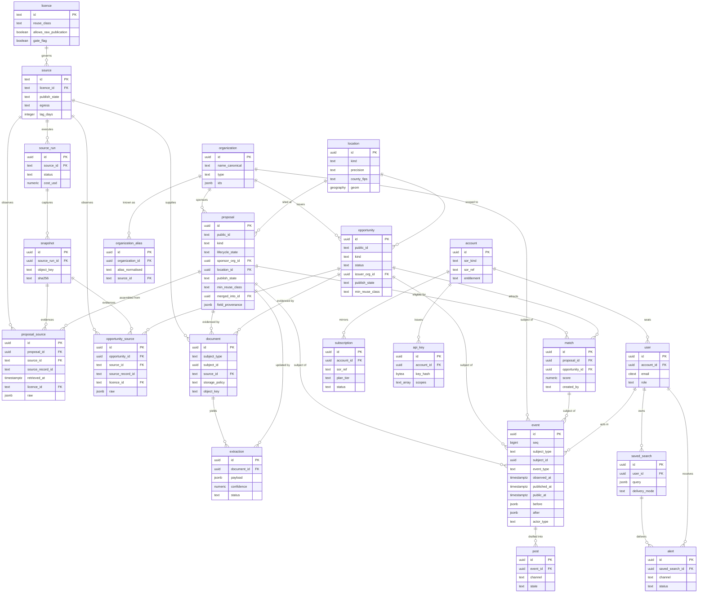

# Domain model and ERD

**Status:** Phase 2 draft v0 · 2026-09-12 · solutions-architect · reviewed by: owner (pending)
**Inputs:** `docs/20-architecture.md` (§2 components, §3 module contracts, §5 tiering, §7 auth, §9 CRM/ERP, §15
technology, §16 assumptions), `docs/02-data-sources.md` §4 (legal register) and §5 (schema seed),
`docs/10-prd-mvp.md` §4 (44 user stories), `data/sources.yaml` (64 sources, field guide).
**Companions:** `docs/20-architecture.md` (system), `docs/23-api-spec-outline.md` (API), `docs/adr/` (decisions).

This is the logical model. Physical DDL lives in Alembic migrations (ADR 0002/0003); the migration is the
executable twin of this document and must not diverge silently. Types below are Postgres 16 types.

Three rules govern everything here:

1. **Provenance is not optional.** Every row that originates outside the platform carries `source_id`,
   `source_url`, `retrieved_at`, `licence_id` (`CLAUDE.md`; `docs/02` §4). Fused entities carry the same four
   fields *per field value* in `field_provenance`, because a proposal is assembled from several sources with
   different licences and the gate has to work at field granularity, not record granularity (§8).
2. **The event log is the product.** Entity tables are a materialised fold of `event`. Anything derived
   (search index, feeds, matches, public views) is rebuildable from `event` + `snapshot` (`docs/20` §3.7, §13).
3. **Nothing is deleted.** Withdrawal, unmerge, unpublish, takedown and correction are all events (§6). The only
   destructive operation in the system is the personal-data redaction procedure (§6.6), which is itself an event.

## 1. Conventions

| Convention | Rule |
|---|---|
| Primary keys | `uuid` (v7, time-ordered) for domain entities; natural text keys for `source` (the `sources.yaml` id) and `licence`. `event` additionally has `seq bigint` identity for cursors. |
| Public identifiers | `public_id` (`prop_01JB…`, `opp_01JB…`) is what the API and URLs expose; internal `uuid` never leaves the store. `slug` gives the human-readable URL (US-201 AC3). |
| Timestamps | `timestamptz`, UTC. `*_at` = system time, `observed_at` = time in the world as the source states it, `*_date` = a date the source gives with no time. |
| Money | `numeric(18,2)` plus `currency char(3)`. Never float. |
| Capacity | `numeric(12,3)` MW / MWh, normalised in `pipeline/normalise` (`docs/20` §3.4). |
| Geography | PostGIS `geography(Point,4326)`; jurisdictions are ISO 3166-2 (`US-TX`, `GB-ENG`). |
| Enums | Postgres `text` + `CHECK` constraint, not native enum types — adding a vocabulary value must not need a lock-taking migration. Vocabularies are listed in §7 and mirrored in a `vocabulary` config table. |
| Raw payloads | `jsonb`. Raw is stored always, exposed conditionally (§8). |
| Nullability | Stated per field. "No" means `NOT NULL` in the migration. |
| Soft state | `merged_into_id`, `publish_state`, `revoked_at`, `anonymised_at`. No `DELETE` grants outside the redaction procedure. |

## 2. Entity-relationship diagram

Relationships the diagram flattens, stated precisely:

- `document`, `extraction` and `event` use a **polymorphic subject** (`subject_type` + `subject_id`) rather than
  one nullable FK per entity type. Referential integrity is enforced by a trigger plus a nightly orphan check,
  not by a foreign key. The trade-off is accepted because the alternative (one `event` table per subject type)
  breaks the single global feed that the product sells.
- `match` is the only many-to-many between the two object families, and it is an entity, not a join table,
  because it carries a score, a rationale and its own lifecycle (US-401, US-402).
- `account` ↔ `subscription` is a **mirror**, authoritative for nothing (`docs/20` §9). The system of record is
  external and replaceable; `sor_kind` + `sor_ref` are the only vendor-shaped values allowed outside the adapter.
