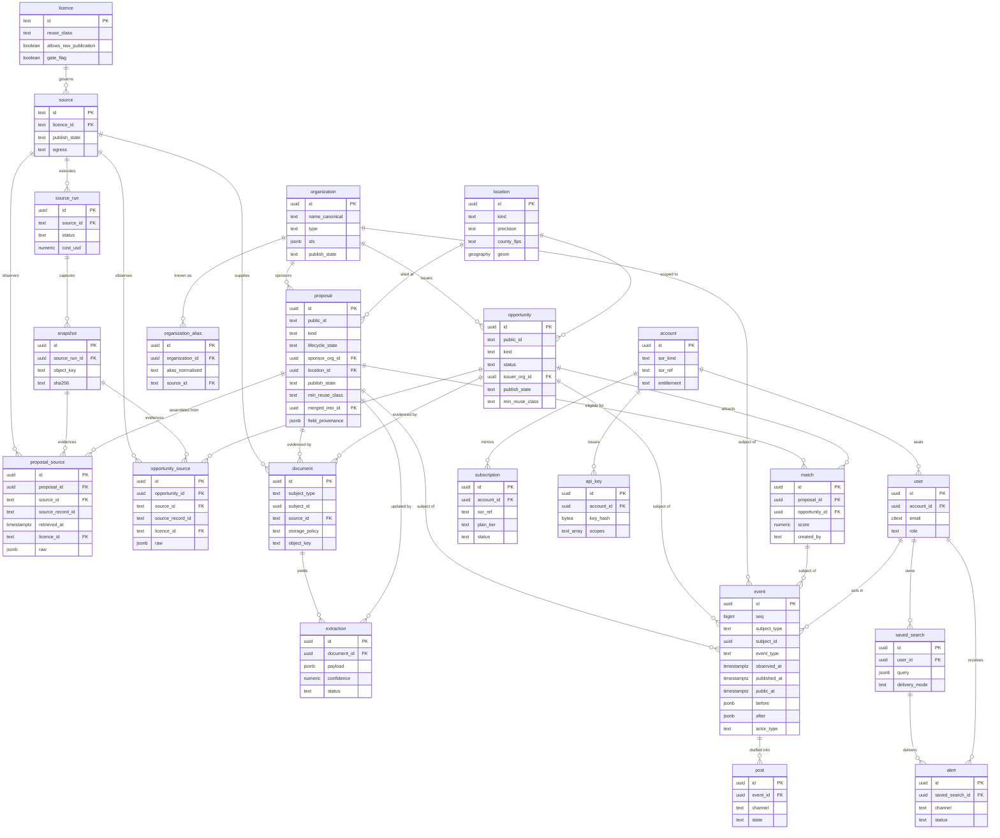
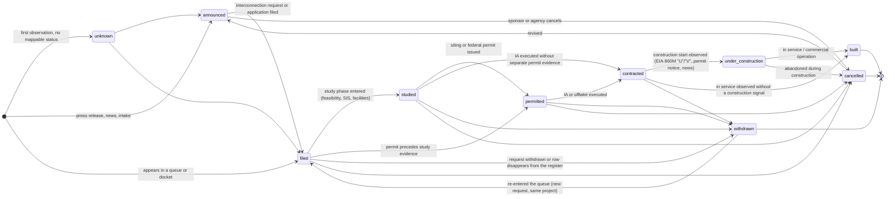
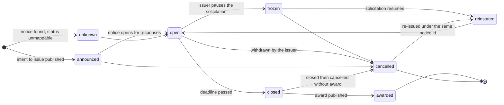

# Domain model and ERD

**Status:** Phase 2 draft v0 · 2026-09-12 · solutions-architect · reviewed by: owner (pending)
**Inputs:** `docs/20-architecture.md` (§2 components, §3 module contracts, §5 tiering, §7 auth, §9 CRM/ERP, §15
technology, §16 assumptions), `docs/02-data-sources.md` §4 (legal register) and §5 (schema seed),
`docs/10-prd-mvp.md` §4 (44 user stories), `data/sources.yaml` (64 sources, field guide).
**Companions:** `docs/20-architecture.md` (system), `docs/23-api-spec-outline.md` (API), `docs/adr/` (decisions).

This is the logical model. Physical DDL lives in Alembic migrations (ADR 0002/0003); the migration is the
executable twin of this document and must not diverge silently. Types below are Postgres 16 types.

Three rules govern everything here:

1. **Provenance is not optional.** Every row that originates outside the platform carries `source_id`,
   `source_url`, `retrieved_at`, `licence_id` (`CLAUDE.md`; `docs/02` §4). Fused entities carry the same four
   fields *per field value* in `field_provenance`, because a proposal is assembled from several sources with
   different licences and the gate has to work at field granularity, not record granularity (§8).
2. **The event log is the product.** Entity tables are a materialised fold of `event`. Anything derived
   (search index, feeds, matches, public views) is rebuildable from `event` + `snapshot` (`docs/20` §3.7, §13).
3. **Nothing is deleted.** Withdrawal, unmerge, unpublish, takedown and correction are all events (§6). The only
   destructive operation in the system is the personal-data redaction procedure (§6.6), which is itself an event.

## 1. Conventions

| Convention | Rule |
|---|---|
| Primary keys | `uuid` (v7, time-ordered) for domain entities; natural text keys for `source` (the `sources.yaml` id) and `licence`. `event` additionally has `seq bigint` identity for cursors. |
| Public identifiers | `public_id` (`prop_01JB…`, `opp_01JB…`) is what the API and URLs expose; internal `uuid` never leaves the store. `slug` gives the human-readable URL (US-201 AC3). |
| Timestamps | `timestamptz`, UTC. `*_at` = system time, `observed_at` = time in the world as the source states it, `*_date` = a date the source gives with no time. |
| Money | `numeric(18,2)` plus `currency char(3)`. Never float. |
| Capacity | `numeric(12,3)` MW / MWh, normalised in `pipeline/normalise` (`docs/20` §3.4). |
| Geography | PostGIS `geography(Point,4326)`; jurisdictions are ISO 3166-2 (`US-TX`, `GB-ENG`). |
| Enums | Postgres `text` + `CHECK` constraint, not native enum types — adding a vocabulary value must not need a lock-taking migration. Vocabularies are listed in §7 and mirrored in a `vocabulary` config table. |
| Raw payloads | `jsonb`. Raw is stored always, exposed conditionally (§8). |
| Nullability | Stated per field. "No" means `NOT NULL` in the migration. |
| Soft state | `merged_into_id`, `publish_state`, `revoked_at`, `anonymised_at`. No `DELETE` grants outside the redaction procedure. |

## 2. Entity-relationship diagram


```mermaid
erDiagram
  licence ||--o{ source : "governs"
  source ||--o{ source_run : "executes"
  source_run ||--o{ snapshot : "captures"
  source ||--o{ proposal_source : "observes"
  source ||--o{ opportunity_source : "observes"
  source ||--o{ document : "supplies"
  snapshot ||--o{ proposal_source : "evidences"
  snapshot ||--o{ opportunity_source : "evidences"

  proposal ||--o{ proposal_source : "assembled from"
  opportunity ||--o{ opportunity_source : "assembled from"
  organization ||--o{ organization_alias : "known as"
  organization ||--o{ proposal : "sponsors"
  organization ||--o{ opportunity : "issues"
  location ||--o{ proposal : "sited at"
  location ||--o{ opportunity : "scoped to"

  proposal ||--o{ document : "evidenced by"
  opportunity ||--o{ document : "evidenced by"
  document ||--o{ extraction : "yields"
  proposal ||--o{ extraction : "updated by"

  proposal ||--o{ event : "subject of"
  opportunity ||--o{ event : "subject of"
  organization ||--o{ event : "subject of"
  match ||--o{ event : "subject of"
  event ||--o{ post : "drafted into"

  proposal ||--o{ match : "eligible for"
  opportunity ||--o{ match : "attracts"

  account ||--o{ user : "seats"
  account ||--o{ subscription : "mirrors"
  account ||--o{ api_key : "issues"
  user ||--o{ saved_search : "owns"
  saved_search ||--o{ alert : "delivers"
  user ||--o{ alert : "receives"
  user ||--o{ event : "acts in"

  licence {
    text id PK
    text reuse_class
    boolean allows_raw_publication
    boolean gate_flag
  }
  source {
    text id PK
    text licence_id FK
    text publish_state
    text egress
  }
  source_run {
    uuid id PK
    text source_id FK
    text status
    numeric cost_usd
  }
  snapshot {
    uuid id PK
    uuid source_run_id FK
    text object_key
    text sha256
  }
  proposal {
    uuid id PK
    text public_id
    text kind
    text lifecycle_state
    uuid sponsor_org_id FK
    uuid location_id FK
    text publish_state
    text min_reuse_class
    uuid merged_into_id FK
    jsonb field_provenance
  }
  proposal_source {
    uuid id PK
    uuid proposal_id FK
    text source_id FK
    text source_record_id
    timestamptz retrieved_at
    text licence_id FK
    jsonb raw
  }
  opportunity {
    uuid id PK
    text public_id
    text kind
    text status
    uuid issuer_org_id FK
    text publish_state
    text min_reuse_class
  }
  opportunity_source {
    uuid id PK
    uuid opportunity_id FK
    text source_id FK
    text source_record_id
    text licence_id FK
    jsonb raw
  }
  organization {
    uuid id PK
    text name_canonical
    text type
    jsonb ids
    text publish_state
  }
  organization_alias {
    uuid id PK
    uuid organization_id FK
    text alias_normalised
    text source_id FK
  }
  location {
    uuid id PK
    text kind
    text precision
    text county_fips
    geography geom
  }
  document {
    uuid id PK
    text subject_type
    uuid subject_id
    text source_id FK
    text storage_policy
    text object_key
  }
  extraction {
    uuid id PK
    uuid document_id FK
    jsonb payload
    numeric confidence
    text status
  }
  event {
    uuid id PK
    bigint seq
    text subject_type
    uuid subject_id
    text event_type
    timestamptz observed_at
    timestamptz published_at
    timestamptz public_at
    jsonb before
    jsonb after
    text actor_type
  }
  match {
    uuid id PK
    uuid proposal_id FK
    uuid opportunity_id FK
    numeric score
    text created_by
  }
  account {
    uuid id PK
    text sor_kind
    text sor_ref
    text entitlement
  }
  subscription {
    uuid id PK
    uuid account_id FK
    text sor_ref
    text plan_tier
    text status
  }
  user {
    uuid id PK
    uuid account_id FK
    citext email
    text role
  }
  api_key {
    uuid id PK
    uuid account_id FK
    bytea key_hash
    text_array scopes
  }
  saved_search {
    uuid id PK
    uuid user_id FK
    jsonb query
    text delivery_mode
  }
  alert {
    uuid id PK
    uuid saved_search_id FK
    text channel
    text status
  }
  post {
    uuid id PK
    uuid event_id FK
    text channel
    text state
  }
```

Relationships the diagram flattens, stated precisely:

- `document`, `extraction` and `event` use a **polymorphic subject** (`subject_type` + `subject_id`) rather than
  one nullable FK per entity type. Referential integrity is enforced by a trigger plus a nightly orphan check,
  not by a foreign key. The trade-off is accepted because the alternative (one `event` table per subject type)
  breaks the single global feed that the product sells.
- `match` is the only many-to-many between the two object families, and it is an entity, not a join table,
  because it carries a score, a rationale and its own lifecycle (US-401, US-402).
- `account` ↔ `subscription` is a **mirror**, authoritative for nothing (`docs/20` §9). The system of record is
  external and replaceable; `sor_kind` + `sor_ref` are the only vendor-shaped values allowed outside the adapter.

## 3. Entities: field-level definitions

Every table below also has `created_at timestamptz NOT NULL DEFAULT now()` and, where rows are mutable,
`updated_at timestamptz NOT NULL`. They are omitted from the tables to keep them readable.

### 3.1 `proposal` — a supply-side object (one real-world project)

| Field | Type | Null | Meaning | Example |
|---|---|---|---|---|
| `id` | uuid | No | Internal key | `018f3c…` |
| `public_id` | text | No | API/URL identifier, immutable | `prop_01JBQ7Z8KD` |
| `slug` | text | No | Human-readable URL segment, set once at creation and never regenerated (as built 2026-10-07: a rename keeps the slug, so public URLs stay stable; docs/22 survivorship "slugs never change"). Title slug plus the shortest tail of `public_id` (≥6 chars) not already taken in the table (`services/ids.py::unique_slug`). A merged record's old slug resolves to its survivor (`services/api/merged_redirect.py`) | `gemini-solar-bess-clark-nv-7k2m9q` |
| `kind` | text | No | `generation \| storage \| load \| transmission \| pipeline \| lng \| nuclear \| ccs \| hydrogen \| other` (`docs/02` §5) | `storage` |
| `name_canonical` | text | No | Chosen display name after resolution | `Gemini Solar + Storage` |
| `sponsor_org_id` | uuid | Yes | FK `organization` — developer/IPP behind it | `018f3d…` |
| `technology` | text | Yes | Normalised technology token | `bess_li_ion` |
| `technology_raw` | text | Yes | Verbatim source value kept for audit | `Battery Energy Storage` |
| `capacity_mw` | numeric(12,3) | Yes | Nameplate/requested MW | `690.000` |
| `storage_mwh` | numeric(12,3) | Yes | Energy capacity where applicable | `1380.000` |
| `jurisdiction` | text | No | ISO 3166-2 | `US-NV` |
| `iso` | text | Yes | Market operator token where one applies | `CAISO` |
| `location_id` | uuid | Yes | FK `location` | `018f3e…` |
| `lifecycle_state` | text | No | §7.1 vocabulary; `unknown` when unmappable | `studied` |
| `status_raw` | text | Yes | Verbatim source status, unmapped values raise a DQ warning (`docs/20` §3.4) | `ACTIVE` |
| `identifiers` | jsonb | No | Resolution keys: `{eia_plant_id, eia_generator_id, queue_ids:[{iso,id}], ferc_dockets:[], nrc_dockets:[]}` | `{"queue_ids":[{"iso":"CAISO","id":"Q1234"}]}` |
| `proposed_online_date` | date | Yes | Source-stated commercial operation date | `2028-06-30` |
| `first_seen` | timestamptz | No | First observation across all sources | `2026-03-04T00:00:00Z` |
| `last_changed` | timestamptz | No | Latest event that changed a canonical field | `2026-09-11T06:12:00Z` |
| `publish_state` | text | No | `pending_review \| ingest_only \| api_only \| public \| unpublished` (US-905, US-1001 AC2) | `public` |
| `published_at` | timestamptz | Yes | When the record became visible to the live tier | `2026-03-04T07:00:00Z` |
| `public_at` | timestamptz | Yes | The only column the public predicate reads (§5.4). Equal to `published_at` on every row since 2026-09-21 — nothing is delayed | `2026-03-18T07:00:00Z` |
| `min_reuse_class` | text | No | Most restrictive `licence.reuse_class` across linked sources; drives §8 | `attribution` |
| `field_provenance` | jsonb | No | Per-field `{source_id, licence_id, retrieved_at, snapshot_id}` — the record-level provenance contract at field granularity | `{"capacity_mw":{"source_id":"us.iso.caiso.gen_queue",…}}` |
| `overrides` | jsonb | No | Fields pinned by a human decision: `{field:{value,event_id,set_at,user_id}}`; the normaliser skips them (§6.4) | `{"sponsor_org_id":{…}}` |
| `source_count` | int | No | Number of active `proposal_source` rows; shown in lists (US-101 AC1) | `3` |
| `created_by` | text | No | `pipeline \| user \| import` (US-1001 AC2) | `pipeline` |
| `resolution_confidence` | numeric(4,3) | Yes | Confidence of the weakest link that formed this entity | `0.94` |
| `merged_into_id` | uuid | Yes | Set when this record was absorbed by another; the row survives (§6.3) | `null` |
| `search_tsv` | tsvector | No | Generated column over name, sponsor, county, identifiers (US-103) | — |

### 3.2 `proposal_source` — one source's observation of a proposal

| Field | Type | Null | Meaning | Example |
|---|---|---|---|---|
| `id` | uuid | No | Internal key | `018f40…` |
| `proposal_id` | uuid | No | FK `proposal` | `018f3c…` |
| `source_id` | text | No | FK `source` = `sources.yaml` id | `us.iso.caiso.gen_queue` |
| `source_record_id` | text | No | Stable id in the source; content hash where the source has none (`docs/20` §3.1) | `Q1234` |
| `source_url` | text | No | Deep link to the row or its nearest addressable page | `https://www.caiso.com/…` |
| `retrieved_at` | timestamptz | No | Fetch time of the snapshot this came from | `2026-09-11T05:00:00Z` |
| `licence_id` | text | No | FK `licence` at time of retrieval | `caiso-tou` |
| `snapshot_id` | uuid | Yes | FK `snapshot` — the exact bytes this row was parsed from | `018f41…` |
| `raw` | jsonb | No | Parsed source row verbatim. **Gated by reuse class (§8)** | `{"Queue ID":"Q1234",…}` |
| `normalised` | jsonb | No | Canonical projection before fusion | `{"capacity_mw":690}` |
| `status_raw` | text | Yes | Source status string | `ACTIVE` |
| `first_seen` | timestamptz | No | First run in which this source record appeared | `2026-03-04T05:00:00Z` |
| `last_seen` | timestamptz | No | Last run in which it was present | `2026-09-11T05:00:00Z` |
| `gone_at` | timestamptz | Yes | Set when the row disappeared from the register (a signal, never a delete, `docs/20` §3.3) | `null` |
| `link_method` | text | No | `deterministic_key \| rule \| model \| user` | `deterministic_key` |
| `link_confidence` | numeric(4,3) | No | 1.0 for deterministic keys | `1.000` |
| `link_event_id` | uuid | No | FK `event` — the `source_linked` event that created this row | `018f42…` |
| `active` | boolean | No | False after an unlink/unmerge; the row is retained | `true` |

`opportunity_source` (§3.4) is the same shape with `opportunity_id`. They are separate tables rather than one
polymorphic table because they carry different normalised projections and are indexed differently.

### 3.3 `opportunity` — a demand-side object

| Field | Type | Null | Meaning | Example |
|---|---|---|---|---|
| `id` | uuid | No | Internal key | `018f45…` |
| `public_id` | text | No | API/URL identifier | `opp_01JBQ8A2M0` |
| `slug` | text | No | URL segment | `apsc-2027-all-source-rfp` |
| `kind` | text | No | `rfp \| foa \| tender \| auction \| loan_program \| procurement_notice \| program` (`docs/02` §5) | `rfp` |
| `issuer_org_id` | uuid | Yes | FK `organization` — utility, agency, MDB | `018f46…` |
| `title` | text | No | Notice title as issued | `2027 All-Source Request for Proposals` |
| `summary` | text | Yes | Derived summary; never a copied article body (`docs/02` §4) | `Up to 1,200 MW…` |
| `jurisdiction` | text | No | ISO 3166-2 or `US` for federal | `US-AZ` |
| `technologies` | text[] | No | Normalised tokens; empty array for all-source | `{solar_pv,bess,wind}` |
| `capacity_sought_mw` | numeric(12,3) | Yes | Where stated | `1200.000` |
| `budget_amount` | numeric(18,2) | Yes | Programme value where stated | `35000000.00` |
| `budget_currency` | char(3) | Yes | ISO 4217 | `USD` |
| `open_at` | date | Yes | Opening date | `2026-10-01` |
| `due_at` | timestamptz | Yes | Deadline with time zone where the notice gives one | `2026-12-15T22:00:00Z` |
| `status` | text | No | §7.2 vocabulary | `open` |
| `status_raw` | text | Yes | Verbatim source status | `Active` |
| `location_id` | uuid | Yes | FK `location` — service territory or delivery point | `018f47…` |
| `identifiers` | jsonb | No | `{grants_gov_number, ted_notice_id, sam_notice_id, solicitation_number}` | `{"ted_notice_id":"2026/S 174-…"}` |
| `first_seen`, `last_changed` | timestamptz | No | As §3.1 | — |
| `publish_state`, `published_at`, `public_at`, `min_reuse_class`, `field_provenance`, `overrides`, `source_count`, `created_by`, `merged_into_id`, `search_tsv` | — | — | Identical semantics to §3.1 | — |

### 3.4 `opportunity_source`

Identical to §3.2 with `opportunity_id uuid NOT NULL` in place of `proposal_id`. Same provenance quartet, same
`raw` gating, same `active`/`gone_at` semantics. A closed RFP disappearing from an issuer page sets `gone_at` and
produces a `closed` event only after the DQ partial-file check passes (`docs/20` §12).

### 3.5 `organization`

| Field | Type | Null | Meaning | Example |
|---|---|---|---|---|
| `id` | uuid | No | Internal key | `018f3d…` |
| `public_id` | text | No | API/URL identifier | `org_01JBQ8C4X1` |
| `slug` | text | No | URL segment | `nextera-energy-resources` |
| `name_canonical` | text | No | Preferred name | `NextEra Energy Resources, LLC` |
| `name_normalised` | text | No | Case/punctuation/suffix-stripped key for fuzzy matching | `nextera energy resources` |
| `type` | text | No | `developer \| ipp \| utility \| coop \| cca \| agency \| lender \| investor \| epc \| oem \| offtaker \| other` | `developer` |
| `country` | char(2) | No | ISO 3166-1 | `US` |
| `jurisdiction` | text | Yes | Home state/province | `US-FL` |
| `ids` | jsonb | No | `{lei, sam_uei, eia_utility_id, cik, duns}` (`docs/02` §5) | `{"lei":"5493…"}` |
| `website` | text | Yes | Primary domain | `https://www.nexteraenergyresources.com` |
| `is_curated_issuer` | boolean | No | True when this organisation is on the 50-issuer RFP list (US-303) | `false` |
| `parent_org_id` | uuid | Yes | FK `organization` — the direct accounting parent, one hop (migration 0011) | `018f3e…` |
| `parent_source_id` | text | Yes | FK `source` — which source stated the parent link | `global.gleif.lei` |
| `parent_as_of` | date | Yes | The date the parent link is stated as of (migration 0015) | `2019-02-08` |
| `parent_share_pct` | numeric(6,3) | Yes | The stake the parent holds, where a source states one (migration 0017) | `30.000` |
| `publish_state` | text | No | `pending_review \| ingest_only \| api_only \| public \| unpublished`, same vocabulary and CHECK as §3.1 (migration 0022, 2026-09-26). Default and backfill `public`: every organisation was already shown on every public surface with no record-level gate, so `public` is the only default that changes nothing visible; `pending_review` would have taken every company page down in the deploy that added the column. BTREE index on the column alone. No `published_at`/`public_at` pair: nothing on an organisation is time-gated | `public` |
| `first_seen`, `last_changed`, `merged_into_id`, `search_tsv` | — | — | As §3.1 | — |

**Organisation visibility (2026-09-26).** The §5.4 predicate for an organisation is its first clause
alone, `publish_state = 'public'`, identical on every tier: an organisation has no source link rows, no
`min_reuse_class` and no timing pair. An organisation that fails it answers the same `404` an unknown id does
on every `/v1/organizations` route, is absent from lists, search and the sitemap, and every edge that would
name it is **dropped rather than shown with the name withheld**, by §8 item 3's reasoning (the existence of
the row is itself a disclosure): `sponsor`/`issuer` embed `null`, the `asset_owner` edge is omitted, the
parent link is `null`, the ancestor chain stops below it, and it and everything below it leave
`subsidiaries`, the counts and every `scope=` walk. A social draft does not name it either. Admin reads
bypass all of it. Implementation: `services/api/visibility.py`, the organisation arm.

**The parent edge.** `parent_org_id` is one hop, not a chain, and the columns travel together: a company
page may render a parent only alongside the source that stated it and the date it was stated as of. Two sources
write them (docs/22 §17): GLEIF Level 2 (`global.gleif.lei`, CC0), which sets `parent_as_of` from the
relationship's own period start, and the curated file (`curated.organization_parents`), which leaves
`parent_as_of` NULL because a company page states a fact, not the date the ownership began. GLEIF wins where it
has a record and the curated loader defers to it, so the two are order-independent. The LEI itself lives in
`ids["lei"]`, written for both ends of every link GLEIF makes — never as a free-standing name match, which has
not been evaluated. Measured on the 2026-09-20 load: 298 links, 289 from GLEIF (all dated), 9 curated (none
dated); of 137 rooted trees, 130 are one level deep, 5 are two and 2 are three (the deepest are ENEL - SPA and
NEW JERSEY RESOURCES CORPORATION), and 9 organisations have a grandchild.

`parent_share_pct` (migration 0017, 2026-09-20) is **NULL on every row and nothing infers a value**. Neither
loaded source states a percentage — GLEIF Level 2 asserts accounting consolidation, which is a control claim
rather than a stake, and the curated file cites a company's own list of the systems it operates. The column
exists because the ownership dataset most likely to land next (Global Energy Monitor, subject to its licence)
models ownership as chains of percentage stakes above a 5% threshold, and a boolean-only edge would have to be
rebuilt to hold it. `0.000` and `100.000` are real values meaning what they say; NULL means "not stated". The
expensive half of that future change — a stake belonging to a *set* of parents rather than one — is deliberately
not taken, because no loaded source has produced a second parent for any organisation.

**Walking the edge.** `services/api/orgtree.py` walks it in both directions for the API's `scope` parameter
(`self` / `children` / `all`): breadth-first by level with a visited set, capped at 10 levels and 500
organisations, with every cap and every re-entered node reported in the response rather than applied silently.
The cycle guard is not hypothetical — two loaders write this column and neither sees the other's rows.

Organisations hold **no personal data**. Named individuals in filings are stored as `organization_alias` rows or
document references only (`docs/20` §11; `docs/02` §4 last row).

### 3.6 `organization_alias`

| Field | Type | Null | Meaning | Example |
|---|---|---|---|---|
| `id` | uuid | No | Internal key | `018f4a…` |
| `organization_id` | uuid | No | FK `organization` | `018f3d…` |
| `alias` | text | No | Spelling as it appeared | `NextEra Energy Resources LLC` |
| `alias_normalised` | text | No | Match key; unique per organisation | `nextera energy resources` |
| `kind` | text | No | `legal_name \| trade_name \| filing_spelling \| abbreviation \| former_name \| subsidiary` | `filing_spelling` |
| `source_id` | text | No | FK `source` where the spelling was seen | `us.ferc.elibrary` |
| `source_url` | text | No | Evidence link | `https://elibrary.ferc.gov/…` |
| `retrieved_at` | timestamptz | No | Fetch time | `2026-08-02T11:04:00Z` |
| `licence_id` | text | No | FK `licence` | `us-public-domain` |
| `confidence` | numeric(4,3) | No | Resolver confidence for the alias link | `0.87` |
| `created_by` | text | No | `pipeline \| model \| user` | `model` |

### 3.7 `location`

| Field | Type | Null | Meaning | Example |
|---|---|---|---|---|
| `id` | uuid | No | Internal key | `018f3e…` |
| `kind` | text | No | `point \| county \| state \| region \| service_territory` | `county` |
| `geom` | geography(Point,4326) | Yes | Representative point; **never a raw restricted-source coordinate on public surfaces** (US-104 AC3, §8) | `POINT(-115.0 35.8)` |
| `precision` | text | No | `exact \| county_centroid \| state_centroid \| country_centroid \| unknown` — what `geom` actually means. **Placement grade** (ADR 0008, derived, never stored): `exact` → `exact` (drawn as a point); `county_centroid`, `state_centroid`, `country_centroid` → `region` (drawn as the highlighted county/state/country polygon with a count, never a point); `unknown` → `none` (list, search, alerts only). `region_id` for the region grade is `county_fips`, `state_code` or `country` respectively | `county_centroid` |
| `county_fips` | char(5) | Yes | US county key. Set from the source row's own `county_name`/`state_code` against the vendored Census Gazetteer (`services/ingest/geocode.py`) whenever that resolves — for a `county_centroid` location and, separately, for an `exact` one whose source row also names a resolvable county — and left NULL otherwise; never inferred from `geom` (no point-in-polygon geocoder is vendored, 2026-09-15) | `32003` |
| `county_name` | text | Yes | Display name | `Clark` |
| `state_code` | text | Yes | ISO 3166-2 subdivision | `US-NV` |
| `country` | char(2) | No | ISO 3166-1 | `US` |
| `raw_place` | text | Yes | Verbatim place string from the source. **Gated (§8)** | `Sec 12 T24S R61E` |
| `source_id`, `source_url`, `retrieved_at`, `licence_id` | — | No | Provenance of the geocode | — |
| `geocoder` | text | Yes | `source_provided \| census_tiger \| gb_substation \| gb_settlement \| manual` — never a commercial geocoder whose terms forbid storage; `gb_substation` (2026-09-13) marks a NESO Connection Site resolved against the vendored NESO grid-supply-point gazetteer, a substation-level proxy stored at `county_centroid` precision; `gb_settlement` (2026-09-20) marks the fallback for a Connection Site that names a settlement rather than a Grid Supply Point, resolved against the vendored ONS Index of Place Names — a further step removed (the project is near a substation which is near that town), still `county_centroid`, only ever reached when the substation lookup missed, and only ever set when the caller supplied the source's own transmission-owner region and the matched place fell inside it | `census_tiger` |

### 3.8 `document`

| Field | Type | Null | Meaning | Example |
|---|---|---|---|---|
| `id` | uuid | No | Internal key | `018f4c…` |
| `subject_type` | text | No | `proposal \| opportunity \| organization \| none` | `proposal` |
| `subject_id` | uuid | Yes | Polymorphic subject | `018f3c…` |
| `source_id`, `source_url`, `retrieved_at`, `licence_id` | — | No | Provenance quartet | — |
| `snapshot_id` | uuid | Yes | FK `snapshot` when the document itself was snapshotted | `018f41…` |
| `title` | text | No | Document title or headline | `Order Issuing Certificate` |
| `doc_type` | text | No | `filing \| order \| notice \| rfp_document \| news_article \| press_release \| report \| other` | `order` |
| `published_date` | date | Yes | Date the issuer gives | `2026-07-18` |
| `identifiers` | jsonb | No | `{accession_number, docket_id, adams_id}` | `{"docket_id":"CP24-12"}` |
| `storage_policy` | text | No | `stored \| link_only \| headline_only` — news is never `stored` (`docs/02` §4) | `stored` |
| `object_key` | text | Yes | Object-storage path when `storage_policy = stored` | `docs/us.ferc.elibrary/2026/07/ab…pdf` |
| `content_type` | text | Yes | MIME | `application/pdf` |
| `byte_size` | bigint | Yes | Size | `2481032` |
| `sha256` | char(64) | Yes | Content hash | `9f2c…` |
| `page_count` | int | Yes | For citation spans | `34` |
| `text_extracted` | boolean | No | Whether pdfplumber/OCR text exists | `true` |
| `personal_data_flag` | boolean | No | Set when the document is known to contain filer contact details; drives redaction and retention (US-910) | `true` |
| `robots_opt_out` | boolean | No | DSM Art. 4 / robots signal observed at fetch; true blocks text extraction | `false` |

### 3.9 `extraction`

| Field | Type | Null | Meaning | Example |
|---|---|---|---|---|
| `id` | uuid | No | Internal key | `018f4e…` |
| `document_id` | uuid | Yes | FK `document` — null for extractions from a structured payload | `018f4c…` |
| `subject_type`, `subject_id` | text/uuid | No | Entity the extraction is about | `proposal` / `018f3c…` |
| `purpose` | text | No | Gateway purpose (`docs/20` §4.5): `extract \| adjudicate` | `extract` |
| `field_path` | text | Yes | Canonical field this proposes to set | `lifecycle_state` |
| `payload` | jsonb | No | Typed extraction result | `{"lifecycle_state":"permitted"}` |
| `confidence` | numeric(4,3) | No | Model or rule confidence | `0.91` |
| `citations` | jsonb | No | `[{document_id, page, span_start, span_end, quote}]` — required, an extraction without a citation is rejected | `[{"document_id":"018f4c…","page":3}]` |
| `model_alias` | text | Yes | `fast \| careful \| batch` — alias only, never a provider model id (`CLAUDE.md`) | `careful` |
| `prompt_template_id` | text | Yes | Template identifier | `extract.lifecycle` |
| `prompt_version` | text | Yes | Template version | `v3` |
| `model_call_id` | uuid | Yes | FK `model_call` (§4.4) for cost attribution | `018f4f…` |
| `status` | text | No | `proposed \| accepted \| rejected \| superseded` | `accepted` |
| `accepted_by_user_id` | uuid | Yes | Set when a human accepted below threshold | `null` |
| `applied_event_id` | uuid | Yes | FK `event` created when applied | `018f50…` |
| `source_id`, `licence_id` | text | No | Inherited from the document; gates the extracted value (§8) | — |

### 3.10 `event` — the append-only log

| Field | Type | Null | Meaning | Example |
|---|---|---|---|---|
| `id` | uuid | No | Stable event identifier exposed in the API | `018f50…` |
| `seq` | bigint | No | Identity column; the API cursor and the alert watermark | `4812993` |
| `subject_type` | text | No | `proposal \| opportunity \| organization \| match \| document \| source \| post \| user \| account \| api_key` | `proposal` |
| `subject_id` | uuid | No | Polymorphic subject | `018f3c…` |
| `event_type` | text | No | §7.3 vocabulary | `status_change` |
| `observed_at` | timestamptz | No | When it happened per the source; the partition key | `2026-09-10T00:00:00Z` |
| `recorded_at` | timestamptz | No | When the platform wrote it | `2026-09-11T05:04:12Z` |
| `published_at` | timestamptz | Yes | Live-tier visibility time; null while gated or unpublished | `2026-09-11T05:04:12Z` |
| `public_at` | timestamptz | Yes | The public predicate reads this column only (§5.4); `= published_at` on every event since 2026-09-21 | `2026-09-25T05:04:12Z` |
| `source_id`, `source_url`, `retrieved_at`, `licence_id` | — | Yes | Provenance quartet; null only for `actor_type = user` events | `us.iso.caiso.gen_queue` |
| `snapshot_id` | uuid | Yes | Evidence for machine-generated events | `018f41…` |
| `before` | jsonb | Yes | Prior values of the changed keys, or the full absorbed entity for a merge (§6.3) | `{"lifecycle_state":"filed"}` |
| `after` | jsonb | Yes | New values | `{"lifecycle_state":"studied"}` |
| `changed_keys` | text[] | Yes | Keys present in `before`/`after`, for cheap filtering | `{lifecycle_state}` |
| `actor_type` | text | No | `pipeline \| model \| user \| system` | `pipeline` |
| `actor_user_id` | uuid | Yes | FK `user` for human actions (the audit log, US-901 AC2) | `null` |
| `reason` | text | Yes | Required when `actor_type = user` (US-905 AC3) | `Duplicate of Q1234` |
| `confidence` | numeric(4,3) | Yes | For model-originated events | `0.88` |
| `reverses_event_id` | uuid | Yes | Set on `unmerge`, `unpublish`, correction (§6.3) | `018f4b…` |
| `run_id` | uuid | Yes | FK `source_run` | `018f39…` |
| `job_id` | text | Yes | Queue job identifier for tracing | `resolve:018f39…` |
| `idempotency_key` | text | No | `(source_id, source_record_id, event_type, hash(after))` — unique, makes re-runs free | `caiso:Q1234:status_change:9f2c…` |

**Reading `seq` in order (2026-10-06, backend audit 2026-09-30 F5; architect A5).** On Postgres `seq`
comes from the identity sequence (migration 0027), so seq order is the order values were *taken*, not
the order transactions *committed*. A load holds its transaction for up to 30 minutes; an admin edit
or a merge that takes a later seq and commits first is visible before it. A reader that moved its
watermark to the highest visible seq passed the load's lower seqs and never saw them. Measured on
Postgres 16 before the fix: with A holding seq 2 and B committing seq 3, the webhook, saved-search and
social watermarks all moved to 3, and `/v1/events?since=` returned 3 alone; seq 2 was never delivered.

Every watermark reader now stops at `stable_event_seq` (`services/db/event_horizon.py`), a bound no
open or future transaction can commit an event at or below:

- *Writers advertise.* A statement-level `BEFORE INSERT` trigger on `event` (migration 0032) runs, once
  per transaction, before the statement takes any value from the sequence. It reads the sequence's last
  value `L` and takes a shared transaction-level advisory lock keyed `0x455651 << 40 | L`. Every seq
  the transaction then takes is above `L`, and the lock lasts until it commits or rolls back. A
  savepoint rollback drops the lock and the once-per-transaction flag together.
- *Readers bound themselves.* Read the sequence's last value `S`, then the smallest advertised `L`
  still held (`pg_locks`), and use `min(S, L)`. A seq at or below the bound was taken before `S` was
  read, by a transaction that had already advertised: if it is still open its `L` lies below its
  seqs; if it has finished, its rows are visible to the reader's next statement. The bound is read
  before the statement that reads events, under READ COMMITTED.
- *Who reads it.* Webhook enqueue (`webhook_endpoint.watermark_seq`), saved-search alerts
  (`saved_search.watermark_seq`), social drafts (`worker_watermark`), the `/v1/events`,
  `/v1/bulk/events` and event-export statement, and the starting watermark of a new saved search or
  webhook. Not bounded: `POST /v1/webhooks/{id}/replay` (the caller names the range) and the admin
  run screens (not cursors).
- *SQLite.* Writers are serialised by the database lock and `seq` is `MAX(seq)+1` inside the writing
  transaction, so seq order is commit order; the bound is `MAX(seq)`.

Why this and not the alternatives. A time lag on the watermark is not a bound: a load transaction can
outlive any lag short of its 1,800 s timeout, and an abandoned thread (architect A9) can outlive that.
Allocating `seq` at commit (one sequencer, or a commit-time `UPDATE`) makes seq order commit order but
either serialises every event writer behind a 30-minute load or leaves `seq` unset until commit for
code that reads it inside the transaction. A transaction-id column with `pg_snapshot_xmin` tells a
reader which transactions are open but not which seqs they hold, so it still needs a per-reader
snapshot cursor in place of the integer `since` the API publishes. The advisory lock costs one
sequence read and one lock per writing transaction, and two single-row reads per reader (0.6 ms
per call on a local Postgres 16, measured).

Costs and limits. While a load is open, events other writers commit after it started wait for the
load to finish before readers and `/v1/events` show them; the delay is the load's length (minutes,
30 at most). The sequence must not cache values (`CACHE 1`, the default; migration 0032 refuses
otherwise). An advisory lock taken by unrelated code in the `0x455651 << 40` range would only hold
the bound lower while it is held. Proven in `tests/test_postgres.py` (CI's Postgres job) and, for the
SQLite ordering and the readers, `tests/test_event_horizon.py`.

### 3.11 `match`

| Field | Type | Null | Meaning | Example |
|---|---|---|---|---|
| `id` | uuid | No | Internal key | `018f52…` |
| `proposal_id` | uuid | No | FK `proposal` | `018f3c…` |
| `opportunity_id` | uuid | No | FK `opportunity` | `018f45…` |
| `score` | numeric(4,3) | No | 0–1 | `0.82` |
| `rationale` | jsonb | No | `{rules_passed:[…], rules_failed:[…], features:{…}}` (US-402 AC1) | `{"rules_passed":["technology","jurisdiction"]}` |
| `rationale_text` | text | No | Rendered plain-language explanation | `storage, TX, 50–500 MW, due in 45 days` |
| `rule_set_version` | text | No | Version of the versioned config that produced it (US-401 AC1) | `match-rules@v2` |
| `created_by` | text | No | `rule \| model \| user` | `rule` |
| `status` | text | No | `active \| removed \| superseded` | `active` |
| `first_matched_at` | timestamptz | No | When first emitted | `2026-09-11T05:06:00Z` |
| `last_evaluated_at` | timestamptz | No | Last recompute | `2026-09-12T05:06:00Z` |
| `removed_at` | timestamptz | Yes | Set with a `match_removed` event | `null` |
| `crm_lead_ref` | text | Yes | CRM lead id when routed (US-403 AC1); the only lead data the app stores | `hs-lead-88213` |

Per-user dismissals (US-402 AC2) live in the supporting table `match_dismissal (user_id, match_id, dismissed_at)`
so that a personal action never mutates global data.

### 3.12 `user`

| Field | Type | Null | Meaning | Example |
|---|---|---|---|---|
| `id` | uuid | No | Internal key | `018f55…` |
| `account_id` | uuid | No | FK `account` — a user belongs to exactly one account (`docs/20` §7) | `018f54…` |
| `email` | citext | Yes | Login identity; null after anonymisation | `ana@example.com` |
| `email_verified_at` | timestamptz | Yes | Magic-link or OAuth verification | `2026-09-01T10:00:00Z` |
| `name` | text | Yes | Display name; optional, minimum personal data (`CLAUDE.md`) | `Ana Ruiz` |
| `role` | text | No | `viewer \| member \| operator \| legal \| owner` (`docs/20` §7; `legal` added 2026-09-12 — US-905 AC1 requires a distinct role to clear a source gate flag, and conflating it with `owner` would make the licence gate unenforceable for anyone but the founder) | `member` |
| `status` | text | No | `active \| disabled \| anonymised` | `active` |
| `auth_provider` | text | No | `magic_link \| google` | `google` |
| `mfa_enforced` | boolean | No | True for `operator`/`owner` (**[A-10]**) | `false` |
| `marketing_consent` | boolean | No | Separate from transactional email | `false` |
| `consent_version` | text | Yes | Privacy notice version accepted | `privacy-2026-09` |
| `tos_version` | text | Yes | Terms version accepted | `tos-2026-09` |
| `last_login_at` | timestamptz | Yes | For US-901 AC1 | `2026-09-12T08:31:00Z` |
| `anonymised_at` | timestamptz | Yes | Deletion request completed (US-910) | `null` |
| `sor_kind` | text | Yes | `hubspot \| odoo \| erpnext \| twenty` (**[A-4]**) | `hubspot` |
| `sor_ref` | text | Yes | Contact id in the system of record | `hs-contact-4471` |

Personal data inventory columns: `email`, `name`, `last_login_at`, `sor_ref`. Any new column holding personal
data must be added to the inventory or the schema check fails (US-910 AC2).

### 3.13 `account` — the entitlement mirror

| Field | Type | Null | Meaning | Example |
|---|---|---|---|---|
| `id` | uuid | No | Internal key | `018f54…` |
| `name` | text | No | Customer name as shown in admin | `Meridian Capital` |
| `kind` | text | No | `personal \| organization` | `organization` |
| `organization_id` | uuid | Yes | FK `organization` when the customer is also in the graph | `null` |
| `entitlement` | text | No | `public \| pro \| api \| admin` — the resolved tier (`docs/20` §5) | `pro` |
| `entitlement_source` | text | No | `sor \| manual_grant \| trial` | `sor` |
| `entitlement_checked_at` | timestamptz | No | Cache stamp; TTL ≤ 15 min (US-602 AC1) | `2026-09-12T08:30:00Z` |
| `entitlement_stale` | boolean | No | Set when the adapter is unavailable; fails open 24 h then closed (`docs/20` §12) | `false` |
| `seats` | int | No | Purchased seats | `3` |
| `seats_used` | int | No | Active sessions/logins (US-602 AC2) | `2` |
| `sor_kind` | text | Yes | Vendor of the system of record | `hubspot` |
| `sor_ref` | text | Yes | Company id in the CRM | `hs-company-9912` |
| `billing_ref` | text | Yes | Customer id in the billing provider (Stripe) | `cus_QX…` |
| `status` | text | No | `active \| suspended \| closed` | `active` |

**Authoritative for nothing.** Every field above is a read model refreshed by webhook and by the nightly
reconciliation job (`docs/20` §9). Conflicts resolve system-of-record-wins.

### 3.14 `subscription` — mirror of the commercial record

| Field | Type | Null | Meaning | Example |
|---|---|---|---|---|
| `id` | uuid | No | Internal key | `018f56…` |
| `account_id` | uuid | No | FK `account` | `018f54…` |
| `sor_kind` | text | No | `stripe \| odoo \| erpnext` | `stripe` |
| `sor_ref` | text | No | Subscription id in the provider | `sub_1PX…` |
| `plan_code` | text | No | Provider plan identifier | `pro_seat_monthly` |
| `plan_tier` | text | No | `free \| pro \| team \| api` — maps to `account.entitlement` | `pro` |
| `status` | text | No | `trialing \| active \| past_due \| paused \| canceled` | `active` |
| `seats` | int | No | Seats on the plan | `3` |
| `current_period_start` / `_end` | timestamptz | No | Billing period | `2026-09-01` / `2026-10-01` |
| `cancel_at` | timestamptz | Yes | Scheduled cancellation | `null` |
| `mrr_amount` | numeric(18,2) | Yes | For metric M-13 | `450.00` |
| `currency` | char(3) | No | ISO 4217 | `USD` |
| `mirrored_at` | timestamptz | No | Last successful sync | `2026-09-12T03:00:00Z` |
| `drift_flag` | boolean | No | Set by reconciliation when local and remote disagree | `false` |
| `last_event_at` | timestamptz | Yes | Provider `created` time of the billing event last applied; an older event is ignored, because the provider does not deliver in order (migration 0032, backend audit 2026-09-30 F4). Null on rows written before 0032 | `2026-09-12T03:00:00Z` |

### 3.15 `saved_search`

| Field | Type | Null | Meaning | Example |
|---|---|---|---|---|
| `id` | uuid | No | Internal key | `018f58…` |
| `user_id` | uuid | No | FK `user` — owner | `018f55…` |
| `account_id` | uuid | No | FK `account` — for quota and entitlement | `018f54…` |
| `name` | text | No | User label; unique per user | `TX storage 50–500 MW` |
| `entity` | text | No | `proposal \| opportunity \| event \| match` | `proposal` |
| `query` | jsonb | No | Filter definition, not results (US-501 AC2) | `{"kind":["storage"],"jurisdiction":["US-TX"]}` |
| `query_hash` | char(64) | No | Dedupe and cache key | `3f1a…` |
| `delivery_mode` | text | No | `immediate \| daily \| weekly \| none`; default `daily` (US-502 AC1) | `daily` |
| `channels` | text[] | No | `{email}`, `{email,webhook}`, `{rss}` | `{email}` |
| `rss_token` | text | Yes | Unguessable token for a private feed URL | `rt_9f2c…` |
| `last_run_at` | timestamptz | Yes | Last matcher pass | `2026-09-12T06:00:00Z` |
| `watermark_seq` | bigint | No | Highest `event.seq` already considered; makes alerting exactly-once | `4812993` |
| `last_match_count` | int | No | For US-504 AC1 | `7` |
| `status` | text | No | `active \| paused` | `active` |

Quota: 25 per user, configurable (US-501 AC1).

### 3.16 `alert`

| Field | Type | Null | Meaning | Example |
|---|---|---|---|---|
| `id` | uuid | No | Internal key | `018f5a…` |
| `saved_search_id` | uuid | No | FK `saved_search` | `018f58…` |
| `user_id` | uuid | No | FK `user` — recipient | `018f55…` |
| `channel` | text | No | `email \| webhook` | `email` |
| `mode` | text | No | `immediate \| daily \| weekly` | `daily` |
| `window_start` / `window_end` | timestamptz | No | Event window covered | `2026-09-11T06:00Z` / `2026-09-12T06:00Z` |
| `event_seqs` | bigint[] | No | Events included; the join to content without copying it | `{4812990,4812993}` |
| `recipient` | text | Yes | Address at send time; redacted on deletion | `ana@example.com` |
| `subject` | text | Yes | Rendered subject | `7 new storage proposals in TX` |
| `provider_message_id` | text | Yes | Email provider id (US-502 AC4) | `re_9f…` |
| `status` | text | No | `queued \| sent \| bounced \| failed \| suppressed` | `sent` |
| `sent_at` | timestamptz | Yes | Delivery time; the metric M-5 source | `2026-09-12T06:02:00Z` |
| `unsubscribe_token` | text | No | One-click unsubscribe (US-502 AC3) | `ut_4a…` |
| `error` | text | Yes | Provider error | `null` |

Retention 12 months (`docs/20` §11), then rows are aggregated into counts and the recipient column is dropped.

### 3.17 `api_key`

| Field | Type | Null | Meaning | Example |
|---|---|---|---|---|
| `id` | uuid | No | Internal key | `018f5c…` |
| `account_id` | uuid | No | FK `account` | `018f54…` |
| `created_by_user_id` | uuid | No | FK `user` | `018f55…` |
| `name` | text | No | User label | `production-etl` |
| `prefix` | text | No | `bk_live` or `bk_test` (`docs/20` §7) | `bk_live` |
| `last4` | char(4) | No | Display aid; the secret is never stored | `f31a` |
| `key_hash` | bytea | No | SHA-256 of the full key; unique | `\x9f2c…` |
| `scopes` | text[] | No | `read:public`, `read:live`, `read:bulk`, `write:webhooks`, `admin:*` | `{read:live,read:bulk}` |
| `tier` | text | No | `public \| pro \| api` — inherited from the plan (US-701 AC3) | `api` |
| `rate_limit_per_hour` | int | No | Plan default, overridable per key (`docs/23` §6) | `6000` |
| `daily_quota` | int | Yes | Daily request cap | `50000` |
| `expires_at` | timestamptz | Yes | Optional expiry | `2027-09-01T00:00:00Z` |
| `last_used_at` | timestamptz | Yes | Updated at most once per minute | `2026-09-12T08:40:00Z` |
| `last_used_ip` | inet | Yes | Truncated to /24 (v4) or /48 (v6) | `203.0.113.0` |
| `revoked_at` | timestamptz | Yes | Revocation takes effect ≤ 60 s (US-701 AC1) | `null` |
| `licence_accepted_version` | text | No | API licence version accepted (US-704 AC2) | `api-licence-1.0` |
| `licence_accepted_at` | timestamptz | No | Acceptance time | `2026-09-05T14:22:00Z` |

### 3.18 `post`

| Field | Type | Null | Meaning | Example |
|---|---|---|---|---|
| `id` | uuid | No | Internal key | `018f5e…` |
| `channel` | text | No | `bluesky \| linkedin \| x` | `bluesky` |
| `event_id` | uuid | No | FK `event` — the change that justified the post (US-801 AC1) | `018f50…` |
| `subject_type`, `subject_id` | text/uuid | No | Denormalised for the review queue | `proposal` / `018f3c…` |
| `template_id` / `template_version` | text | No | Editorial template from `docs/32` | `status_change.permitted` / `v2` |
| `body` | text | No | Rendered text within channel limits | `Permit issued: Gemini…` |
| `link_url` | text | No | Detail page with UTM parameters (US-803 AC2) | `https://…?utm_source=bluesky` |
| `credit_line` | text | No | Source attribution rendered into the post (US-801 AC2) | `Source: CAISO` |
| `disclosure_label` | text | Yes | Automation label where the platform requires it (US-803 AC3) | `Automated post` |
| `state` | text | No | `draft \| approved \| scheduled \| published \| rejected \| withdrawn \| failed` | `draft` |
| `gate_checked_at` | timestamptz | No | Proof the licence/publish gate was evaluated before drafting (US-801 AC3) | `2026-09-11T05:07:00Z` |
| `approved_by_user_id` | uuid | Yes | Human approver; null only if the channel's `auto_publish` is on | `018f55…` |
| `auto_published` | boolean | No | True when published without human review | `false` |
| `scheduled_for` | timestamptz | Yes | Scheduled time | `2026-09-12T13:00:00Z` |
| `published_at` | timestamptz | Yes | Actual publish time | `null` |
| `external_post_id` | text | Yes | Id on the platform | `at://did:plc:…` |
| `reject_reason` | text | Yes | Required on reject (US-802 AC3) | `null` |
| `metrics` | jsonb | No | `{impressions, clicks, likes, reposts, fetched_at}` (US-803 AC2) | `{"clicks":14}` |
| `cost_usd` | numeric(10,4) | No | Per-post cost where the channel charges (X) | `0.2000` |

### 3.19 `licence`

The gate. One row per distinct licence or terms-of-use document, referenced by `source`, and copied onto every
observation row so that a later licence change cannot retroactively rewrite what was permitted at fetch time.

| Field | Type | Null | Meaning | Example |
|---|---|---|---|---|
| `id` | text | No | Stable key | `pjm-data-miner-restricted` |
| `name` | text | No | Display name | `PJM Data Miner 2 Terms of Use` |
| `url` | text | Yes | Canonical terms URL | `https://dataminer2.pjm.com/terms` |
| `reuse_class` | text | No | `open \| attribution \| noncommercial \| restricted \| unknown` (`sources.yaml` field guide; `noncommercial` added 2026-09-25 by migration 0020, `docs/26`) | `restricted` |
| `attribution_required` | boolean | No | Whether a credit line must render | `true` |
| `attribution_text` | text | Yes | Exact credit string the product renders (`docs/02` §4) | `Source: PJM Interconnection LLC` |
| `requires_link_back` | boolean | No | Whether a link to the source page is mandatory | `true` |
| `allows_derived_publication` | boolean | No | May normalised/derived fields be published | `false` |
| `allows_raw_publication` | boolean | No | May the raw row be rendered | `false` |
| `allows_api_redistribution` | boolean | No | May the data leave over the API | `false` |
| `allows_bulk_export` | boolean | No | May it appear in CSV/bulk exports | `false` |
| `allows_commercial_use` | boolean | No | Commercial reuse permitted. Must be `false` when `reuse_class = 'noncommercial'` (`ck_licence_noncommercial_no_commercial_use`, migration 0020); `false` on an `attribution` row means "not verified", because the manifest's `attribution` spans `open-attribution` and `attribution-restricted` register classes | `false` |
| `share_alike` | boolean | No | Copyleft obligation on derived datasets | `false` |
| `gate_flag` | boolean | No | An unmet gate (G-PJM, G-MISO, G-SPP, G-NYISO, G-ISONE; PRD §3.3) | `true` |
| `gate_name` | text | Yes | Which gate | `G-PJM` |
| `gate_cleared_at` / `gate_cleared_by` | timestamptz / uuid | Yes | Only a user with the `legal` role may set these (US-905 AC1) | `null` |
| `evidence_url` | text | Yes | Where the terms were read | `https://…` |
| `evidence_retrieved_at` | timestamptz | Yes | When they were read | `null` |
| `evidence_object_key` | text | Yes | Stored PDF/screenshot capture of the terms | `null` |
| `classified_by` | text | Yes | Reviewer (legal-compliance) | `null` |
| `contract_ref` | text | Yes | Signed licence reference where one exists | `null` |
| `expires_at` | timestamptz | Yes | Renewal date for paid licences | `null` |
| `notes` | text | Yes | Free text | `Redistribution License enquiry opened 2026-09-12` |

**Invariant L1:** a `source` may not move to `publish_state` `public` or `api_only` unless its licence has
`reuse_class IN ('open','attribution')`, `gate_flag = false`, and non-null `evidence_url`,
`evidence_retrieved_at`, `classified_by` (US-905 AC1). Enforced by a `CHECK` plus a trigger, not by the UI.
*Amended 2026-09-25 (`docs/26`):* the class list is the platform posture's — `('open','attribution')` under
`commercial`, plus `'noncommercial'` under `noncommercial` — computed by `services/posture.py` and read once at
process start by every gate (`Licence.is_publishable_class`, the loader, the registry, the API predicate).

**Invariant L2:** `licence_id` on an observation row is immutable. Re-classifying a source writes a new `licence`
row and future observations point at it; historical rows keep the licence that applied when they were fetched.

### 3.20 `built_plant` — operating plants as context (added 2026-09-14)

One row per operating generating plant, drawn *beneath* the proposals map as context (`docs/00-PLAN.md`
decision 2026-09-14). Not a proposal: no lifecycle, events, matches or resolution against queue rows. Sources
in licence order: EIA-860M "Operating" sheet (public domain) first; Global Energy Monitor (CC BY 4.0, TZ-ID
rows dropped, `docs/13` §2.2) later; OpenStreetMap never until counsel answers `docs/00-PLAN.md` open
question 7(b).

| Field | Type | Null | Meaning | Example |
|---|---|---|---|---|
| `id` | uuid | No | Internal key | — |
| `source_plant_id` | text | No | The source's plant key; unique with `source_id` | `6452` (EIA Plant ID) |
| `name`, `operator_name` | text | No / Yes | Plant name; operating entity | `Roscoe Wind Farm` |
| `technology` | text | Yes | Dominant class in the `pipeline.normalize.classify_tech` vocabulary | `wind` |
| `technology_raw` | text | Yes | The source's own label for that dominant class | `Onshore Wind Turbine` |
| `technologies` | jsonb | No | Raw technology → nameplate MW split across the plant's units | `{"Onshore Wind Turbine": 781.5}` |
| `capacity_mw` | numeric(12,3) | Yes | Sum of nameplate over operating units | `781.500` |
| `generator_count` | integer | No | Operating units at the plant | `627` |
| `earliest_operating_year` | integer | Yes | First unit's operating year | `2007` |
| `geom` | geography(Point,4326) | Yes | Source-supplied coordinate (public-domain source, so exact is allowed) | `POINT(-100.4 32.4)` |
| `state_code`, `county_name`, `country` | text, text, char(2) | Yes, Yes, No | As §3.7 | `US-TX`, `Nolan`, `US` |
| `source_id`, `source_url`, `retrieved_at`, `licence_id` | — | No | Provenance quartet | — |

### 3.22 `asset` — registry-sourced infrastructure with identity (ADR 0008, 2026-09-18; generalises §3.20)

One row per existing infrastructure asset from a public registry. Has a page and owners; has no lifecycle,
events, matches or alerts. `built_plant` rows migrate into this table as `asset_type = power_plant`
(migration 0009 renames the table and widens it; the §3.20 columns keep their meaning). A registry row whose
status is planned or under construction is a proposal, not an asset.

| Field | Type | Null | Meaning | Example |
|---|---|---|---|---|
| `id` | uuid | No | Internal key | — |
| `public_id`, `slug` | text | No | Public identity, as §3.2 (`asset_…` prefix); slug from name + state | `asset_01j…`, `roscoe-wind-farm-tx` |
| `asset_type` | text | No | `power_plant \| gas_pipeline \| gas_processing_plant \| gas_storage \| lng_terminal \| compressor_station \| ethanol_plant \| biodiesel_plant \| rng_project \| transmission_line \| substation \| refinery` (check constraint) | `power_plant` |
| `source_asset_id` | text | No | The source's own key; unique with `source_id` (was `source_plant_id`) | `6452` |
| `name` | text | No | Display name | `Roscoe Wind Farm` |
| `operator_name` | text | Yes | Operating entity as the source spells it (resolved edge lives in §3.23) | `Roscoe Wind Farm LLC` |
| `status` | text | No | `operating \| standby \| retired \| unknown` — the source's current status; never a lifecycle | `operating` |
| `technology`, `technology_raw`, `technologies` | text, text, jsonb | Yes | As §3.20; for non-generation types `technology` is the type's own class (`interstate`, `salt_cavern`, `landfill_gas`) | `wind` |
| `capacity_mw` | numeric(12,3) | Yes | Electrical capacity where the asset has one | `781.500` |
| `capacity_value`, `capacity_unit` | numeric(14,3), text | Yes | The registry's native capacity for non-electrical assets | `1200.000`, `MMcf/d` |
| `commissioned_year` | integer | Yes | First operating year (was `earliest_operating_year`) | `2007` |
| `unit_count` | integer | Yes | Generators, trains, tanks (was `generator_count`) | `627` |
| `geom` | geography(Point,4326) | Yes | Representative point; source-supplied for public-domain registries | — |
| `geom_line` | geography(MultiLineString,4326) on Postgres (migration 0013, 2026-09-19; was LineString in 0009); text (WKT) on SQLite | Yes | Line geometry for pipelines and transmission; used for pages and joins, not for drawing (lines are tiles). Multi-part because a pipeline row is the dissolve of its segments (EIA Atlas: one row per operator and pipeline type, 259 rows from 32,961 segments). Read and written as a `MULTILINESTRING(...)` WKT string on both dialects (`services/db/types.py::GeographyLine`) | `MULTILINESTRING((-104.28 40.99, …), (…))` |
| `attributes` | jsonb | No | The type's **objective feature set** only (ADR 0008 §4): e.g. `{"heat_rate_btu_kwh": 7150, "capacity_factor_2025": 0.41}` for plants; `{"diameter_in_mix": {...}, "miles": 412, "incidents_5y": 2}` for pipelines; `{"rin_pathway": "D3", "feedstock": "landfill_gas"}` for RNG. No valuation, tariff or contract fields | `{}` |
| `state_code`, `county_name`, `county_fips`, `country` | text, text, char(5), char(2) | Yes/Yes/Yes/No | As §3.7 | `US-TX` |
| `source_id`, `source_url`, `retrieved_at`, `licence_id` | — | No | Provenance quartet | — |
| `first_seen`, `last_changed` | timestamptz | No | Load bookkeeping | — |

Unique: (`source_id`, `source_asset_id`). Index: `asset_type`, `state_code`, `geom` (GiST on Postgres).
The GiST index over `geom` is `ix_asset_geom` and there is exactly one of it: migration 0007 created
`built_plant` with both an explicit `ix_built_plant_geom` and the implicit `idx_built_plant_geom` that
GeoAlchemy2 adds for a `Geography` column, 0009 renamed the table and dropped only the explicit one, and
Postgres maintained the orphan alongside `ix_asset_geom` until migration 0014 dropped it (verified on the
CI PostGIS, 2026-09-19). A migration that renames a table with a geography column has to drop the
`idx_<old table>_<column>` index by hand; nothing renames it for you.

Sources loaded at 2026-09-19 (`services/ingest/assets.py::ASSET_TYPE_SOURCE_IDS`): `power_plant` from
EIA-860M; `gas_pipeline`, `gas_processing_plant`, `gas_storage`, `lng_terminal` from the EIA Atlas natural gas
layers via `pipeline/context/eia_atlas.py` (the Atlas feature services answered `Token Required` that day, so
the bytes come from EIA's own shapefile zips on `eia.gov/maps/map_data/`; vintages 202001 / 2017 / 202012 /
202004, kept per row as `attributes.source_vintage`). The Atlas pipeline layer carries no name, diameter or
capacity, so a `gas_pipeline` row's `name` is the operator string, `technology` is `interstate | intrastate |
gathering`, `unit_count` is the segment count, `geom` is a vertex on the longest part, and `attributes` is
`{pipeline_type, segment_count, part_count, miles (geodesic, from the geometry), states_crossed, status_raw,
source_vintage}` — nothing the registry does not state or the geometry does not yield (ADR 0008 §4).
`gas_storage.capacity_value` is EIA-191 working gas in Mcf; `gas_processing_plant.capacity_value` is EIA-757
plant capacity in MMcf/d; `lng_terminal.capacity_value` is liquefaction Bcf/d for an export terminal, else
regasification Bcf/d. `source_asset_id` is the registry key where one exists (storage `ID`), the
`(operator, type)` slug for pipelines, and a content hash of name + state + county + coordinates for
processing plants and LNG terminals, whose registries have no key (and repeat names: two `Wheeler / TX`).

**Pipeline parts are chained at ingest (2026-09-20).** The Atlas pipeline layer is one shapefile network
split into 33,184 parts across the 259 rows (128 per row, 2,027 on the largest), and most of those parts
touch: a segment's end coordinate is exactly the next segment's start. Stored unchained they were expensive
at every zoom for a reason no tolerance could fix — Douglas-Peucker keeps both endpoints of every part, so at
zoom 4 (`services/api/lines.py::simplify_parts`) 35,226 of the 36,571 drawn vertices, 96%, were the
two-per-part floor. `pipeline/context/geo.py::merge_touching_lines` now chains parts whose endpoints coincide
at the stored 6-decimal precision into maximal runs before the WKT is written, reversing a part where that is
what makes it join. Measured on the recorded 2026-09-19 snapshot:

| | parts | stored vertices | zoom-4 parts | zoom-4 vertices | zoom-4 GeoJSON |
|---|---|---|---|---|---|
| before | 33,184 | 194,887 | 17,613 | 36,571 | 662.5 KB / 168.8 KB gzipped |
| after | 17,997 | 179,700 | 10,511 | 24,309 | 445.5 KB / 114.9 KB gzipped |

The GeoJSON column is geometry only — a `FeatureCollection` of the 259 rows with empty `properties`, so the
two figures differ by geometry alone. The served payload is larger: `services/api/assets.py::_line_feature`
adds the name, operator, length, `attributes` subset and the provenance quartet per feature.

**Only degree-2 nodes are joined.** Where three or more part-endpoints meet, every chain stops: welding two
of three branches into one part would assert a continuous run the source does not describe. Chaining greedily
*through* junctions instead would reach 11,945 parts and 19,955 zoom-4 vertices — measured, and not taken,
because the extra reduction is bought with invented topology (ADR 0008 §4, "nothing the registry does not
state or the geometry does not yield").

What the merge does not change, verified row by row against the unchained output of the same snapshot:
`miles` is identical on all 259 rows (the only vertices removed are duplicated joints; underlying drift
7.3e-12 miles), `states_crossed` is identical on all 259, and the distinct vertex set of every row is
identical. `attributes.part_count` now counts stored parts, not source segments; `segment_count` and
`unit_count` still count what the source shipped, so the two no longer agree and are not meant to.

What it does change: `geom`, the representative point, is the vertex nearest the midpoint of the *longest
part*, and merging makes the longest part longer. It moved on 131 of 259 rows (median 92 km, p90 458 km, max
1,197 km) — the midpoint of a continuous run rather than of an arbitrary segment, which is the improvement.
It remains a stored vertex of its own line on all 259 rows. **`state_code` changed on 30 rows**, all of them
multi-state pipelines crossing 2–16 states: 25 moved to a different state and 5 had previously fallen outside
every state polygon (offshore) and now land on land; none became null, and in all 30 the new state is one the
row's own `states_crossed` lists. On a multi-state interstate line `state_code` was always an arbitrary pick
among the states it crosses, and it still is — it is a convenience for filtering, not a claim that the asset
sits in one state.

**Feature keys written by `services/ingest/enrich.py` (features lane, 2026-09-19).** The loaders
write what a registry states about the asset itself; a second pass merges the *objective feature
sets* from three sources that are keyed by something other than the asset id, and it only ever adds
keys — the layer's own `attributes` (`miles`, `segment_count`, `source_vintage`, …) are untouched.
The call is `apply_context_features(session, data_root)`, idempotent, creating nothing.

| Key | Type | On | From | Meaning |
|---|---|---|---|---|
| `phmsa` | object | `gas_pipeline` | `us.phmsa.pipeline_operator_reports` | `{operator_id, operator_name, report_year, onshore_transmission_miles, miles_by_decade{unknown\|pre_1940\|1940s…2020s}, miles_by_diameter{4_or_less\|6\|8…56\|58_or_more\|other}, incidents_5y_total, incidents_5y_significant, incidents_5y_with_fatality\|injury\|ignition\|explosion, incident_years[], matched_on, source_id, source_url, retrieved_at, feature_flags[]}` |
| `rfs` | object | `ethanol_plant`, `rng_project` | `us.epa.rfs_public_data` | `{d_codes[], pathway_count, first_registered_year, facility_name, company_name, facility_type, matched_on, source_id, source_url, retrieved_at, feature_flags[]}` |
| `capacity_factor_<year>` | number \| null | `power_plant` | `us.eia.form923` | Net generation ÷ (`capacity_mw` × 8,760) for that data year |
| `heat_rate_btu_kwh_<year>` | number \| null | `power_plant` | `us.eia.form923` | Fuel MMBtu × 1,000 ÷ net generation MWh, **thermal plants only** |
| `net_generation_mwh_<year>`, `fuel_mmbtu_<year>` | number \| null | `power_plant` | `us.eia.form923` | The two filed inputs, so a reader can recompute or see why a derived value is null |
| `feature_flags` | array of strings | any | this pass | Why a derived key is null, namespaced by source (`eia923:…`); a merge rewrites only its own prefix |

Rules this pass follows, each of which shows up in the stored values:

- **Nothing is clamped.** A capacity factor over 1.05, or a heat rate outside 5,000–30,000
  Btu/kWh, is stored as `null` with a `feature_flags` entry naming the computed value; the inputs
  stay on the row. "We do not know" and "it is low" stay distinguishable (owner's objective-feature
  rule, ADR 0008 §4).
- **Thermal means it burns something.** EIA-923 fills the fuel column for hydro, wind and solar at
  the 3,412 Btu/kWh energy equivalence, so `fuel_mmbtu > 0` is not the test; a heat rate is written
  only when the plant reported a combustible fuel code, and a non-combustion plant gets no key and
  no flag.
- **Nulls that mean "not published".** `incidents_5y_significant` and `first_registered_year` are
  `null` on every row with a flag saying so: PHMSA publishes the significant flag in a file this
  environment cannot reach, and EPA's registration list states no registration date. Neither is
  inferred from the fields that *are* published.
- **`matched_on` records how the row was joined** (`org_key`, `alias_file`, `expanded_key` for
  PHMSA; `facility_name`, `company_name` for RFS), so a questionable feature can be traced to the
  rule that attached it. Measured on the 2026-09-19 load: PHMSA 92 of 259 `gas_pipeline` assets,
  EIA-923 13,910 of 14,659 `power_plant` assets, RFS 271 of 388 `ethanol_plant` and 48 of 1,851
  `rng_project` assets.

### 3.22a `asset_source` — one source's contribution to an asset (docs/24 §5(a), migration 0021, 2026-09-26)

One row per source record behind an `asset`, built to the `proposal_source` pattern (§3.2): `asset` keeps
its own `source_id`/`source_asset_id`/`source_url`/`retrieved_at`/`licence_id` unchanged (the primary
source's identity, predating this table), and this table adds the provenance quartet for **every**
contributing source, primary included, so a resolved asset's page can list every register that named it.

| Field | Type | Null | Meaning | Example |
|---|---|---|---|---|
| `id` | uuid | No | Internal key | — |
| `asset_id` | uuid | No | FK `asset` | — |
| `source_id`, `source_url`, `retrieved_at`, `licence_id` | — | No | Provenance quartet for this one source record | — |
| `source_record_id` | text | No | The source's own key for this row (`asset.source_asset_id`'s value on that row) | `NE-flint-hills-fairmont` |
| `is_primary` | boolean | No | True for the one row that set `asset.source_id`/`source_asset_id` (the source with coordinates, when the asset has one) | `true` |
| `match_method` | text | No | `deterministic_key` for the primary row (no ambiguity); `rule`/`model`/`user` for a fused secondary source (reuses `proposal_source.link_method`'s vocabulary) | `rule` |
| `match_score` | numeric(4,3) | Yes | Null for the primary row; the scored match for a fused one | `0.767` |
| `created_at` | timestamptz | No | — | — |

Unique: (`source_id`, `source_record_id`). Index: `asset_id`.

Landed for `ethanol_plant` first (`pipeline/context/ethanol_match.py`, `services/ingest/assets.py::
load_ethanol_plants`, docs/24 §11): matched on state, company name and city, tie-broken on nameplate
capacity, assigned globally greedy at a threshold chosen against `data/eval/ethanol_match_labels.csv`
(100% precision and recall measured against the real registries at the chosen threshold, docs/24 §11.2).
Measured 2026-09-26: 388 `ethanol_plant` rows (197 Atlas, 191 capacity report) resolve to 204 assets, 184
matched pairs and 20 single-source rows, every one of the 388 source records carrying its own link
(docs/24 §11.3). Every other asset type still loads exactly as before this migration and writes no row
here — the table is generic, adoption is one type at a time (`services/api/coverage.py::
resolved_asset_types` derives which types are actually resolved from this table's own contents, not from
its mere existence, so a second type's resolution landing later needs no edit there).

### 3.23 `asset_owner` — ownership and operation edges (ADR 0008, 2026-09-18)

| Field | Type | Null | Meaning | Example |
|---|---|---|---|---|
| `id` | uuid | No | Internal key | — |
| `asset_id` | uuid | No | FK `asset` | — |
| `organization_id` | uuid | No | FK `organization` (resolved through §3.5/§3.6 aliases; a new organisation is created when the resolver finds none) | — |
| `role` | text | No | `owner \| operator` | `owner` |
| `share_pct` | numeric(6,3) | Yes | Ownership share where the source states one (EIA-860 Schedule 4); NULL for operator edges and registries without shares | `50.000` |
| `as_of` | date | Yes | The source's reporting date | `2024-12-31` |
| `owner_name_raw` | text | No | The source's spelling, kept for audit | `NextEra Energy Resources, LLC` |
| `source_id`, `source_url`, `retrieved_at`, `licence_id` | — | No | Provenance quartet | — |

Unique: (`asset_id`, `organization_id`, `role`, `source_id`). Sources in order: EIA-860 Schedule 4 (`us.eia.860`,
shares), EIA-860M and EIA Atlas operator fields (`operator`), EPA LMOP/AgSTAR owner and developer fields, GEM
owner fields (CC BY, TZ-ID rows dropped). `organization.parent_org_id` (added in the same migration, nullable FK
to `organization`, with `parent_source_id`, plus `parent_as_of` since migration 0015) records the GLEIF Level 2
direct accounting parent where a match holds; the LEI itself goes in `organization.ids.lei`. See §3.5 for the
triple and docs/22 §17 for the match rule and its measured precision.

Loaded at 2026-09-19 (`services/ingest/midstream.py`, docs/22 §15): the EIA Atlas `Operator`/`Company` strings
become `operator` edges and the Atlas `Owner` strings (processing plants, LNG) become `owner` edges with a NULL
share, each edge carrying the layer's own provenance quartet; measured on the four layers, 1,126 operator and
457 owner edges over 1,157 assets, 628 organisations after `norm_org` dedupe. GLEIF Level 2 landed 2026-09-20
(`services/ingest/organizations.py`, docs/22 §17): 199 organisations linked to 105 parents on the dev store,
alongside the 9 the curated file `data/vendored/organizations/parents.yaml` links
(`parent_source_id = curated.organization_parents`, registered in `data/sources.yaml` §K; every row cites the
company statement it came from). The two are told apart by `parent_source_id`; GLEIF overwrites a curated row
where it has a record and the curated loader refuses to overwrite a GLEIF one. There is no overlap today —
GLEIF publishes no Level 2 record for any of the nine Tallgrass children — so every curated rule still does
work.

### 3.21 `ui_event` — identifier-free interaction counters (added 2026-09-14)

The context layer's purpose is engagement, so it ships with a measurement. A row is an allowlisted `name`
(`services/db/models.py::UI_EVENT_NAMES`), a small `props` bag and `occurred_at` — never a user id, session
id, IP address, user agent or referrer. That is the whole privacy design: with no identifier the row is not
personal data (GDPR art. 4(1)) and nothing is stored on the device (PECR reg. 6). The API rejects, not merely
omits, any property that looks like an identifier. Read as weekly counts per name on the admin ops page.

| Field | Type | Null | Meaning | Example |
|---|---|---|---|---|
| `id` | bigint identity | No | — | — |
| `name` | text | No | One of `map.layer_toggled`, `map.region_jumped`, `map.basemap_failed`, `auth.registered`, `alert.created` | `map.layer_toggled` |
| `props` | jsonb | No | Small, non-identifying: `layer`, `on`, `region`, `layers` | `{"layer": "plants", "on": true}` |
| `occurred_at` | timestamptz | No | Server time of receipt | — |

### 3.24 `interconnection_point` — where a proposal connects to the grid (migration 0026, 2026-09-28)

Owner decision 2026-09-28. A project **connects at** a substation bus or a tap on a line; it is not built
there, so this is not a `location` (§3.7) and never places a record on the map. Every US ISO queue carries the
point of interconnection only inside the raw row (`Interconnection Location`: ERCOT 1,778 rows, CAISO 2,278,
NYISO 1,804) and the NESO TEC register as `Connection Site` (2,198). The loader parses it on every proposal
load (`services/ingest/interconnection.py`, key rule and measurement in `docs/25` §1). One row per register
spelling group; `proposal.interconnection_point_id` (nullable FK, indexed) links a proposal to it.

| Field | Type | Null | Meaning | Example |
|---|---|---|---|---|
| `id` | uuid | No | Internal key | — |
| `public_id` | text | No | `poi_…`, unique; no slug (the display spelling can change as spellings are added) | `poi_01JBQ8K2P4` |
| `operator` | text | No | Market operator token of its proposals (`proposal.iso`), else the source's operator | `ERCOT` |
| `name_display` | text | No | The register's own spelling; the most common one when several group | `59903 Bearkat 345kV` |
| `name_key` | text | No | Grouping key (D-15); unique with `source_id` | `sub:bearkat\|345\|b59903` |
| `key_rule` | text | No | Version of the rule that derived `name_key` | `2026-09-28.1` |
| `voltage_kv` | numeric(8,3) | Yes | First voltage the text states (highest of a `275/132kV` group) | `345.000` |
| `bus_number` | text | Yes | Bus number the text states (ERCOT PSS/E) | `59903` |
| `kind` | text | No | `substation \| line_tap \| unknown` (CHECK) | `substation` |
| `jurisdiction` | text | Yes | Most common jurisdiction of its proposals | `US-TX` |
| `substation_asset_id` | uuid | Yes | FK `asset` (`asset_type = substation`), written by the substation crosswalk (lane G2); NULL until then | — |
| `source_id`, `source_url`, `retrieved_at`, `licence_id` | — | No | The naming register's provenance quartet; `retrieved_at` is the latest retrieval of any row naming it | — |

Unique: (`source_id`, `name_key`), `public_id`. Index: `operator`, `jurisdiction`; `proposal.interconnection_point_id`.
**No aggregate is stored** (D-16): queued MW and counts are computed per request over the proposals the caller's
tier may see. Visibility (D-17): the point's source and licence pass `source_permits`/`licence_permits` and at
least one proposal at it is visible at the tier (`services/api/visibility.py::interconnection_point_visibility_filter`).

## 4. Operational entities

These carry the pipeline's own state. They are as much a part of the product as the graph: source health,
cost per record and snapshot evidence are admin surfaces (`docs/20` §8) and licence-dispute evidence (§3.2).

### 4.1 `source` — the runtime mirror of `data/sources.yaml`

`data/sources.yaml` remains the editable manifest and the connector registry (`docs/20` §3.1). This table is
its loaded form plus mutable runtime state. A manifest load is idempotent: fields marked *manifest* are
overwritten from YAML on every boot, fields marked *runtime* are never touched by the loader.

| Field | Type | Null | Origin | Meaning | Example |
|---|---|---|---|---|---|
| `id` | text | No | manifest | `sources.yaml` id, primary key | `us.iso.caiso.gen_queue` |
| `name` | text | No | manifest | Display name | `CAISO Public Queue Report` |
| `jurisdiction` | text | Yes | manifest | ISO 3166-2 | `US-CA` |
| `category` | text | No | manifest | `generation_queue \| load_queue \| permit \| regulatory_docket \| funding \| procurement \| registry \| planning \| news \| aggregator \| social_channel` | `generation_queue` |
| `operator` | text | Yes | manifest | Publishing body | `California ISO` |
| `url` | text | No | manifest | Entry point | `https://www.caiso.com/…` |
| `access` | text | No | manifest | `api \| bulk_file \| html \| js_app \| pdf \| rss \| email \| wsdl` | `bulk_file` |
| `format` | text | Yes | manifest | Payload format | `xlsx` |
| `cadence` | text | No | manifest | `15-min \| daily \| weekly \| twice_weekly \| monthly \| quarterly \| annual \| realtime \| continuous` | `weekly` |
| `tier` | int | No | manifest | 1 = MVP, 2, 3 | `1` |
| `effort` | text | Yes | manifest | `S \| M \| L` | `S` |
| `egress` | text | No | manifest | `plain \| browser \| residential \| api_key` (`docs/20` §4.3; new YAML field proposed there) | `plain` |
| `connector` | text | Yes | manifest | Dotted path or gridstatus symbol | `gridstatus.CAISO.get_interconnection_queue` |
| `implemented` | boolean | No | runtime | False = manifest entry only, shown as "unimplemented" in admin | `true` |
| `licence_id` | text | No | manifest | FK `licence` | `caiso-tou` |
| `publish_state` | text | No | runtime | `ingest_only \| api_only \| public` (US-905 AC1) | `public` |
| ~~`lag_days`~~ | — | — | — | **Dropped 2026-09-21** (migration `0019`): nothing is time-delayed on any tier and there is no per-source knob to set one (§5.4) | — |
| ~~`lag_overrides`~~ | — | — | — | **Dropped 2026-09-21** with `lag_days` | — |
| `schedule_cron` | text | No | runtime | Derived from cadence, editable in admin | `0 6 * * 1` |
| `next_run_at` | timestamptz | Yes | runtime | Scheduler state | `2026-09-14T06:00:00Z` |
| `paused` | boolean | No | runtime | Operator pause (US-904 AC2) | `false` |
| `health` | text | No | runtime | `ok \| degraded \| failing \| blocked \| paused` | `ok` |
| `consecutive_failures` | int | No | runtime | Flag at 3 (US-904 AC3), dead-letter at 5 (`docs/20` §4.2) | `0` |
| `last_success_at` | timestamptz | Yes | runtime | Last `ok`/`unchanged` run | `2026-09-11T05:00:00Z` |
| `last_loaded_ts` | text | Yes | runtime | Snapshot token of the last run whose load committed; the next scheduled load replays every promoted run after it, oldest first (migration 0032, architect audit 2026-09-30 A6) | `20260911T050000Z` |
| `last_error` / `last_error_at` | text / timestamptz | Yes | runtime | Latest failure | `null` |
| `host` | text | No | manifest | Rate-limit bucket key | `www.caiso.com` |
| `max_rps` | numeric(6,3) | No | manifest | Host politeness limit (`docs/02` §7) | `0.500` |
| `max_concurrency` | int | No | manifest | Parallel fetches allowed | `1` |
| `enrichment_enabled` | boolean | No | runtime | Model enrichment on/off per source (`docs/20` §3.6) | `true` |
| `model_budget_usd_daily` | numeric(10,2) | Yes | runtime | Per-source daily budget (`docs/20` §4.5) | `2.00` |
| `cost_per_changed_record_30d` | numeric(10,4) | Yes | runtime | Rolling metric; threshold default USD 0.50 **[A-9]** | `0.0312` |
| `attribution_text` | text | Yes | manifest | Overrides `licence.attribution_text` where a source demands its own wording | `null` |
| `manifest_hash` | char(64) | No | runtime | Hash of the YAML entry; a change is an audited `source` event | `4b1e…` |

Guard: a connector whose source resolves to `category = aggregator` with `reuse = restricted` fails to register
(`docs/20` §4.3). Private aggregators therefore cannot be ingested even by accident.

### 4.2 `source_run`

| Field | Type | Null | Meaning | Example |
|---|---|---|---|---|
| `id` | uuid | No | Run identifier, carried on every log line and event. **One row per run** (**D-11**, **D-12**): the id is the run record's (`pipeline/connectors/runner.py`); an admin "run now" creates the row first and the job passes its id to the runner (`--run-id`), and the loader attaches to the fetch's row instead of adding one | `018f39…` |
| `source_id` | text | No | FK `source` | `us.iso.caiso.gen_queue` |
| `trigger` | text | No | `schedule \| manual \| backfill \| retry`, CHECK-enforced since migration `0025`. The scheduler records `schedule` (it passes `--trigger schedule` to the CLI and its value wins over the record's); a CLI run defaults to `manual`; admin "run now" passes `manual`/`backfill` through the job (**D-8**); a Procrastinate retry of the fetch job is its own row, recorded `retry` whatever started the first attempt (**D-13**) | `schedule` |
| `started_at` / `finished_at` | timestamptz | No / Yes | Wall clock | `2026-09-11T05:00:00Z` |
| `status` | text | No | `running \| ok \| unchanged \| partial \| failed \| blocked \| budget` (`docs/20` §3.2, §4.5, §12) | `ok` |
| `snapshot_id` | uuid | Yes | FK `snapshot` produced by this run | `018f41…` |
| `http_status` | int | Yes | Final HTTP status | `200` |
| `bytes` | bigint | Yes | Payload size | `1842019` |
| `egress_class` | text | No | Which pool ran it | `plain` |
| `rows_seen` / `rows_new` / `rows_changed` / `rows_gone` | int | No | Diff outcome (US-904 AC1) | `2278 / 12 / 31 / 4` |
| `events_emitted` | int | No | Events written downstream | `43` |
| `model_calls` | int | No | Gateway calls attributed to the run | `6` |
| `cost_usd` | numeric(10,4) | No | Model cost for the run (`docs/20` §6) | `0.1240` |
| `worker_seconds` | numeric(10,2) | No | Compute attribution | `41.20` |
| `dq_status` | text | No | `pass \| warn \| fail` | `pass` |
| `dq` | jsonb | No | Warning list: row-count delta, vocabulary drift, null spikes, duplicate keys (`docs/20` §10) | `{"row_delta_pct":-0.4}` |
| `error` / `error_class` | text | Yes | Failure detail and classification. `RunAbandoned`: a `running` row closed with no outcome from the connector (refused, the job failed first, or older than the 2-hour cutoff, **D-12**); a later real outcome still completes it | `null` |
| `attempt` | int | No | 1-based attempt number of the fetch job (`procrastinate` `job.attempts + 1`, **D-13**) | `1` |
| `dead_lettered` | boolean | No | `true` on the transient failure `FETCH_RETRY` will not retry again (`docs/20` §4.2; **D-13** on the attempt count) | `false` |
| `released_at` / `released_by` / `release_reason` | timestamptz / uuid FK `user` / text | Yes | Set when an operator releases a data-quality hold (`status = partial`, `dq_status = fail`) through `POST /admin/v1/source-runs/{run_id}/release` (migration `0025`); the same facts are in the audited `admin_edit` event. The row turns `ok` with the promoted diff counts once `release_held_run` has run (**D-9**) | `null` |

### 4.3 `snapshot`

| Field | Type | Null | Meaning | Example |
|---|---|---|---|---|
| `id` | uuid | No | Snapshot identifier | `018f41…` |
| `source_id` | text | No | FK `source` | `us.iso.caiso.gen_queue` |
| `source_run_id` | uuid | No | FK `source_run` | `018f39…` |
| `object_key` | text | No | `raw/{source_id}/{yyyy}/{mm}/{dd}/{sha256}.{ext}` (`docs/20` §3.2) | `raw/us.iso.caiso.gen_queue/2026/09/11/9f2c….xlsx` |
| `sha256` | char(64) | No | Content hash; equal to previous ⇒ run recorded `unchanged` | `9f2c…` |
| `byte_size` | bigint | No | Size | `1842019` |
| `content_type` | text | No | MIME as served | `application/vnd.openxmlformats-…` |
| `fetched_url` | text | No | Final URL after redirects | `https://www.caiso.com/…` |
| `http_status` | int | No | Status | `200` |
| `retrieved_at` | timestamptz | No | Fetch time — the `retrieved_at` copied onto every derived row | `2026-09-11T05:00:00Z` |
| `licence_id` | text | No | Licence in force at fetch time | `caiso-tou` |
| `parser_version` | text | Yes | Connector/parser version that read it | `caiso@1.4.0` |
| `record_count` | int | Yes | Parsed record count | `2278` |
| `previous_snapshot_id` | uuid | Yes | Diff baseline | `018f2f…` |
| `retention_class` | text | No | `full \| sampled \| expired` — 24 months full, then monthly samples **[A-7]** | `full` |
| `expires_at` | timestamptz | Yes | Object-storage lifecycle date | `2028-09-11` |

`snapshot` rows are kept forever even when the object is compacted; the row is the evidence that a fetch
happened, under which licence, and what it contained (`docs/20` §3.2, §12 licence dispute).

### 4.4 Supporting tables (named here, specified in the migration)

| Table | Purpose | Key fields |
|---|---|---|
| `job` | Postgres-backed queue (ADR 0004) | `id, type, key, payload, run_after, attempts, status, locked_by` |
| `model_call` | One row per gateway call (`docs/20` §4.5, US-909) | `id, purpose, subject_type, subject_id, source_id, alias, prompt_template_id, prompt_version, input_tokens, output_tokens, cost_usd, latency_ms, cache_hit, error` |
| `rate_bucket` | `UNLOGGED` sliding-window counters per key/IP (`docs/20` §7) | `bucket_key, window_start, count` |
| `session` | Revocable server-side sessions | `id, user_id, created_at, expires_at, revoked_at, ip_prefix` |
| `task` | Admin work queue (US-907, US-204, US-910, US-1001) | `id, type, subject_type, subject_id, status, assignee_user_id, notes` |
| `match_dismissal` | Per-user match dismissal (US-402 AC2) | `user_id, match_id, dismissed_at` |
| `webhook_endpoint` / `webhook_delivery` | API-tier webhooks (`docs/23` §9) | `url, secret_hash, events[], status` / `attempt, response_status` |
| `export` | CSV export jobs and their audit trail (US-603 AC3) | `id, user_id, query, row_count, object_key, expires_at` |
| `slug_history` | Old slugs → surviving entity, for 301s (US-201 AC3) | `slug, subject_type, subject_id` |
| `vocabulary` | Editable enum vocabularies and source-status mappings (§7.4) | `domain, value, label, sort_order, active` |

## 5. Keys, indexes and constraints

### 5.1 Uniqueness

| Constraint | Rationale |
|---|---|
| `proposal_source (source_id, source_record_id) WHERE active` | One live link per source record; the resolver's idempotency anchor |
| `opportunity_source (source_id, source_record_id) WHERE active` | Same |
| `event (idempotency_key)` | Re-running a stage cannot duplicate history (`docs/20` §3) |
| `snapshot (source_id, sha256)` | Unchanged fetches do not create new objects |
| `organization_alias (organization_id, alias_normalised)` | Alias set stays clean |
| `match (proposal_id, opportunity_id) WHERE status = 'active'` | One active match per pair |
| `api_key (key_hash)`, `user (email) WHERE status <> 'anonymised'`, `saved_search (user_id, name)` | Obvious |
| `proposal (public_id)`, `opportunity (public_id)`, `organization (public_id)`, and each `slug` | Stable URLs |

### 5.2 Indexes that the product depends on

| Index | Serves |
|---|---|
| `GIN (search_tsv)` on `proposal`, `opportunity`, `organization` | Free-text search, US-103 AC3 (< 500 ms p95) |
| `GIN (name_normalised gin_trgm_ops)` on `organization`, `organization_alias` | Fuzzy sponsor resolution (`docs/02` §5 key 5) |
| `GIN (identifiers jsonb_path_ops)` on `proposal`, `opportunity` | Exact queue-id / docket / EIA-id lookup, US-103 AC1 |
| `GIST (geom)` on `location` | Map bounding box, US-104 |
| `BTREE (publish_state, public_at DESC)` on `proposal`, `opportunity` | The public list query, US-101 |
| `BTREE (publish_state)` on `organization` (migration 0022) | The organisation arm of the visibility predicate; no `public_at` to order by |
| `BTREE (subject_type, subject_id, observed_at DESC)` on `event` | Detail-page timeline, US-202 |
| `BTREE (seq)` on `event` | API cursor and alert watermark, US-703 AC1 |
| `BTREE (public_at) WHERE published_at IS NOT NULL` on `event` | Public feed and RSS, US-503 |
| `BTREE (source_id, started_at DESC)` on `source_run` | Source health, US-904 |
| `BTREE (state, channel, created_at)` on `post` | Review queue, US-802 |

### 5.3 Partitioning

`event` is range-partitioned monthly on `observed_at` from day one (`docs/20` §13 step 5 assumes the key is
already there; creating the partitioned table later is a rewrite). `model_call` and `webhook_delivery` are
partitioned monthly on `created_at` and dropped by retention policy.

### 5.4 The visibility predicate

One function, used by every read path (US-601 AC1). Pseudocode over an entity or event row `r` for tier `t`:

```
visible(r, t, now) :=
      r.publish_state = 'public'                                    -- record-level gate (US-905)
  AND source_permits(r.source_id, t)                                -- source.publish_state ⊇ t
  AND licence_permits(r.licence_id, t, field_class)                 -- §8
  AND (t = 'public' ? r.public_at IS NOT NULL AND r.public_at <= now
                    : r.published_at IS NOT NULL AND r.published_at <= now)
```

~~`public_at` is materialised at write time from `lag(source_id, event_type)`.~~ **Amended 2026-09-19, closed
2026-09-21: there is no `lag()` function and no configuration behind it.** `public_at` is still a stored column,
still the only column the public predicate reads, and it is now written as `published_at` itself on every row of
every shape:

| Row | `public_at` | Since |
|---|---|---|
| `proposal`, `opportunity` | `= published_at` | 2026-09-19 (owner: the paywall is by shape, not by time) |
| `event`, from any source, of any type | `= published_at` | 2026-09-21 (owner: drop the ISO change-event delay) |

The column is kept rather than dropped because the predicate above is an index scan on it, and because a future
per-shape cut-off — if one is ever decided — lands there. What was *removed* is everything that could set it to
anything else: `data/sources.yaml`'s `change_event_lag_days`, the `source.lag_days` / `source.lag_overrides`
columns (migration `0019`), those fields on `PATCH /admin/v1/sources/{id}`, and the `relag` job this section
used to describe, which now has nothing to recompute. That is deliberate and is the same argument
`services/ingest/lag.py` already made for the record-level lag: a dormant per-source delay an operator could
switch back on re-creates exactly the promise the owner removed. Reintroducing one is a code change and an
owner decision. `tests/test_publication_is_never_time_delayed.py` fails if any part of the machinery returns.

Why the ISO delay went, in one line, since the reasoning is easy to lose: change events fire on three fields
that are all on the free-tier record payload, the record updated in the same transaction that withheld the
event, and a full daily sweep of the register cost 53 requests against the public tier's own 1,440 — so the
withheld event was recoverable from two public reads (`tests/test_free_tier_change_reconstruction.py`).

Migrations `0016` and `0019` recomputed `public_at` on every existing row, because it is stored, not computed:
without them a free reader would have kept waiting out a delay the owner had already abolished.

**What this does not change.** `licence_permits` is untouched: `restricted` and `unknown` sources remain
invisible on every non-admin tier, PJM included, and `source_permits` still requires `publish_state = 'public'`
for the free tier. The time gate and the licence gate were always orthogonal (`docs/20` §5) — tier answered
"how old", licence answers "at all" — and removing the first entirely cannot widen the second.
`services/api/visibility.py` was not edited for either decision, which is the proof;
`tests/test_licence_gate_survives_removing_the_delay.py` fails if it ever is in a way that loosens the licence
clause.

## 6. The event log

### 6.1 Append-only, enforced

- No role except `migration` holds `UPDATE`/`DELETE` on `event`. A `BEFORE UPDATE OR DELETE` trigger raises
  unless the session sets `bankable.redaction = on`, which only the redaction procedure (§6.6) does.
- Writes are transactional with the entity update and the outbound job inserts (`docs/20` §3.7): one commit
  gives a changed entity, its events and the alert/post/webhook/CRM jobs.
- `idempotency_key` makes re-running a stage a no-op, which is what allows any stage to be replayed from its
  snapshot (`docs/20` §3).

### 6.2 `before` / `after` payloads

- Both are objects keyed by **canonical field name**, never raw source columns. `changed_keys` lists the keys.
- Values are gated the same way as the entity: an event whose `after` touches a field whose provenance is a
  `restricted` source is not published to any tier that may not see that field (§8). The publisher computes the
  event's field classes at commit, not at read.
- Creation events carry `before = null`; `removed`/`gone` events carry `after = null` but never delete anything.
- `before` for a status change carries the prior value *and* the prior evidence pointer
  (`{lifecycle_state: "filed", _provenance: {source_id, snapshot_id}}`) so that a reversal restores provenance
  as well as value.

### 6.3 Reversible merges

Merging proposal B into surviving proposal A writes **one** `merged` event on A with:

```json
{
  "event_type": "merged",
  "subject_type": "proposal", "subject_id": "A",
  "before": { "surviving": { "...changed canonical fields of A before the merge..." },
              "absorbed":  { "id": "B", "public_id": "prop_…", "slug": "…",
                             "entity": { "...full row of B..." },
                             "proposal_source_ids": ["…","…"],
                             "match_ids": ["…"], "document_ids": ["…"] } },
  "after":  { "surviving": { "...canonical fields of A after the merge..." } },
  "actor_type": "model", "confidence": 0.86
}
```

B is **not deleted**. `B.merged_into_id = A` and `B.publish_state = 'unpublished'`; its `proposal_source` rows are
re-pointed to A with `link_event_id` set to the merge event. `slug_history` gains B's slug pointing at A so old
URLs 301 (US-201 AC3).

`unmerge` is therefore mechanical and total: create an `unmerge` event with `reverses_event_id` = the merge
event, clear `B.merged_into_id`, restore `B.publish_state`, move the listed `proposal_source` ids back, restore
A's fields from `before.surviving`, recompute both entities' `field_provenance`, `min_reuse_class` and matches,
and remove B's slug from `slug_history`. Invariant **M1**: every `merged` event must contain enough state to
execute this without reading any other row; a merge that cannot satisfy it is rejected in code and in tests.

**As built, `link_event_id` on re-pointed links (2026-10-07, `services/resolve/merge.py`).** `merge_proposal` sets
`link_event_id` to the merge event on every `proposal_source` row it re-points, and records each row's previous
value in `before.absorbed.proposal_source_link_event_ids` (`{link id: previous value or null}`). `unmerge` moves
back the links that still carry the merge's id, plus any listed link a later merge has since carried onward
(followed through each later merge's recorded previous value), and gives each its previous value back. A link
another unmerge has already returned is left where it is: after C into B, B into A, then C out, unmerging B no
longer takes C's links (before this change it did, because it moved every listed id). A merge stored before the
change has no previous-value map and its links were never stamped; its unmerge still moves its listed ids, as
before. Measured on the eval pull (docs/22 §13.7): 407 of 407 re-pointed links had no `link_event_id` before,
0 after. Departures from this section and §3.2, recorded rather than changed: (1) `link_event_id` is nullable in
the model and nothing writes `source_linked` events, so a link attached by its loader has null, not "the event that
created this row"; the column means "the merge that attached this row to its current record". (2) Finding links a
later merge carried onward reads that merge's event, so M1 ("without reading any other row") holds for in-order
unmerges only. (3) `organization_alias`, `asset_owner` and `match` have no `link_event_id`; an organisation merge
moves aliases and edges by the ids listed in its payload, and no merge moves matches or opportunity links
(`match_ids` is always empty and no opportunity merge exists).

### 6.4 Human decisions win

An event with `actor_type = user` on field *f* writes `entity.overrides[f] = {value, event_id, set_at, user_id}`.
The normaliser and the enricher skip overridden fields until a user clears the override. **Enforced 2026-10-06** (L-1 of the 2026-09-30 legal audit, which found that nothing read
`overrides` and every edit, privacy redactions included, reverted at the next load): the loader's update path
(`services/ingest/loader.py::_update_existing_entity`) neither writes nor re-stamps an overridden field (the
source's own value still lands on its link's `normalised` row, so clearing the override and reloading restores
it), and a merge (`services/resolve/merge.py::merge_proposal`) carries the absorbed record's overrides onto the
survivor where the survivor has none of its own for that field, records the survivor's previous column values in
`before.surviving.overrides_carried`, and `unmerge_proposal` restores them; an overridden `identifiers` takes no
carried `select_basis`. Every served surface prints an overridden field as stored, whichever source is hidden. Resolver decisions made
by a human on a candidate pair are recorded in `resolution_decision` (supporting table) and short-circuit later
automated adjudication of the same pair (`docs/20` §3.5).

### 6.5 Rebuild and replay

The entity tables are a fold of `event`; `event` is derivable from `snapshot` + parser + resolver version. Two
recovery levels: **replay** (re-fold events into entity tables — always safe, used after a bad deploy) and
**reprocess** (re-parse snapshots into events — used after a parser fix, and it writes new events rather than
rewriting old ones, so history keeps the mistake and the correction). Derived artefacts (search index, matches,
feeds, alerts watermarks) are rebuildable from either.

### 6.6 Redaction (the single exception)

A completed deletion request (US-910) runs a procedure that replaces personal-data values inside historical
`before`/`after` payloads with `"[redacted]"`, nulls `user.email`/`name`, revokes sessions and keys, suppresses
alerts, issues the system-of-record deletion through the port, and writes a `personal_data_redacted` event
carrying only an opaque subject id. Event ids, timestamps and structure survive so the audit chain is unbroken.

## 7. Lifecycle state machines

### 7.1 Proposal lifecycle

Vocabulary from `docs/02` §1 plus `unknown` for unmappable source values (`docs/10` §4, 216 blank SPP rows).


```mermaid
stateDiagram-v2
  direction LR
  [*] --> unknown: first observation, no mappable status
  [*] --> announced: press release, news, intake
  [*] --> filed: appears in a queue or docket
  unknown --> announced
  unknown --> filed
  announced --> filed: interconnection request or application filed
  filed --> studied: study phase entered (feasibility, SIS, facilities)
  studied --> permitted: siting or federal permit issued
  filed --> permitted: permit precedes study evidence
  permitted --> contracted: IA or offtake executed
  studied --> contracted: IA executed without separate permit evidence
  contracted --> under_construction: construction start observed (EIA-860M "U"/"V", permit notice, news)
  under_construction --> built: in service / commercial operation
  contracted --> built: in service observed without a construction signal
  under_construction --> cancelled: abandoned during construction
  filed --> withdrawn: request withdrawn or row disappears from the register
  studied --> withdrawn
  permitted --> withdrawn
  contracted --> withdrawn
  announced --> cancelled: sponsor or agency cancels
  filed --> cancelled
  studied --> cancelled
  permitted --> cancelled
  withdrawn --> filed: re-entered the queue (new request, same project)
  cancelled --> announced: revived
  built --> [*]
  withdrawn --> [*]
  cancelled --> [*]
```

Rules: the state is always the `after` value of the latest `status_change` event, or `unknown` (US-202 AC3, with
a nightly consistency check). Backward transitions are legal and common — a re-entered queue position is a
`filed` event, not a data error. Terminal states are absorbing only for the purpose of alerting; a later event
reopens them.

### 7.2 Opportunity lifecycle


```mermaid
stateDiagram-v2
  direction LR
  [*] --> unknown: notice found, status unmappable
  [*] --> announced: intent to issue published
  announced --> open: notice opens for responses
  unknown --> open
  open --> frozen: issuer pauses the solicitation
  frozen --> reinstated: solicitation resumes
  reinstated --> open
  open --> closed: deadline passed
  frozen --> cancelled
  open --> cancelled: withdrawn by the issuer
  announced --> cancelled
  cancelled --> reinstated: re-issued under the same notice id
  closed --> awarded: award published
  closed --> cancelled: closed then cancelled without award
  awarded --> [*]
  cancelled --> [*]
```

`reinstated` is retained as a state because US-301 AC1 lists it among the displayed statuses; it is transient and
resolves to `open` on the next observation. `closed` means "deadline passed, outcome unknown" and is the default
terminal state for the many notices that never publish an award (`docs/02` §4 news rules mean we rarely learn).

### 7.3 Event-type vocabulary

| Group | Types |
|---|---|
| Identity | `created`, `source_linked`, `source_unlinked`, `merged`, `unmerged`, `alias_added` |
| Proposal lifecycle | `status_change`, `filed`, `studied`, `permitted`, `contracted`, `built`, `withdrawn`, `cancelled` |
| Opportunity lifecycle | `announced`, `opened`, `closed`, `frozen`, `reinstated`, `cancelled`, `awarded`, `due_date_changed` |
| Field-level | `field_changed`, `capacity_changed`, `sponsor_changed`, `location_changed`, `extraction_accepted` |
| Matching | `match_added`, `match_removed`, `lead_created` |
| Publication | `published`, `unpublished`, `gate_cleared`, `licence_reclassified` |
| Operational | `source_health_changed`, `admin_edit`, `personal_data_redacted`, `key_issued`, `key_revoked` |

### 7.4 Source status → lifecycle mapping

Mappings live in versioned YAML next to each connector (`docs/20` §3.4) and are mirrored into `vocabulary` so the
admin panel can show them. The seed for the ISO queues:

| Source value | Maps to | Note |
|---|---|---|
| `ACTIVE`, `Active`, `In Progress` | `filed`, promoted to `studied` when a study document or milestone field is present | Most queue rows sit here |
| `COMPLETED`, `Completed`, `In Service` | `built` | gridstatus normalises the ISO variants |
| `WITHDRAWN`, `Withdrawn` | `withdrawn` | Also emitted when a row disappears (`docs/20` §3.3) |
| `SUSPENDED`, `On Hold` | `filed` with `status_raw` preserved | No separate state; the raw value is shown |
| blank / null | `unknown` | 216 SPP rows (`docs/01` §3.3); raises a DQ warning, not an error |
| Anything unmapped | `unknown` + DQ vocabulary-drift warning | Never silently coerced |

## 8. Licence and reuse-class gating

Gating is **orthogonal to tier and stricter** (`docs/20` §5). Tier answers "how old must this be"; licence
answers "may this leave the building at all, and in what form". Both are evaluated in the store layer; the public
API code path cannot construct a query without them, and a CI fixture containing a `restricted` source proves it
(`docs/20` §11).

Field classes, used by the predicate:

| Class | Fields |
|---|---|
| **derived** | `name_canonical`, `kind`, `technology`, `capacity_mw`, `storage_mwh`, `jurisdiction`, `iso`, `lifecycle_state`, `first_seen`, `last_changed`, counts and aggregates |
| **identifying** | `proposal_source.source_record_id` (queue id, docket number), `identifiers.*` |
| **raw** | `proposal_source.raw`, `opportunity_source.raw`, `status_raw`, `location.raw_place`, `event.before`/`after` whose only evidence is that source |
| **precise_geo** | `location.geom` where `precision = exact` |
| **document** | `document.object_key`, stored bytes, extracted text |

Behaviour by `licence.reuse_class`, for a source whose gate is clear:

| Class | Example sources | Public (delayed) | Pro / API (live) | Export & bulk | RSS & social |
|---|---|---|---|---|---|
| `open` | ERCOT, all US federal, EIA, grants.gov | everything, live — records and change events alike | everything | everything | everything |
| `attribution` | LBNL, GEM, NESO, TED, World Bank, curated issuers | everything, live, with the credit line rendered | everything + credit | everything + licence header row | credit line in every item and post |
| `attribution`, raw withheld | **CAISO** (`allows_raw_publication = false`) | derived + identifying; **no raw**, no `status_raw`, no exact coordinates — county centroid only; "view at source" link | same as public but live | derived columns only | derived only, credit CAISO, link out |
| `noncommercial` (added 2026-09-25, `docs/26`) | none yet; first candidate `us.tx.rrc.class_vi` | **while `PLATFORM_POSTURE=noncommercial`**: as `attribution` (everything, live, credit line + link rendered); **under `commercial`**: nothing, as `restricted` | same rule; paid tiers are to be suspended while the posture is noncommercial (`docs/26` precondition i) | **nothing**: `allows_bulk_export` and `allows_api_redistribution` are written `false` at load | as `attribution` while the posture admits it; nothing otherwise |
| `restricted` | **PJM** until a Redistribution License exists | **nothing** — no record, no event, no aggregate, no count | **nothing** (see §10, correction C-3) | nothing | nothing |
| `unknown` | **MISO, SPP, NYISO, ISO-NE** until terms are read and recorded | treated exactly as `restricted` (`CLAUDE.md`) | treated as `restricted` | nothing | nothing |

What the public tier may **not** show for a `restricted` or `unknown` source, stated as the implementation
checklist:

1. No row in `proposal`, `opportunity` or `organization` whose `min_reuse_class` is `restricted`/`unknown`.
2. No `event` whose `licence_id` resolves to such a licence, including in the global feed, RSS and webhooks.
3. No `proposal_source.raw`, `source_record_id`, `source_url`, `retrieved_at` from such a source — the Sources
   panel omits the row entirely rather than showing a greyed placeholder, because the existence of the row is
   itself a disclosure of the underlying register's contents.
4. No aggregate, count, map cluster or "N sources" number that includes it — `source_count` is computed over
   visible sources only.
5. No `post` draft (US-801 AC3) and no CSV row.
6. No `extraction` derived from a document supplied by that source.

The **mixed-provenance case** is the one that matters in practice: a proposal seen in both ERCOT (`open`) and PJM
(`restricted`) is published on the strength of the ERCOT evidence, with the PJM `proposal_source` row and every
field whose `field_provenance` points only at PJM removed from the response, and `min_reuse_class` computed over
**visible** sources. This is exactly why provenance is per field (§3.1) rather than per record. An entity whose
*only* evidence is restricted is invisible, full stop.

**Field-level enforcement (2026-10-06; QA-1 of the 2026-09-30 platform audit).** The paragraph above was not
implemented: unpublishing EIA-860M left its name, capacity, status text, plant ids and exact point on merged
records whose Sources panel then listed only ERCOT, `source_count` stayed 2, and organisations only EIA-860M named
stayed public. It is now, in one place, `services/api/visibility.py::GatedRecord`, built by every serialising
surface (record list and detail, bulk, CSV export, map features and totals, RSS items, alert and webhook
payloads, event subject names, interconnection-point rows and totals, social drafts). For each field a source
supplies, at the caller's tier:

1. an admin override is served as stored (§6.4);
2. else the stored value is served when its `field_provenance` source is one the tier may read (`source_permits`
   and `licence_permits`), and, for bulk and export, one whose licence permits that shape
   (`allows_api_redistribution`, `allows_bulk_export`);
3. else the value is re-derived from the readable links' own `normalised` rows, most recently retrieved first;
4. else it is withheld (`null`; a required field takes the loader's neutral placeholder). A field with no
   recorded provenance is served as stored only while every active link is readable.

`source_count` and `min_reuse_class` are computed over the readable links (checklist item 4), the placement is
withheld when its own source is not readable (the record is unplaced, never drawn at the hidden source's point),
`identifiers.select_basis` drops a hidden source's entry, and no `redactions[]` row names the hidden source (that
would be the item-3 disclosure). Sums a surface prints (interconnection-point totals, map clusters) are over the
served values. Admin views print the stored row. The **organisation** arm gains an evidence clause: an
organisation is public only when it is curated, has no alias row, or has an `organization_alias` row from a source
the tier may read, so one only a hidden source named is withdrawn with it (conservative: a second register that
spelled the name identically adds no alias, so such an organisation is hidden too). Tests:
`tests/test_source_unpublish_fields.py`, `tests/test_gated_record.py`; the nightly M-11 audit restates it
(`field_from_gated_source:<field>`, `served_field_leak:<field>`).

**Raw class at serialisation (2026-10-06; L-4).** The derived-only row's "no raw, no `status_raw`" is enforced by
the same object: `status_raw` and `technology_raw` are `null` wherever the source supplying the served value has
`allows_raw_publication = false`, with a `redactions[]` entry (`reason: licence`), on every surface. A coordinate
in a derived-only register's point-of-interconnection text is withheld from the point's served name
(`services/ingest/interconnection.py::withhold_coordinates`, at link time and at serve time).

**Known limits (2026-10-06).** List *filters and sorts* still read the stored columns: `q=` can match a record by
a hidden source's spelling and `capacity_mw[gte]`/sort can order by a hidden capacity, although neither value is
printed; the interconnection-point list's `active_mw` sort key is a SQL sum of stored values. Each is an
ordering/matching oracle on a hidden value, not a printed one; closing them needs the served values in SQL. Cost,
measured on the 11,098-proposal audit store (SQLite, 4-core host): with every source public the map and list
cost what they did (`/v1/proposals/geo` at zoom 4 p50 1.20 s against 1.16 s, `/v1/proposals?limit=200` 0.19 s
against 0.17 s), because whole-set surfaces skip the per-row gate when no source is hidden
(`visibility.source_split`) and select only rows whose provenance names a hidden source otherwise
(`visibility.hidden_provenance_clause`); with EIA-860M unpublished the map takes about 1.7 s against 0.95 s.

**Credit lines (2026-10-06; L-2, L-10).** The credit is the manifest's `attribution` field verbatim (plus its
`changes_statement`), written to `licence.attribution_text` with `licence_url` to `licence.url` on every load;
`Source: <operator>` is only the fallback for terms that name no credit. Pages print it unprefixed
(`web/templates/_macros.html`), feeds use it as `dc:creator`, and `/attribution` lists the geocoding gazetteers.
`docs/13` §6.3 and `scripts/check_manifest_licences.py` R5/R6.

**Manifest field (2026-09-18).** The row a source falls under is declared, not inferred: `data/sources.yaml`
carries `publication: raw_ok | derived_only | none` on every source alongside `reuse`. `raw_ok` is the plain
`open`/`attribution` row; `derived_only` is the "`attribution`, raw withheld" row and is what sets
`licence.allows_raw_publication = false` at load (CAISO, NYISO, AEMO, GDELT today); `none` is the only value a
`restricted`/`unknown` source may carry. `scripts/check_manifest_licences.py` fails when either field is more
permissive than the register's class or rule for that source (`docs/13` §6), and
`tests/test_manifest_licences.py` runs it in CI. The loader's older free-text match on "derived-only" in
`notes` remains only as a warned fallback for a manifest without the field.

**Restricted-precision rule at the API boundary (2026-09-18).** The `precise_geo` field class above is
enforced where a row is *served*, not only where it is loaded: a `location` stored `exact` whose licence has
`allows_raw_publication = false` (a licence reclassified after load, or a row loaded before the derived-only
override existed) is returned at its region grade — county centroid, else state centroid, else unplaced —
with `precision_reason = licence`, on every non-admin surface (record detail and lists, the proposals map,
`placement=` filtering, `nearby-proposals`, exports), and the stored coordinate is never read
(`services/api/geo.py::effective_placement`; SQL twin `services/api/visibility.py::location_exact_permitted`).
Assets go through the same `visible_asset_predicate` (licence class publishable, source on the surface) on
every read path, and an event is visible only when its subject record is (`event_visibility_filter` joins the
subject's own predicate), which is what makes item 2 of the checklist above hold for the global feed and RSS.

For `attribution` sources the credit line is not optional and not a UI concern: the API returns it
(`docs/23` §10), the page renders it, the CSV carries it as columns plus a header line (US-105 AC2, US-603 AC2),
the RSS item carries it (US-503 AC3) and the social post carries it (US-801 AC2). A response that omits the
attribution for a source present in the payload is a bug that fails the launch checklist (US-908).

## 9. Assumptions in this document

| Id | Assumption | Depends on | Effect if wrong |
|---|---|---|---|
| D-1 | ~~Public lag default **14 days**, per-source and per-event-type override, bounded 7–30~~ **Closed 2026-09-19 for records and 2026-09-21 for change events: there is no lag anywhere, and no knob (§5.4).** The 7-vs-14 argument in `docs/10` A-7 and `docs/20` A-8 is moot | Owner, paywall by shape, then the measurement that the surviving delay was defeatable | Migrations `0016` and `0019`; `services/ingest/lag.py` |
| D-2 | `restricted` and `unknown` sources are invisible on **every** non-admin surface, Pro included | `docs/10` §3.2/§3.3 (stricter) vs `docs/20` §5 (allows derived aggregates to Pro/API) | If the owner and legal-compliance accept derived aggregates for Pro, the §8 table gains a row; the mechanism already supports it |
| D-3 | `uuid` v7 keys with separate public ids | none | Cosmetic |
| D-4 | `event` partitioned monthly on `observed_at` from the first migration | `docs/20` §13 | Rewrite later if skipped |
| D-5 | Personal data is limited to `user` columns, `alert.recipient`, intake contact fields and `document.personal_data_flag` | legal-compliance inventory (`docs/10` §8.2) | Inventory grows; schema check (US-910 AC2) enforces it |
| D-6 | The app stores only `crm_lead_ref`, `sor_ref`, `billing_ref` from the system of record | `docs/20` §9, **[A-4]** | Adapter change only |
| D-7 | `location.geom` for restricted-source projects is always a county centroid, never an exact point | US-104 AC3, legal-compliance to confirm which sources | Precision field already carries the distinction |
| D-8 | *(2026-09-27)* `source_run.trigger` says who started the run: the caller's explicit value wins over the run record's, and the legacy `scheduled` the scheduler wrote from 2026-09-18 is rewritten to `schedule` by migration `0025`. Measured before: every scheduled row read `manual`, because the runner's default won in `infra/scheduler/jobs.py::record_source_run` | §4.2 vocabulary; `api/openapi.yaml` `SourceRun.trigger` | A new trigger value needs the CHECK, `SOURCE_RUN_TRIGGERS` and `pipeline/connectors/runner.py::RUN_TRIGGERS` changed together (`infra/scheduler/test_trigger.py` pins the last two) |
| D-9 | *(2026-09-27)* Releasing a data-quality hold lifts that one gate and nothing else: the held frame is promoted by the runner's own diff-and-store step, becomes the baseline the next run's drift is measured against, and is loaded through the ordinary `load_source` path, whose licence gate still applies; a gated source is refused (`422 gate_unmet`), and so is a run that is not held or that a later run with output has superseded (`409`). Before the route an operator needed a database edit, and because a held run's snapshot hash counts for the `unchanged` short-circuit, the source stayed held until its bytes changed | `docs/04` DA-6; `pipeline/connectors/dq.py`; `services/api/admin_sources.py` D12 | If a release should *not* reset the drift baseline, `release_held` would have to write the record with a status the DQ history skips; nothing else changes |
| D-10 | *(2026-09-27)* An annual source with a `release_month` in `data/sources.yaml` runs on the 2nd of the month **after** it; without one, in January as before. The month after, not the month of, because release months are known at month granularity and the day inside the month varies (EIA-860 2025 final on 2026-09-10; GHGRP RY2023 on 2024-10-15): a run on the 2nd of the release month would almost always precede the release and then wait a year | Cited release pages in `data/sources.yaml`; `infra/scheduler/cadence.py` | A release that slips past its month is missed for a year unless an operator runs the source by hand; the field is per source, so a chronically late source can name a later month |
| D-11 | *(2026-09-27)* One fetch plus its load is **one** `source_run` row, the one the scheduler writes for the fetch (`infra/scheduler/jobs.py::record_source_run`, under the run record's id). It is canonical because it alone carries what the readers need: the caller's trigger, the attempt, `dead_lettered`, the health update, the id a DQ-hold release looks up. The loader (`services/ingest/loader.py::_run_for_load`) attaches to that row (its events and DQ warnings point at it) and writes a row itself only when loaded standalone (CLI/dev path), under the record's id so a re-load reuses it. Measured before: every loaded run had two rows, so it appeared twice on `GET /admin/v1/source-runs` and its `rows_changed` counted twice in `GET /admin/v1/costs` | §4.2; `services/api/admin_sources.py` (runs screen, costs); `infra/scheduler/jobs.py` (health) | A reader that wanted "loaded" separately from "fetched" would need a column on the one row (e.g. `loaded_at`), not a second row |
| D-12 | *(2026-09-27)* Admin "run now" creates the run's row and the job completes that row: the job carries the id to the CLI (`--run-id`) and `record_source_run` completes a `running` (or abandoned) row in place. A refusal or a job that fails before the connector reports closes it `failed`/`RunAbandoned` without touching health; a `running` row older than **2 hours** (`services/api/admin_sources.py` `STALE_RUNNING_AFTER`: the first attempt's queue wait + execution lock up to 30 min + fetch up to 10 min is ≈ 40 min, times three) is closed by the run-now guard instead of blocking it. Measured before: the job wrote a second row and the first stayed `running`, so every later run-now of the source was refused `409` | `services/api/admin_sources.py` D13; `infra/scheduler/app.py::run_connector` | A fetch that legitimately queues for more than 2 hours (a worker outage) has its row marked abandoned early; its real outcome still completes the row when it arrives |
| D-13 | *(2026-09-27)* A Procrastinate retry of the fetch job is a separate run: its own row, `trigger = retry`, `attempt = job.attempts + 1` (Procrastinate's `attempts` counts attempts already made, 0 the first time); the attempt `FETCH_RETRY` will not retry is recorded `dead_lettered`. Procrastinate retries while `attempts < max_attempts`, so `max_attempts = 5` ran the job **six** times, one more failure than `docs/20` §4.2's "five failures → dead-letter". Since 2026-09-27 the policy is `max_attempts = 4`: five runs, waits 5/25/125/625 s (≈ 13 min), and attempt 5's failure is the dead letter (coordinator, matching the code to the §4.2 rule; §4.2's old list of waits, 25–3,125 s, could not come from Procrastinate's `exponential_wait ** (attempts + 1)` and was corrected) | `procrastinate.RetryStrategy.get_retry_decision` (3.9.0); `infra/scheduler/app.py` `FETCH_RETRY` | Changing `max_attempts` changes when `dead_lettered` is set and the backoff total (≈ 13 min now), nothing else |
| D-14 | *(2026-09-28)* A grid interconnection point is its own record (§3.24), not a `location` and not a field on `proposal`: many proposals share one, it has its own page, list and totals, and a project connects at a substation without being built there. `proposal.interconnection_point_id` is a plain FK; a proposal from two registers keeps the first register's point (the second does not re-point it) | Owner decision 2026-09-28; `services/ingest/interconnection.py::link_source_points` | If proposals are fused across registers and each register's POI must be kept, the FK becomes a link table (`proposal_interconnection_point` with its own provenance); the point table is unchanged |
| D-15 | *(2026-09-28)* A point is unique per **(`source_id`, `name_key`)**, not per ISO: one register is one naming space and its quartet gates the point exactly as it gates the proposals. The key keeps voltage and a stated bus number (a point is a bus: `Gates 230 kV` and `Gates 500 kV`, `8795 Roma` and `8796 Roma` stay apart) and sorts line endpoints. Measured on the dev store: 30 of 30 hand-checked groupings are one bus or line; with the bus number left out, 4 ERCOT substation groups and 2 line groups merged different buses (`docs/25` §1) | `docs/25` §1; `KEY_RULE_VERSION` | Misses, not false merges, are the known cost (a spelling that omits the voltage or bus stays a separate point); unifying across spellings, registers and voltages is the substation crosswalk's job (`substation_asset_id`), not this key's |
| D-16 | *(2026-09-28)* Point totals (queued MW, counts by lifecycle bucket and technology) are **computed per request over visible proposals**, never stored. A stored total would carry a hidden proposal's capacity (§8 item 4). "Active" is the public list's default view (announced through under construction); withdrawn = withdrawn or cancelled | `services/api/interconnection_points.py`; `web/viewmodels.py::ACTIVE_PROPOSAL_STATES` (pinned equal by a test) | If the per-request aggregate becomes slow at scale, a per-tier materialised view refreshed with the visibility inputs is the path, never a column on the point |
| D-17 | *(2026-09-28)* A point is visible only when its naming register passes `source_permits` and `licence_permits` **and** at least one proposal at it is visible at the tier; otherwise it is a 404 identical to an unknown id, and `interconnection_point_id=` on the proposal lists selects nothing, exactly as an unknown id | §8 item 3 (existence is a disclosure); `services/api/visibility.py` | None known; a PJM-named point stays dark on every non-admin tier (C-3) |
| D-18 | *(2026-09-28)* The POI text of a `derived_only` register (CAISO, NYISO) is published as the point's name. It is a normalised place name and voltage, the same class as `name_canonical` (served verbatim for those registers), not `location.raw_place` (a project's own place string, which stays gated) | §8 field classes; `data/sources.yaml` CAISO/NYISO `publication: derived_only` | If counsel reads the POI string as raw for a `derived_only` register, `name_display` is replaced by a name rebuilt from `name_key` for those sources; the key, totals and pages are unchanged |

## 10. Corrections to `docs/20`

These are contradictions found while writing this model. None is silently resolved here; each names what this
document did and what should change in `docs/20`.

| Id | Where | Contradiction | What this document assumed | Fix needed in `docs/20` |
|---|---|---|---|---|
| C-1 | `docs/20` §1, §2 boundary rule, §7 | Cross-references the CRM/ERP system of record as "§11"; the CRM/ERP section is **§9** and §11 is Security and privacy | Referenced §9 | Renumber the three references to §9 |
| C-2 | `docs/20` §4.1, §4.4, §7, §12 | Refer to "the scaling path in §15"; the scaling path is **§13** and §15 is Technology recommendations | Referenced §13 | Renumber four references to §13 |
| C-3 | `docs/20` §5 vs `docs/10` §3.2, §3.3, `CLAUDE.md` | §5 says PJM rows are "returned to `pro`/`api` only as derived aggregates with a link out"; the PRD puts PJM rows out of scope for **any public or Pro surface** until the licence is signed, and `CLAUDE.md` says PJM rows are not public until a licence exists | Took the stricter reading (D-2): invisible everywhere except admin | Either restate §5 to match the PRD, or have legal-compliance and the owner record explicitly that derived aggregates are permitted under PJM terms, with the evidence in `licence.evidence_url` |
| C-4 | `docs/20` A-8 vs `docs/10` A-7 | Default public lag is 7 days in `docs/20`, 14 days in the PRD | **Resolved 2026-09-19 and finally 2026-09-21: neither. Nothing has a lag at all** (owner, §5.4) | Closed |
| C-5 | `docs/20` §5 table vs `docs/10` US-901 AC1 | `docs/20` roles are `viewer \| member \| operator \| owner`; the PRD lists user "role" as `public \| pro \| api \| admin`, which are entitlements, not roles | Kept `docs/20`'s roles on `user.role` and put `public \| pro \| api \| admin` on `account.entitlement` | Note in the PRD that US-901 AC1's "role" column renders `user.role` + `account.entitlement` |
| C-6 | `docs/20` §3.4 / §4.3 | `egress` is described as a field the data-engineer will add to `data/sources.yaml`, but the topology already routes on it | Modelled `source.egress` as manifest-sourced with a default derived from `access` until the YAML field exists | No change to §4.3; the YAML change is a data-engineer task with a deadline in Sprint 1 |
| C-7 | `docs/20` §11 (personal data) vs US-1001 | §11 says filer contacts are never stored as contact records; the intake form deliberately collects a contact name and email | Intake contact fields live on `task` + the CRM through the port, never on `organization`, and are in the personal-data inventory | Add one sentence to §11 distinguishing *scraped* contacts (never stored) from *submitted* contacts (stored with consent, deletable) |
