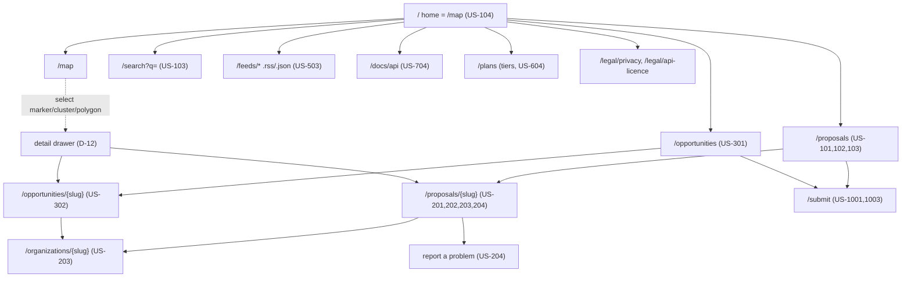
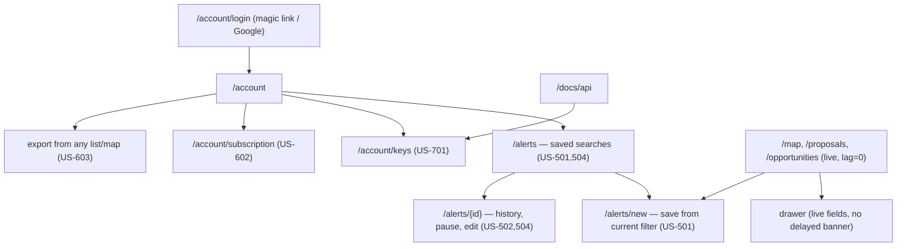
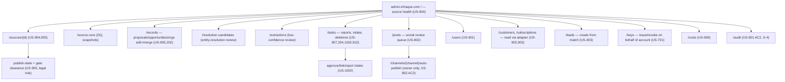
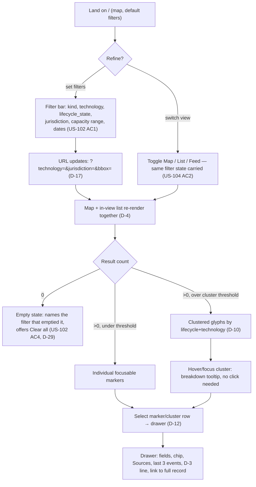
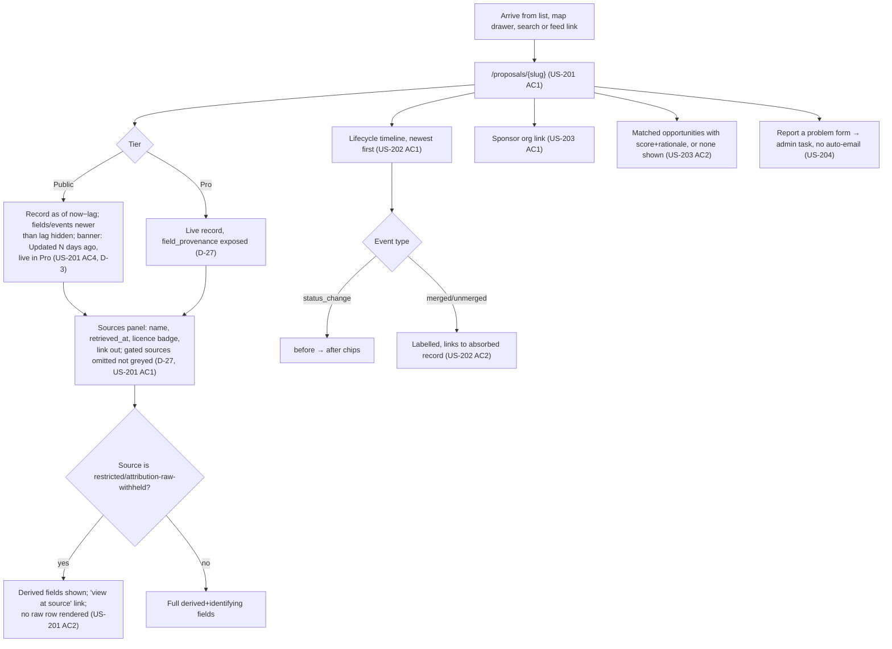
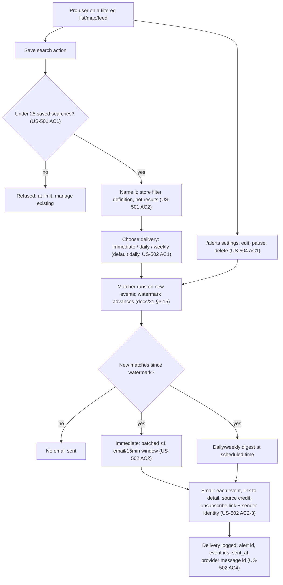
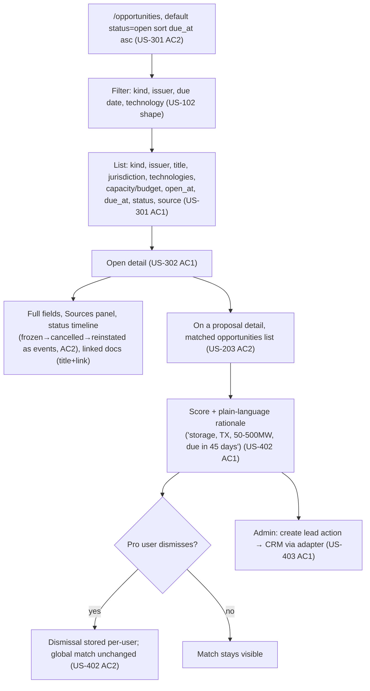
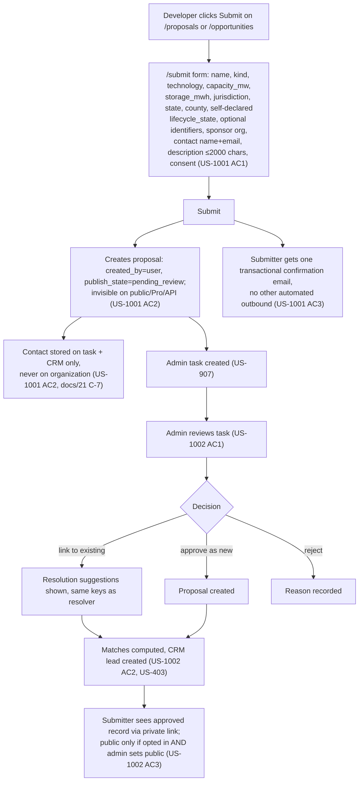
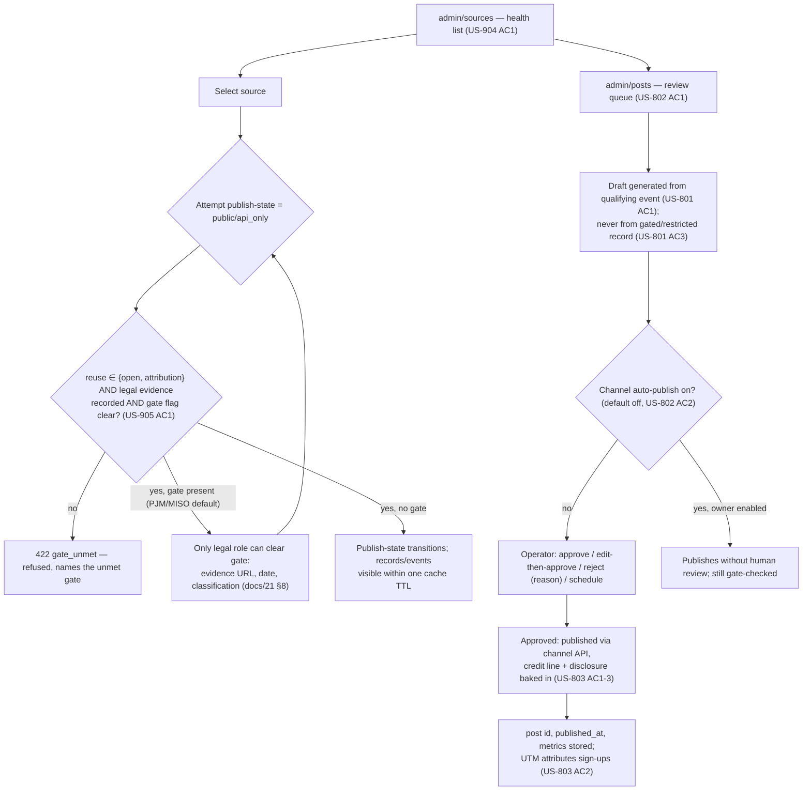

# Information architecture and flows

**Status:** Sprint 1 deliverable, v1 · 2026-09-12 · owner: product-designer · reviewed by: owner (pending)
**Authority:** `docs/04-standards.md` §2.2–2.3 (D-8…D-18); `docs/30-design-references.md` §4–§9 (typography, scales,
map model, motion, banned patterns) are the design inputs this doc builds screens against.
**Inputs:** `CLAUDE.md`; `.claude/agents/product-designer.md`; `docs/10-prd-mvp.md` §4 (US-101…US-1003);
`docs/23-api-spec-outline.md` §3–§4; `docs/21-data-model.md` §8.
**Product name used in this doc:** Infraque (placeholder, `docs/12-naming-shortlist.md`).

## 1. Three surfaces, one grammar

D-16 fixes the shape: Public (`infraque.com`, delayed, no key), Pro (same host, entitlement-gated routes, live),
Admin (`admin.` host, role `operator`/`owner`). D-4 and D-17 fix the rule governing every screen below: one filter
vocabulary, one URL grammar (`docs/23` §7), shared across list, map and feed, on every tier — a tier changes what
a query returns, never its shape. Primary nav is identical across public and Pro: **Proposals · Opportunities ·
Map · Feed · Alerts · API**. Depth ≤ 3 clicks to any record (D-16); breadcrumbs on every record page.

### 1.1 Public (delayed) sitemap



Every node is reachable from `/` in ≤ 3 clicks; `/map` is the landing surface per the owner's map-first decision
(`docs/00-PLAN.md`, US-104), with `/proposals` and `/search` as co-equal entries into the same filtered result set
(D-4) — the map is not "browse" with search as a separate mode, it is one more view of the same query.

### 1.2 Pro (live) sitemap

Adds an entitlement-gated layer over the same routes (`lag=0`, more fields, `docs/23` §3.2):



Pro reuses every public route; the only new top-level surfaces are `/account` and `/alerts`. A Pro user's `/map`
is the identical URL a public visitor sees, with `lag_days = 0` in the envelope (`docs/23` §10) — no separate
"Pro map" page exists, per D-4.

### 1.3 Admin sitemap



Admin nav order follows `docs/23` §4's grouping exactly: Sources → Records → Resolution/Extraction → Tasks →
Posts → Users/Customers → Keys/Costs/Audit. Every admin write is an audited event (S-4); nothing here is reachable
without `operator`/`owner` role and the `admin.` host's second factor (S-2).

## 2. Navigation model: map and search as co-equal entries

D-8…D-14 govern this. The nav bar is not "Proposals, Opportunities, **Map**" with Map as a third list — Map is
the home route (`/`), carrying the same filter rail `/proposals` and `/search` render inline. List ↔ map ↔ feed
preserve `?kind=&technology=&lifecycle_state=&jurisdiction=&bbox=…` verbatim (D-17, US-104 AC2); a "View as: Map ·
List · Feed" control sits beside the filter bar, not in a menu (US-104 AC1–AC2).

Placement precedence (D-8, US-104 AC1): `exact` → marker; `county_centroid` → centroid marker, visibly labelled;
state-only → state aggregate marker plus a side-list row; no geography → "Unplaced (N)", never dropped. Validated
as a shipped pattern by Interconnection.fyi's county/state toggle (`docs/30` §2.3).

Restricted-precision (D-9, US-104 AC3): a record whose only geometry provenance is `restricted`/`unknown` never
renders an exact point on public or Pro surfaces regardless of source precision — county centroid, drawer states
"location shown at county level (source licence)" (`docs/30` §7, §2.13).

Clustering (D-10, US-104 AC4): ≤500 visible records → individual focusable markers; above it, server clusters
from `/v1/proposals/geo?bbox&zoom` carrying `{count, lifecycle_state_counts, technology_counts, capacity_mw_sum}`.
Glyph = size (count) + chip colour/label (dominant lifecycle family) + shared icon (dominant technology,
consolidated per Flightradar24, `docs/30` §2.12) — never a bespoke icon per fine-grained value.

Selection (D-12): marker, cluster-row or polygon opens a drawer, not a navigation — `role="dialog"`, focus trap,
fields, chip, Sources, last three events, D-3 line, link to the full record; `Escape`/close returns focus.

Keyboard/screen-reader path (D-14, US-104 AC5): a synchronised "in view" list, reachable by skip link — arrow
keys pan, `+`/`-` zoom, `Enter` opens the focused marker, roving tabindex ≤500 rendered, `aria-live="polite"`
announces "N proposals, M opportunities in view" debounced 500ms; above 500, the list is the primary path.

## 3. Page inventory

| Page | Surface | Purpose | PRD stories | API reads | Tier-gated elements |
|---|---|---|---|---|---|
| `/map` (home) | Public/Pro | Map-first browse, filters, in-view list | US-104, US-101, US-102 | `GET /v1/proposals/geo`, `/v1/opportunities` (polygon) | D-3 delay banner (public); exact points withheld for restricted sources (D-9) at any tier |
| `/proposals` | Public/Pro | Filtered, sorted list | US-101, US-102, US-103 | `GET /v1/proposals` | Rows past the lag hidden on public (US-101 AC3); gated-source rows never present (AC4) |
| `/proposals/{slug}` | Public/Pro | Canonical record, provenance, timeline | US-201, US-202, US-203, US-204 | `GET /v1/proposals/{id}`, `/events`, `/sources`, `/matches` | US-201 AC4 "as of now−lag" banner; Sources panel omits gated rows (D-27); `field_provenance` Pro+ only |
| `/opportunities` | Public/Pro | Filtered, sorted opportunity list | US-301 | `GET /v1/opportunities` | Same tier rules as US-101 AC3–4 |
| `/opportunities/{slug}` | Public/Pro | Record, provenance, status timeline, matches | US-302, US-402 | `GET /v1/opportunities/{id}`, `/events`, `/sources` | Linked documents = title+link only (no article bodies, `docs/02` §4) |
| `/organizations/{slug}` | Public/Pro | Company page: summary line by role and type, map of every asset with geometry, assets grouped by role then type, parent/subsidiaries, proposals, opportunities, sources of those records | US-203 AC1, US-303 | `GET /v1/organizations/{id}`, `/assets`, `/proposals`, `/opportunities`; `GET /v1/assets?organization=` when asset rows carry no geometry | None beyond list-level tier rules; no lag (assets are public-domain / CC BY) |
| `/assets/{slug}` | Public/Pro | Existing-asset page (ADR 0008): fields by type, static map (SVG, MapLibre-enhanced), attributes, owners/operators, nearby exact-grade proposals with distance, sources | US-104, US-203 | `GET /v1/assets?slug=`, `/v1/assets/{id}/nearby-proposals` | None; no lag |
| `/search` | Public/Pro | Free-text + identifier search | US-103 | `GET /v1/proposals?q=`, `/v1/opportunities?q=` | Same as list |
| `/alerts` | Pro | Saved searches, delivery mode, history | US-501, US-502, US-504 | `GET/POST/PATCH/DELETE /v1/saved-searches`, `/v1/alerts` | Pro-only route; entitlement check (US-602) |
| `/account` | Pro | Seats, subscription, keys, export log | US-602, US-603, US-701 | `GET /v1/me`, `/v1/keys` | Pro/API scopes; billing read-through CRM adapter |
| `/docs/api` | Public/Pro | Generated API reference | US-704 | `api/openapi.yaml` (Redoc) | Licence-acceptance gate before key creation |
| `/feeds/*` | Public | RSS/JSON Feed twins of every list | US-503 | Same list endpoints, `.rss`/`.json` | Feed title states "N days delayed" (D-28) |
| `admin/sources` | Admin | Source health, cadence, gate | US-904, US-905 | `GET/PATCH /admin/v1/sources`, `/source-runs` | `legal` role required to clear a gate flag |
| `admin/records` | Admin | Edit, merge/unmerge with reason | US-201–202 (admin actions), US-905 AC3 | `PATCH /admin/v1/proposals`, `POST …/merge` | Audit-logged; mandatory reason field |
| `admin/tasks` | Admin | Reports, intake review, deletions | US-907, US-204, US-1002, US-910 | `GET/PATCH /admin/v1/tasks`, `POST …/approve-intake` | — |
| `admin/posts` | Admin | Social review queue | US-802, US-803, US-804 | `GET/PATCH /admin/v1/posts`, `PUT …/auto-publish` | `auto-publish` toggle is owner-role only, default off per channel |
| `admin/users` `admin/customers` | Admin | Roles, entitlement, CRM read-through | US-901, US-902, US-903 | `GET/PATCH /admin/v1/users`, `/customers`, `/subscriptions` | Staleness banner + refused writes if adapter down (US-902 AC3) |

### 3.1 Asset and company pages (added 2026-09-19, midstream slice)

Both pages are server-rendered records in the `/proposals/{slug}` idiom (D-18), reachable from the map drawer
("Open asset page"), the in-view list, `/search` (which now has an **Assets** section beside Organisations, so a
pipeline name and its operator both resolve) and `/sitemap.xml`.

- **Asset page** `/assets/{slug}`: header with type, pipeline class and status; a key/value grid whose rows
  exist only where the source carries the value (the "None" gate: no "None", no "—" rows); for a pipeline —
  operator (linked to the company page through its `operator` edge), class, length, diameter, states crossed,
  status, source and retrieval date; for a plant — technology, capacity, commissioned year, units, county,
  state; for an ethanol plant — nameplate capacity with its unit, feedstock, PADD, capacity as-of year,
  operator; for an RNG project — project type, technology family (landfill gas to electricity / direct use,
  renewable natural gas, farm digester), rated MW and/or LFG flow, biogas end use, host landfill or digester
  type, feedstock, start and shutdown year (second midstream slice, 2026-09-19). Then **Map** (SVG of the geometry with nearby proposals as dots; MapLibre replaces it when scripts
  run), Attributes, Owners and operators, Nearby proposals (nearest first, each with its distance; the
  wording says "route" for a line, "point" for a point), Sources. No map section when the record has no
  geometry. Nearby rows are one per project, not per EIA-860M generator unit: rows sharing (name, sponsor,
  county) collapse to one row with "× n units", the summed capacity and the nearest unit's distance
  (`web/app.py::group_nearby_proposals`; the map's in-view list applies the same key).
- **Company page** `/organizations/{slug}`: header whose badge, for an organisation typed `other` that holds
  assets, is a descriptor derived from the holdings ("Ethanol producer", "Gas pipeline operator and Power plant
  owner"; the raw type stays in the fields table), a one-line summary "Operates 3 gas pipelines · Owns 12
  power plants" (from the API's `asset_counts`, else counted over the page's rows), fields present only where
  set, parent and subsidiaries where the API embeds them, **Assets** (map of everything with geometry, then one
  table per role → type group with the columns that group fills: length and states for pipelines, capacity and
  share for plants), Proposals, Opportunities, and **Sources** listing the distinct registers behind the
  organisation's assets, proposals and opportunities — an organisation row carries no sources of its own, and
  the page never shows the "withheld under licence" empty state for that case; with no sources anywhere it shows
  no panel at all.
- **Map** (`/`): the "Existing assets" toggle now carries an **Asset types** checkbox set (power plants, gas
  pipelines, gas processing, gas storage, LNG terminals, ethanol plants, RNG projects), written to the URL as
  `asset_type=` csv. Ethanol capacity-table plants (state grade) and AgSTAR digesters (county grade) are never
  points and are not returned by `/v1/assets/geo`; the legend says so and the lists carry them. The in-view list gains labelled groups for **Regions** (links to the filtered list) and
  **Existing assets** (points and lines; each row links to the asset page and has a Details button that opens
  the same drawer a map click does), so both are keyboard-reachable (audit finding 2026-09-18).

## 4. Core-job flows

### 4.1 Find proposals by geography and filters (US-101, US-102, US-104)



### 4.2 Open a proposal, read provenance and lifecycle (US-201, US-202, US-203)



### 4.3 Track changes via saved search and alerts (US-501–504)



### 4.4 Browse opportunities and see matches (US-301, US-302, US-401, US-402)



### 4.5 Submit a project — light intake (US-1001, US-1002)



### 4.6 Admin: source gate, publish decision, post queue (US-905, US-802)



## 5. Wireframes — five key screens

Structured-text wireframes, not pixel layouts; component names match `docs/31-design-system.md` §5 inventory.
Grid and breakpoints per `docs/30` §5 (400/720/1080/1440px, D-32).

### 5.1 Map-first home (`/`)

```
┌───────────────────────────────────────────────────────────────────────┐
│ Infraque        Proposals · Opportunities · Map · Feed · Alerts      │ nav, identical all tiers
│ D-3 banner: "Public data is 14 days delayed (as of 29 Aug). Live Pro"  │ fixed, public tier only
│ Filter bar: kind▾ technology▾ lifecycle▾ jurisdiction▾ capacity– –     │ D-19 tokens, URL-bound (D-17)
│ View: [Map] List Feed              1,834 in view                       │
│ ┌─────────────────────────────────────┬─────────────────────────────┐│
│ │ [MapLibre canvas]                    │ In view (142)               ││
│ │  ● cluster: size=count, colour=chip  │ chip│name    │state│MW      ││ synced list = accessible
│ │    family, icon=technology (D-10)    │ Prog│Gemini… │NV   │690     ││ path (D-14)
│ │  ▲ county-centroid marker, labelled  │ Neut│…       │TX   │—       ││
│ │  ▦ opportunity service territory     │ "Unplaced (12)" ▾           ││
│ └─────────────────────────────────────┴─────────────────────────────┘│
│ Legend (on-screen, D-10): ● Neutral ● Progress ● Committed ● Success  │
│ ● Danger [icons]     Basemap © OpenStreetMap contributors, ODbL (D-13)│
│ Attribution: "Sources: CAISO; ERCOT; EIA (public domain)." (D-27)     │
└───────────────────────────────────────────────────────────────────────┘
```
States: empty — zero markers, filter bar names the facet + Clear all (D-29). Loading — skeleton tiles + list rows,
no spinner. Error — RFC 9457 `title`/`request_id` in place of the map; list loads independently. Delayed-tier —
D-3 banner, never dismissible on public. Restricted-precision — centroid marker labelled "county level (source
licence)", same wording in the drawer (D-9). Unplaced — "Unplaced (N)" collapsible row, never omitted (D-8).

### 5.2 Proposal detail with drawer variant (`/proposals/{slug}`, and the drawer opened from `/map`)

```
Full page (server-rendered, D-18):                    Drawer (from a map marker):
┌───────────────────────────────────────────────┐     ┌─────────────────────────┐
│ Home / Proposals / Gemini Solar     [breadcrumb│     │ [×] Gemini Solar + Storg│ role="dialog"
│ Gemini Solar + Storage  [chip: Progress·studied│     │ chip: Progress · studied│ focus trap (D-12)
│ Updated 12d ago (live tier) · [Live in Pro →]  │     │ D-3 line if public tier │
│ ─────────────────────────────────────────────│     │ fields · Sources ·      │
│ Fields (2-col, tabular-nums): kind, technology,│     │ last 3 events only      │
│  capacity_mw, jurisdiction, sponsor [link]     │     │ (condensed)             │
│ ─────────────────────────────────────────────│     │ [Open full record →]    │
│ Sources (D-27): CAISO Public Queue Report ·    │     └─────────────────────────┘
│  retrieved 11 Sep · [attribution]; derived     │
│  fields shown, raw withheld, [view at source→] │
│  (US-201 AC2). PJM row absent, not greyed (D-27│
│  item 3)                                        │
│ ─────────────────────────────────────────────│
│ Timeline (newest first, D-26): 2026-08-20      │
│  status_change filed→studied CAISO [licence];  │
│  2026-03-04 created CAISO [licence]            │
│ Matched opportunities: none shown (omitted,    │
│  not "0 found", US-203 AC2)                    │
│ [Report a problem →]   Attribution line (D-27) │
└───────────────────────────────────────────────┘
```
States: loading — skeleton of the key/value grid and timeline rows. Error — RFC 9457 title, no stack trace; a
gated record renders identically to not-found (D-21/API-4). Delayed — fields/events newer than lag are absent,
not shown-then-blurred. Restricted-precision — "view at source" language, not a map label. Unplaced — n/a (no
map here); location falls back to text ("Clark County, NV — centroid").

### 5.3 Opportunity list (`/opportunities`)

```
┌─────────────────────────────────────────────────────────────────────┐
│ D-3 banner (public tier)                                              │
│ Filter bar: kind▾ issuer▾ technologies▾ due date range                │
│ Default: status=open, sort due_at asc (US-301 AC2)                    │
│ chp│ title                │ issuer │ tech       │ due    │ source     │ sticky header, 40-48px
│ Cmt│ 2027 All-Source RFP  │ APSC   │ solar,bess │ 15 Dec │ TED [i]    │ rows, numbers right-
│ Neu│ …                    │ …      │ …          │ …      │ …          │ aligned (D-24)
│ Page size 50, cursor pagination — no "page 7 of 40" (D-24)            │
│ Attribution line (footer)                                              │
└─────────────────────────────────────────────────────────────────────┘
```
States: empty — "No open opportunities match these filters" + which facet + Clear all. Loading — skeleton rows
at final row height (no CLS). Error — RFC 9457 banner above table, table area empty. Delayed — D-3 banner;
status changes newer than lag not reflected (record shows state at `now−lag`). Restricted-precision — n/a here.
Unplaced — opportunities without a territory show jurisdiction as text only.

### 5.4 Pro alerts (`/alerts`)

```
┌───────────────────────────────────────────────────────────────────┐
│ Alerts                                        [+ New from filter] │
│ [card] TX storage 50–500 MW   daily·active·last run 06:00         │ saved-search card
│        7 new matches              [edit] [pause] [delete]         │ (docs/31 §5)
│ [card] Nevada BESS filings    immediate·paused·last run —         │
│        0 new matches              [edit] [resume] [delete]        │
│ Quota: 2 of 25 saved searches used                                 │
└───────────────────────────────────────────────────────────────────┘
```
States: empty — "No saved searches yet. Save a filter from any list or map to get alerted," linked to `/map`.
Loading — skeleton cards. Error — RFC 9457 banner; existing cards keep last-known state, staleness noted.
Delayed-tier — n/a (Pro-only, lag=0). Restricted-precision, unplaced — n/a. At-quota — "New" disabled with
quota text, not silently hidden.

### 5.5 Admin source health (`admin/sources`)

```
┌───────────────────────────────────────────────────────────────────────┐
│ Source health                                        [+ add issuer]   │
│ St│ source          │last run │rows Δ│events│$/rec  │publish          │
│ ✓ │ CAISO gen_queue │ 05:00   │ +12  │ 12   │$0.004 │ public          │
│ ⚠ │ PJM interconn.  │ —       │ —    │ —    │ —     │ GATED (visible) │
│ ✗ │ MISO queue      │ 3 fails │ —    │ —    │ —     │ unknown         │
│ Row detail: cadence, licence class, legal evidence link,               │
│ [run now] [pause] [resume] [edit cadence] [edit lag]                   │
│ Gate clearance (legal role only): evidence URL + date + classification │
└───────────────────────────────────────────────────────────────────────┘
```
States: empty — n/a (registry always populated from `sources.yaml`; unimplemented shows literally as
"unimplemented", never absent, DA-12). Loading — skeleton rows. Error — adapter/API failure banner, table falls
back to last successful poll with a staleness timestamp. Delayed-tier — n/a (admin always live).
Restricted-precision, unplaced — n/a. Gated — publish column reads "GATED", not blank or a false "public".

## 6. State inventory summary

| State | Applies to | Rule |
|---|---|---|
| Empty | every list/map/feed | Names the filter that emptied results, offers Clear all (D-29, US-102 AC4) |
| Loading | every screen | Skeleton of final layout, never a spinner over a table (D-29, CLS) |
| Error | every screen | RFC 9457 `title` + `request_id`; never a stack trace; gated record = not-found, indistinguishable (D-29, API-4) |
| Delayed-tier notice | every public list/map/detail/feed | Fixed-position D-3 line: "Public data is N days delayed (as of {date}). Live in Pro." (D-3, D-28) |
| Restricted-precision notice | map markers, detail location field | "location shown at county level (source licence)" wherever the geometry renders (D-9) |
| Unplaced-record fallback | map side panel only | "Unplaced (N)" collapsible, never silently dropped (D-8) |

## 7. Assumptions

| ID | Assumption | Basis | Affected |
|---|---|---|---|
| IA-1 | `/` is the map route rather than a separate marketing landing page, since US-104 makes the map primary and D-7 bans a marketing hero above a working screen | US-104, `docs/04` D-7 | `docs/31` home-screen component budget |
| IA-2 | Admin nav order follows the `docs/23` §4 endpoint grouping literally (Sources → Records → Resolution/Extraction → Tasks → Posts → Users/Customers → Keys/Costs/Audit) since no separate admin IA exists yet | `docs/23` §4 | `docs/20` §8 if that doc states a different order |
| IA-3 | The `/submit` intake route is reachable from both `/proposals` and `/opportunities` list toolbars (developer vs. utility framing) rather than a single generic entry, since US-1001 and US-1003 are separate forms with different fields | US-1001, US-1003 | Nav component in `docs/31` |

## 8. Change history

- 2026-09-12 v1 — first draft (product-designer), following `docs/30-design-references.md` v1.
- 2026-09-19 — §3 page inventory rows for `/assets/{slug}` and the company page updated, §3.1 added
  (frontend-developer, midstream slice).
- 2026-09-19 — §3.1 updated (frontend-developer, second midstream slice): ethanol and RNG asset rows, the
  company-page descriptor for `other`-typed holders, grouped nearby rows, ethanol/RNG live on the map.
