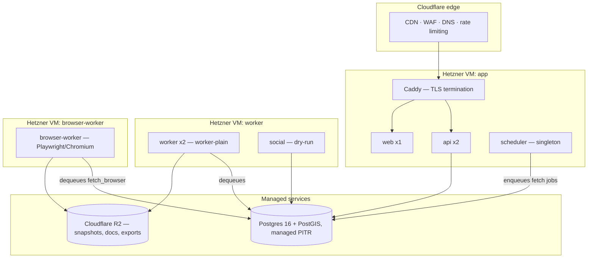

# Deployment: infrastructure, environments, observability, backups, runbooks

**Status:** Sprint 2 deliverable, v1 · 2026-09-13 · devops-engineer · reviewed by: solutions-architect
(`docs/04` R-2)
**Authority:** `docs/adr/0005-hosting-and-iac.md` (Accepted 2026-09-12) is the decision; this document is its
implementation and operating manual. Where the two disagree, the ADR wins and this document is wrong.
**Inputs:** `docs/20-architecture.md` §4 (run-time topology), §6 (cost metering), §10 (observability), §11
(security), §12 (failure modes), §14 (cost estimate), §15 (technology rows); `docs/04-standards.md` §7
(O-1…O-9) and §3 (E-2, E-8, E-10, E-11, E-15, E-19, E-20); `docs/adr/0003` (datastore), `docs/adr/0004`
(queue); `data/sources.yaml` (cadence field); `services/README.md`, `pipeline/README.md`,
`services/social/README.md`, `web/README.md` (what actually runs and its known gaps).
**Implements:** `infra/terraform/`, `infra/compose/`, `infra/docker/`, `infra/scheduler/`, `infra/sops/`,
`infra/scripts/`, `.github/workflows/ci.yml`, `.github/workflows/connectors-nightly.yml`, the top-level
`Makefile`.

Assumptions carried from open owner questions are marked **[B-n]** and listed in §12, continuing the
lettering scheme `docs/20` §16 uses for its own assumptions (that document is up to **A-11**).

## 1. Posture, in one paragraph

Three small Hetzner Cloud VMs in a US region (`ash`), running Docker Compose, behind Cloudflare's edge
(CDN/WAF/DNS) and Cloudflare R2 (object storage), against a managed Postgres provider (PITR, ADR 0003).
One container image family with per-process entrypoints (`docs/20` §4.1): `api`, `web`, `scheduler`,
`worker`, `browser-worker`, `social`. Everything is reproducible from this repo (`docs/04` O-2): OpenTofu
provisions the VMs/DNS/R2 bucket, Compose files define the services, SOPS+age encrypts the secrets that
configure them, and one script (`infra/scripts/deploy.sh`) drives a deploy in the order `docs/04` O-4
specifies. See `docs/adr/0005-hosting-and-iac.md` for why (VMs+Compose over a managed container platform;
Hetzner over DigitalOcean; Cloudflare kept for DNS/storage even though compute moved to Hetzner).

## 2. Run-time topology as deployed



One process per Compose service (`infra/compose/docker-compose.yml`), matching `docs/20` §2's component
table and the task brief's list: `postgres` (local/dev/CI only — see §3), `api`, `web`, `scheduler`,
`worker`, `browser-worker`, `social`, plus `caddy` in `infra/compose/compose.prod.yml`.

| Service | VM | Replicas | Image target | Notes |
|---|---|---|---|---|
| `caddy` | app | 1 | `caddy:2.8-alpine` | TLS via Let's Encrypt; only public port on the app VM |
| `api` | app | 2 | `infra/docker/Dockerfile` `api` | `docs/20` §4.1 |
| `web` | app | 1 | `infra/docker/Dockerfile` `web` | server-rendered, `docs/20` §15 |
| `scheduler` | app | 1 (singleton) | `infra/docker/Dockerfile` `worker` | leader-lock semantics — see §6 |
| `worker` | worker | 2 | `infra/docker/Dockerfile` `worker` | `worker-plain`, `docs/20` §4.1 |
| `social` | worker | 1 | `infra/docker/Dockerfile` `worker` | dry-run only, `services/social/README.md` |
| `browser-worker` | browser-worker | 1 | `infra/docker/Dockerfile.browser-worker` | Playwright Chromium, `docs/20` §4.1 |
| `postgres` | app (local profile only) | 1 | `postgis/postgis:16-3.4` | `local`/`dev`/CI only, see §3 |

`worker-model` (`docs/20` §4.1's fourth pool, enrichment/adjudication) is not a separate Compose service
this sprint: `services/modelgw` (the model-call gateway, `docs/20` §4.5) does not exist yet
(`services/README.md` scope is public-tier store + API only), so there is nothing for a dedicated
model-worker container to run. The `worker` service's queue list already includes `enrich`
(`infra/scheduler/app.py`'s `run_connector` only handles `fetch`; a `worker-model` split is a one-line
Compose addition — a new service with `--queues enrich` — once `services/modelgw` and its job handler
exist. Flagged here rather than built against nothing.

## 3. Environments

Per `docs/04` O-1:

| Environment | Where | Database | Outbound | Notes |
|---|---|---|---|---|
| `local` | operator's machine, `make dev` | SQLite loaded from `data/eval/` | none | no Docker required; see Makefile §9 |
| `dev` | `infra/compose/docker-compose.yml --profile local` | Postgres container (`local` profile) | none | Compose smoke-test environment; also what CI's connector-fixture jobs run against when a database is needed |
| `preview` | one per PR (stubbed, see `ci.yml`) | seeded fixture Postgres | none — social/CRM adapters dry-run | design-review surface (`docs/04` D-36) and CWV measurement point (D-31); not yet wired to a real ephemeral host — see §11 gaps |
| `staging` | Hetzner VMs, `staging` Tofu workspace | managed Postgres, `staging` project | ≤ 5 open sources at real cadence, social/CRM dry-run | rollback rehearsed here every sprint (`docs/04` O-5) |
| `production` | Hetzner VMs, `production` Tofu workspace | managed Postgres, `production` project | full `data/sources.yaml`, real cadence | |

Twelve-factor: every environment difference is an environment variable (`infra/compose/.env.example`
lists every one used), never a code path (`docs/04` O-1).

## 4. Provider choice and monthly cost

**Compute: Hetzner Cloud.** `docs/20` §14 already prices the app+worker VMs against "Hetzner Cloud or
equivalent, US region"; Hetzner's Terraform/OpenTofu provider (`hetznercloud/hcloud`) is mature and
supports the private networks and firewalls the egress-control design needs (`docs/20` §4.3, §11). Not
DigitalOcean: at the `cx32` (4 vCPU/8 GB) size Hetzner lists lower and its `ash` (Ashburn, VA) location
satisfies the US-region assumption (**[A-3]**) as directly as DO's comparable droplet.
**DNS and object storage stay on Cloudflare**, not Hetzner — see `docs/adr/0005-hosting-and-iac.md`'s
Decision section for why this is not a contradiction of "pick a named provider."
**Managed Postgres: Neon** (ADR 0003 names Neon/Crunchy Bridge/provider-managed; Neon is picked here for
its native branch-per-preview-environment fit with the `preview` row in §3). Neon's pricing moved to
usage-based billing in 2026 (Compute-Unit-hours plus a PITR GB-month charge for retained WAL), not a flat
monthly tier, so the figure below is an estimate at MVP traffic, not a quoted price.

| Line item | Provider | Basis | Est. USD/mo | Source |
|---|---|---|---|---|
| Compute: 1 app VM (`cx32`, 4 vCPU/8 GB) | Hetzner Cloud, `ash` | list price | 7.69 | [vpsbenchmarks CX32](https://www.vpsbenchmarks.com/hosters/hetzner/plans/cx32), retrieved 2026-09-13 |
| Compute: 1 worker VM (`cx32`) | Hetzner Cloud | list price | 7.69 | same |
| Compute: 1 browser-worker VM (`cx32`) | Hetzner Cloud | list price | 7.69 | same |
| Managed Postgres 16 + PostGIS, PITR (7-day window) | Neon, Launch plan | ~0.5 CU average (mostly idle worker traffic) × 730 h × $0.106/CU-h + PITR on a small (~5 GB) change-rate database | 35–55 | [Neon new usage-based pricing](https://neon.com/blog/new-usage-based-pricing), retrieved 2026-09-13; moderate confidence — re-measure after 30 days of real traffic (**[B-1]**) |
| Object storage (raw snapshots, docs, exports), ~200 GB | Cloudflare R2 | $0.015/GB-month standard storage + Class A/B ops, 10 GB free tier | 3–6 | [Cloudflare R2 pricing](https://egresscost.com/cloudflare/), retrieved 2026-09-13 |
| Edge: DNS, CDN, WAF, rate limiting | Cloudflare Free/Pro | unchanged from `docs/20` §14 | 0–20 | `docs/20` §14 (not re-verified this sprint) |
| Transactional email (alerts, magic links, digests) | Resend | unchanged from `docs/20` §14 | 20–40 | `docs/20` §14 (not re-verified) |
| Error tracking + logs/metrics | Sentry free tier + Grafana Cloud free tier | unchanged | 0–30 | `docs/20` §14 |
| CI/CD | GitHub Actions | free minutes at this volume | 0 | — |
| Domain, certificates, secrets tooling | — | Let's Encrypt is free; SOPS/age are free | 5 | `docs/20` §14 |
| Model calls (extraction, adjudication, drafting) | provider API via gateway | unchanged — `services/modelgw` does not exist yet, so this is $0 today and the `docs/20` §14 figure once it ships | 0 today / 60–150 once `services/modelgw` ships | `docs/20` §14 |
| **Core total (today, `services/modelgw` not yet built)** | | | **≈ 80–170** | |
| **Core total (once model gateway ships)** | | | **≈ 140–320** | |
| X posting at 50 link posts/day (optional, capped) | `docs/32` §4.7 | unchanged | 250 (cap, not the `docs/20` §14 estimate — `docs/04` §10 pick 8) | `docs/04` §10 item 8 |

Both totals sit inside the `docs/04` O-8 ceiling (≤ USD 415/month core infrastructure). The gap between
today's real total and `docs/20` §14's ≈195–415 estimate is mostly the model-gateway line, which is
genuinely zero until `services/modelgw` exists — not a hidden saving. **[B-1]**: re-price the Neon line
from actual Grafana Cloud/Sentry usage after the first month in `staging`, and correct this table rather
than trusting the estimate past one billing cycle.

## 5. Secrets

SOPS + age (ADR 0005). Full mechanics, bootstrapping and the "try it now" example are in
`infra/sops/README.md`; do not duplicate that content here — the "Rotate a secret" runbook (§10.5) is the
operational half of the same design.

## 6. Scheduling per source cadence

`infra/scheduler/` (Procrastinate, ADR 0004) reads `data/sources.yaml`'s `cadence` field for every source
that has a connector and buckets it into one of six cron-expressible schedules (`infra/scheduler/cadence.py`
— 15-min/daily/weekly/monthly/quarterly/annual, always rounding to the more frequent bucket on an ambiguous
string like `"quarterly (scorecard); monthly (Generation Information)"`, and never less often than weekly
even for `varies`/`per-auction` cadences, so a source is never silently unscheduled). The `scheduler` service
runs only the periodic ticks (one per bucket); `worker`/`browser-worker` consume the `fetch`/`fetch_browser`
queues those ticks enqueue into, routed by `data/sources.yaml`'s `access` field until DA-12's proposed
`egress` field exists (`infra/scheduler/cadence.py`'s `queue_for_source` prefers `egress` the moment it
does). See `infra/scheduler/app.py`'s module docstring for why running the tick task in more than one
process is safe (Procrastinate dedupes at the database level), which is what makes the "singleton,
leader-lock" requirement (`docs/20` §4.2) achievable without a hand-rolled Postgres advisory lock.

Per-host politeness limits (FERC ≤ 0.5 rps, PJM 6/min, GDELT 1 per 5 s) and the per-source/browser job
timeouts (10 min / 5 min, `docs/20` §4.2) are enforced inside `pipeline/connectors` and
`infra/scheduler/app.py`'s `run_connector` respectively — the scheduler does not duplicate that logic, only
decides *when* to enqueue.

### 6.1 Alert cycle and social draft generation (Sprint 3 item 4)

Two more periodic jobs follow the same tick-defers-a-job split as the bucket ticks above, each a single
unit of work per firing rather than a per-source fan-out:

| Job | Cron | Queue | `queueing_lock` | Timeout | Calls |
|---|---|---|---|---|---|
| `alert_tick` | `*/15 * * * *` (US-502 AC1: alerts fire within 15 minutes) | `alert` | `alert_tick` | 10 min | `services.alerts.worker.run_alert_tick` |
| `post_draft_tick` | `7 * * * *` (hourly, off the hour so it never collides with a fetch bucket's top-of-hour jitter offset, `infra/scheduler/cadence.py`'s `CRON_BY_BUCKET`) | `post_draft` | `post_draft_tick` | 10 min | `services.social.worker.draft_posts_tick` |

Both carry `retry=0`: the next periodic tick is the retry, so a Procrastinate-managed retry would only race
it. `queueing_lock` guarantees an overlapping tick is refused (`AlreadyEnqueued`, logged and dropped) rather
than double-run, the same guarantee `queueing_lock_for` gives each source's `fetch` job above. The
10-minute timeout is enforced in `infra/scheduler/app.py`'s `_run_with_timeout` — the same discipline as
`run_connector`'s `subprocess.run(timeout=...)`, but implemented with a bounded `Future.result()` instead,
because these two jobs call an in-process Python function rather than shelling out (there is no subprocess
for the OS to kill on timeout; a thread-based Python timeout abandons a hung call rather than interrupting
it, which is a known limitation but still lets the job fail promptly so the next tick can retry).

The tick itself (`tick_alert`/`tick_post_draft`) runs on `SCHEDULER_ONLY_QUEUE` like every bucket tick,
so it only ever executes inside the `scheduler` service; the deferred job (`alert_tick`/`post_draft_tick`)
runs on the `alert`/`post_draft` queue, which the `worker` service already consumes
(`infra/compose/docker-compose.yml`'s `worker` command). Both job bodies live in `infra/scheduler/jobs.py`,
kept separate from `app.py`'s Procrastinate registrations so that module stays importable without Postgres
and lazily imports `services.alerts.worker`/`services.social.worker` only when a tick actually runs.

To run either job by hand (bypassing the scheduler, e.g. to backfill or debug):

```
python -m services.alerts.worker
python -m services.social.worker
```

## 7. Observability

| Signal | Mechanism | Where |
|---|---|---|
| Structured logs | JSON to stdout, `docs/04` E-18 keys | every service; Compose `logging.driver: json-file` caps local disk (`infra/compose/compose.prod.yml`); shipped to Grafana Cloud Loki (14-day retention, `docs/20` §10) — **not wired this sprint**, see §11 gaps |
| Per-source success/latency/row-count | `source_run` rows (`pipeline/connectors`) | Grafana dashboard reading Postgres directly (no separate metrics pipeline needed at this scale, `docs/20` §10) — **dashboard not built this sprint**, see §11 |
| Cost per model call | `model_call` rows (`docs/20` §4.5) | same Grafana dashboard, once `services/modelgw` exists |
| Uptime | Caddy healthchecks + an external uptime check (UptimeRobot free tier or Grafana Cloud synthetic monitoring) hitting `/v1/health` and `/health` | alerts to the owner's email + chat channel on 2 consecutive failures |
| Certificate expiry | Caddy auto-renews; alert if a renewal has not happened in 60 days (Let's Encrypt certs are 90-day) | same channel |
| Backup age | `infra/scripts/backup.sh`'s last successful run timestamp, checked by a scheduled GitHub Actions job or a Grafana Cloud check | alert if > 26 h (`docs/04` O-7) |
| Errors | Sentry free tier | every service, DSN from `infra/sops/secrets.<env>.enc.yaml` |

Compose healthchecks (`infra/compose/docker-compose.yml`) are the first line of defense regardless of the
dashboard gap: `api`/`web` fail their healthcheck and get restarted by Docker's `restart: unless-stopped`
policy before an external monitor would even notice.

## 8. Backups and restore drills

- **Primary:** the managed Postgres provider's own daily snapshot + PITR (RPO ≤ 1 h, ADR 0003) — no script,
  it is a property of the managed service.
- **Secondary (this sprint's deliverable):** `infra/scripts/backup.sh` runs `pg_dump` and uploads to a
  *different* account (Cloudflare R2) daily via cron on the app VM, so a compromised or suspended Postgres
  provider account is not also a total-loss event. Retention: `infra/terraform/variables.tf`'s
  `backup_retention_days` (default 35) locally; R2 objects are kept indefinitely until a lifecycle rule is
  added (not yet — flagged in §11).
- **Restore drill:** `infra/scripts/restore_drill.sh`, run monthly (`docs/04` O-7), restores the latest R2
  dump into a throwaway local Postgres container, runs row-count sanity checks against the four core tables,
  and prints a ready-to-paste row for the runbook's "Last executed" line (§10.3).

## 9. CI/CD

`.github/workflows/ci.yml` implements the `docs/04` O-3 blocking gates; `.github/workflows/
connectors-nightly.yml` runs the fixture-only connector suite daily (`docs/04` O-3's E2E/E-12 intent,
never against live sources in CI, `docs/20` §3.1). See each file's header comment for the job list; this
section only records what devops-engineer could and could not validate in the sandbox this sprint —
`docs/CHANGELOG.md` and the task's final summary have the same list, this is the durable copy.

**Validated here:** workflow YAML parses (`actionlint` — see §11); `tofu fmt`/`validate`/`init` succeed
against the real OpenTofu and provider plugins (both installed from GitHub releases into this sandbox,
since neither ships by default — see §11); `docker compose config` merges the base + prod override cleanly
and confirms the `local`-profile Postgres service is correctly excluded from the production plan;
`infra/scheduler`'s pure functions have a full green pytest run; every shell script in `infra/scripts/`
passes `bash -n` and `shellcheck` with only two informational (not warning-level) notes.

**Not validated here (state per the task's own instruction):** an actual `docker build` of any Dockerfile
— the Docker daemon is present as a CLI but has no running daemon in this sandbox (`docker info` fails);
`hadolint` was run instead as a static check and both Dockerfiles are clean. An actual `tofu apply` against
real Hetzner/Cloudflare accounts — `tofu plan` was exercised far enough to reach real provider
authentication (confirms the configuration is structurally complete) but no real cloud resources were
created, and no HCLOUD_TOKEN/CLOUDFLARE_API_TOKEN exists in this sandbox to go further. Both are §11's
first two "unvalidated" items with the exact commands to run once real credentials exist.

### 9.1 Basemap tile refresh

Added 2026-09-15 (`docs/adr/0007-basemap-protomaps-on-r2.md`; `docs/40` §2.7). A fourth workflow,
`.github/workflows/basemap.yml`, separate from the three above because its trigger (monthly cron +
manual dispatch) and its dependency (`go` for `go install`ing the `pmtiles` CLI, not the Python
toolchain the others use) are both different in kind:

- **What it does:** runs `infra/scripts/build_basemap.sh` against the `production` GitHub
  Environment's R2 secrets, then verifies the uploaded object is range-request-capable.
- **The script:** extracts a single region (contiguous US + Great Britain, `--maxzoom=12`) from the
  current Protomaps weekly planet build, uploads it to a dated key on the tiles R2 bucket
  (`infra/terraform/storage.tf`'s `cloudflare_r2_bucket.tiles`, output as `tiles_bucket_name`), then
  promotes that key to the canonical `basemap.pmtiles` name — the same "never half-replace the live
  artefact" discipline §10.1's deploy runbook uses for the database, applied here to a static file
  instead of a migration.
- **Measured in this sandbox** (real, non-dry-run extracts against the 2026-09-14 planet build):
  the combined US+GB region at `--maxzoom=12` is 3,892,675,048 bytes, extracted via HTTP range
  requests in 28.1 s wall-clock with 8 download threads; a smaller sanity check (Texas alone,
  `--maxzoom=10`) was 19,897,851 bytes in 4.1 s. Both are network-bound measurements against this
  task's sandbox bandwidth, not a production-network guarantee, but they establish the order of
  magnitude the monthly job actually moves — a few GB, well under any GitHub Actions job timeout.
- **Validated here:** the script end-to-end (real `pmtiles extract`/`verify` against the live
  Protomaps build, a faked `aws` in `PATH` standing in for the real upload so the logic runs without
  real R2 credentials) — see `docs/CHANGELOG.md`; `bash -n` and `shellcheck` clean; the workflow
  YAML passes `actionlint`.
- **Not validated here:** an actual upload to a real R2 bucket (no `R2_ACCOUNT_ID`/credentials exist
  in this sandbox — the same gap as §11 item 1); the manual custom-domain and CORS dashboard/API
  steps `infra/terraform/storage.tf`'s comment block documents (nothing to click against without a
  real zone and bucket yet).

## 10. Runbooks

Format per `docs/04` O-9. Kept as sections of this file rather than one file each under `docs/6x-runbooks/`
— five runbooks, under the "until there are more than ten" allowance.

### 10.1 Deploy

**Trigger / symptom:** a tag is pushed to `main`, or the operator runs a manual deploy.
**Severity:** routine.
**Preconditions and access:** SSH access to the target VMs (the key in
`infra/terraform/variables.tf`'s `ssh_public_key`); the environment's `SOPS_AGE_KEY`;
`APP_HOST`/`WORKER_HOSTS`/`BROWSER_WORKER_HOST` from `tofu output` (`infra/terraform/outputs.tf`); the CI
job build-and-pushed an image and the digest/tag is known.
**Steps:**
1. `export APP_HOST=... WORKER_HOSTS="..." BROWSER_WORKER_HOST=... SOPS_AGE_KEY="$(cat path/to/key)"`
2. `infra/scripts/deploy.sh <staging|production> <image-tag>`
3. The script: stops `worker`/`browser-worker`/`scheduler` on the worker VMs first → runs
   migrations once (`alembic upgrade head`, expand phase only, `docs/04` E-11) → restarts `caddy`/`api`/`web`
   on the app VM (public pages keep serving from the Cloudflare edge cache throughout, `docs/20` §12) →
   restarts the workers → restarts the scheduler last.
4. It appends a row to `infra/deploy-log.md` (timestamp, environment, tag, deployer, commit).
**Verification:** `curl https://{{DOMAIN}}/health` and `curl https://{{DOMAIN}}/v1/health` return 200; the
E-10 Playwright smoke suite passes against the environment; `infra/deploy-log.md`'s new row looks right.
**Rollback:** see 10.2.
**Escalation:** if migrations fail, do not proceed to step 3 — fix forward or roll back the migration per
its own reversibility docstring (E-11); page the owner if a production deploy has been mid-rollout for more
than 15 minutes.
**Last executed:** not yet — no real Hetzner/Postgres environment exists this sprint (see §11 item 1).

### 10.2 Rollback

**Trigger / symptom:** a deploy is bad (5xx spike, failing health check, a source silently breaking that
correlates with the deploy time).
**Severity:** S2 by default (`docs/04` S-9); S1 if gated/restricted data is now visible (unpublish first,
per the S-9 runbook, before rolling back the deploy itself).
**Preconditions and access:** same as 10.1, plus the previous image tag (kept ≥ 5 back, `docs/04` O-5).
**Steps:**
1. `infra/scripts/rollback.sh <staging|production> <previous-image-tag>` — re-runs the deploy script
   against the older tag.
2. Only pass `--downgrade-migration` if the migration being rolled back from documents itself as
   reversible (E-11); otherwise the old image runs against the new-but-compatible schema (expand/contract).
3. If entity tables need repair after a bad merge/write during the bad window, run the `docs/21` §6.5
   `replay` procedure next.
**Verification:** same checks as 10.1's verification step, against the restored tag.
**Rollback (of the rollback):** re-run `deploy.sh` forward once the underlying bug is fixed.
**Escalation:** owner, immediately, if a rollback does not clear the symptom within 15 minutes.
**Last executed:** not yet — rehearsed on `staging` every sprint per `docs/04` O-5 once `staging` exists.

### 10.3 Restore from backup

**Trigger / symptom:** monthly scheduled drill, or an actual data-loss incident.
**Severity:** routine (drill) or S1 (real incident — data loss is an availability/integrity event).
**Preconditions and access:** for a **real** restore: the managed Postgres provider's console/API access
and its own PITR restore flow (provider-specific — Neon's is "create a branch as of a timestamp", not a
destructive in-place restore, which is why it is safe to rehearse against production data without an
outage). For the **drill**: `R2_BUCKET`/`R2_ACCOUNT_ID`/`R2_ACCESS_KEY_ID`/`R2_SECRET_ACCESS_KEY` and a
local Docker daemon.
**Steps (drill):**
1. `infra/scripts/restore_drill.sh`
2. It downloads the latest `infra/scripts/backup.sh` dump from R2, restores it into a throwaway local
   Postgres+PostGIS container, and runs row-count sanity checks against `proposal`/`opportunity`/
   `organization`/`event`.
3. Paste the script's printed line into this runbook's "Last executed" field below.
**Steps (real incident):** use the managed provider's PITR restore to a new branch/instance at the target
timestamp; point a **new** `DATABASE_URL` at it; verify with the same row-count checks before cutting
`DATABASE_URL` over in `infra/sops/secrets.<env>.enc.yaml` and redeploying (10.1).
**Verification:** row counts are non-zero and plausible against the known pre-incident scale (`docs/20` §13:
~10⁵ entities); the E-9 integration fixtures pass against the restored database if this is a real incident,
not just the drill's four-table spot check.
**Rollback:** none — a restore drill targets a throwaway container; a real restore's rollback is "restore
again from a different point."
**Escalation:** owner immediately for a real incident (`docs/04` S-9 S1); a failed *drill* is S3 (fix the
script/credentials, does not mean data is unsafe — the provider's own PITR is still intact).
**Last executed:** not yet — no managed Postgres/R2 account exists this sprint (§11 item 1); run this the
first month `staging` is live and record the result here.

### 10.4 A source breaks

**Trigger / symptom:** `source.health = failing` (`docs/20` §4.2, five consecutive job failures), a DQ hold
(`docs/04` DA-6), or a `blocked` classification (challenge page / 403).
**Severity:** S3 by default (`docs/04` S-9); escalate to S2 if the source is on the critical path for a
paying customer's saved search.
**Preconditions and access:** admin panel source-health view (`docs/20` §8 item 1) once it exists; until
then, `python -m pipeline.connectors list` and `data/runs/<source_id>/` on the worker VM.
**Steps:**
1. Confirm the failure mode against `docs/20` §12's table (layout change vs blocked vs DQ hold vs
   HTTP-200-with-error-body).
2. **Layout change:** the connector's fixtures under `pipeline/connectors/<source_id>/fixtures/` need a new
   sample; open a fixture+parser-fix PR (this is the supervision Routine's job per `docs/03` §1 once that
   exists; until then, a human does it).
3. **Blocked:** do not retry beyond the normal schedule; do not attempt a challenge bypass (`docs/04` S-5);
   escalate an egress-class change (e.g. to `browser` or `residential`) only with legal-compliance sign-off.
4. **DQ hold:** the run's snapshot is stored but its diff was not applied — release it from the admin queue
   (`docs/20` §12, US-907) once that surface exists, or manually inspect `data/held/<source_id>/` and confirm
   before re-running with the hold's cause fixed.
5. Whatever the cause, the source keeps serving its last-good published data throughout (`docs/20` §12) — no
   emergency unpublish is needed for a fetch failure alone.
**Verification:** the next scheduled run for that source completes with `status: ok` and a plausible row
count.
**Rollback:** n/a (nothing was deployed).
**Escalation:** legal-compliance for any egress-class change; owner if the source is contractually promised
to a customer.
**Last executed:** not yet — no connector has failed in production because there is no production
environment yet.

### 10.5 Rotate a secret

**Trigger / symptom:** scheduled (≤ 90 days, `docs/04` S-7), personnel change, suspected exposure, or a
vendor incident notice.
**Severity:** routine (scheduled) or S1/S2 (`docs/04` S-9, if the trigger is suspected exposure).
**Preconditions and access:** the environment's SOPS age key (§5, `infra/sops/README.md`); for an age-key
rotation itself (not a value inside the file), `infra/scripts/bootstrap_age_key.sh`.
**Steps (rotating a value — API key, DB password, webhook secret):**
1. `infra/scripts/rotate_secret.sh <environment> <KEY_NAME>` — opens `$EDITOR` on the decrypted file,
   re-encrypts on save, appends a row to `infra/secret-rotation-log.md`.
2. Redeploy (`10.1`) so running containers pick up the new value — the script prints this reminder.
3. Revoke the old value at the provider (API key deletion, DB user password change confirmed applied,
   webhook secret's old value removed from the sender's config) — this step is provider-specific and not
   scriptable generically; do it before closing the rotation.
**Steps (rotating the age key itself — rare, only after a suspected compromise of the key file):**
1. `infra/scripts/bootstrap_age_key.sh <environment>` generates a new keypair.
2. Update `infra/sops/.sops.yaml`'s recipient for that environment to the new public key.
3. `sops updatekeys infra/sops/secrets.<environment>.enc.yaml` re-encrypts to the new recipient.
4. Distribute the new private key (password manager + CI environment secret); destroy the old one
   everywhere it was stored.
**Verification:** `sops -d` the file with only the new key present and confirm it still decrypts; the next
deploy succeeds.
**Rollback:** keep the previous SOPS-encrypted file's git history — `git show <commit>:infra/sops/secrets.
<env>.enc.yaml` recovers the prior ciphertext if the new value is wrong, decryptable with the *old* key
(kept until the rotation is confirmed good, then destroyed).
**Escalation:** owner for any S1/S2-triggered rotation (`docs/04` S-9); legal-compliance if the exposed
secret is a data-source credential covered by a licence term.
**Last executed:** not yet — see `infra/secret-rotation-log.md` (empty until a real environment exists).

## 11. What is unvalidated here, and the exact next steps

In the order the owner needs to act, per the task brief:

1. **No real cloud accounts exist.** Create the Hetzner Cloud project and the Cloudflare account/zone (or
   confirm the one already fronting bankablehq.com can host a new zone), issue `HCLOUD_TOKEN` and
   `CLOUDFLARE_API_TOKEN`, store them as GitHub Actions environment secrets for `staging` and `production`,
   then `cd infra/terraform && tofu init && tofu plan -var-file=terraform.tfvars` (copy
   `terraform.tfvars.example` first) to see the real plan before `tofu apply`.
2. **No managed Postgres project exists.** Create a Neon project (or Crunchy Bridge, ADR 0003 names both),
   enable the `postgis`/`pg_trgm`/`btree_gin`/`pgcrypto` extensions, and run
   `alembic -c services/db/migrations/alembic.ini upgrade head` against it — this has never been run against
   a real Postgres anywhere (`services/README.md`'s own caveat).
3. **Generate the real per-environment age keys** (`infra/scripts/bootstrap_age_key.sh dev|staging|
   production`) and fill in `infra/sops/.sops.yaml`'s three `REPLACE_WITH_*` placeholders, then create the
   real `secrets.<env>.enc.yaml` files (they do not exist yet — only the throwaway `secrets.dev.example.
   enc.yaml` does).
4. **`requirements.txt` has no Postgres driver.** Every test suite in this repo runs against SQLite
   (`services/README.md`). `infra/docker/Dockerfile` and `Dockerfile.browser-worker` install
   `psycopg[binary]` at the image layer as a stopgap; the durable fix (adding it to the root
   `requirements.txt`/`pyproject.toml`) is outside this task's write scope (`infra/`, `.github/workflows/`,
   `docs/60-*.md`, `docs/adr/0005`, the Makefile only) and is flagged for whoever owns that lockfile.
5. **`services/modelgw` does not exist yet** (§2, §4's cost table) — the `worker-model` pool has no code to
   run. Not a DevOps gap: the model gateway is `docs/20` §2's `backend-developer`-owned component and has
   not been built in any sprint so far.
6. **Preview-per-PR is stubbed, not wired**, per the task's own instruction ("a preview deploy job stubbed
   behind an environment secret"). `.github/workflows/ci.yml`'s `preview-deploy` job is a real job with a
   real `environment:` gate but its steps are commented placeholders — there is no ephemeral-host
   provisioning (a Fly.io/Hetzner-per-PR VM, or a shared preview VM with per-PR ports) implemented, because
   that is itself a small design decision (shared host with path-based routing vs. one VM per PR) the owner
   has not made. Recorded here rather than guessed at silently.
7. **Grafana Cloud/Sentry accounts do not exist**, so §7's dashboards and alert routing are designed, not
   built. `infra/compose/.env.example`'s `SENTRY_DSN`/`GRAFANA_CLOUD_API_KEY` are the wiring points once
   they do.
8. **No R2 lifecycle rule** prunes old backup objects (§8) — `infra/scripts/backup.sh` prunes its local
   copy but R2 itself grows unbounded until a lifecycle rule is added via `infra/terraform/storage.tf` (R2
   lifecycle rules are supported by the Cloudflare Terraform provider; not added here because there is no
   real bucket yet to attach one to without live credentials to verify the resource against).

## 12. Assumptions

| Id | Assumption made here | Depends on | Effect if wrong |
|---|---|---|---|
| B-1 | Neon's usage-based Postgres cost lands in the 35–55 USD/mo range at MVP traffic | actual 30-day usage once `staging` is live | Budget line changes, not architecture; re-measure and correct §4's table |
| B-2 | A shared preview host (not one VM per PR) is the right shape once preview deploy is unstubbed, to stay inside the cost ceiling | owner has not decided; item 6 in §11 | If the owner wants true per-PR isolation instead, that is a `hcloud_server` per PR via a Tofu workspace, at roughly $8/mo per concurrently-open PR |
| B-3 | `infra/scheduler`'s "route by `access: js_app`" heuristic correctly identifies every source that actually needs the browser pool until DA-12's `egress` field lands | `data/sources.yaml` gaining an explicit `egress` field (data-engineer, DA-12) | A source misrouted to the plain pool fails with a connector-level `blocked` classification (`docs/20` §12), which is safe (no bypass) but wastes a fetch cycle; misrouting the other way (browser pool for a plain source) just costs more RAM per fetch, no correctness issue |
| B-4 | Hetzner `cx32` (4 vCPU/8 GB) is large enough for the browser-worker's "max 3 pages, 2 GB RAM" budget (`docs/20` §4.1) with headroom for the OS and image pulls | measured once real Chromium fetch jobs run in `staging` | Bump to `cx42` (8 vCPU/16 GB) if OOM-killed; a one-line Tofu variable change (`browser_worker_server_type`) |
