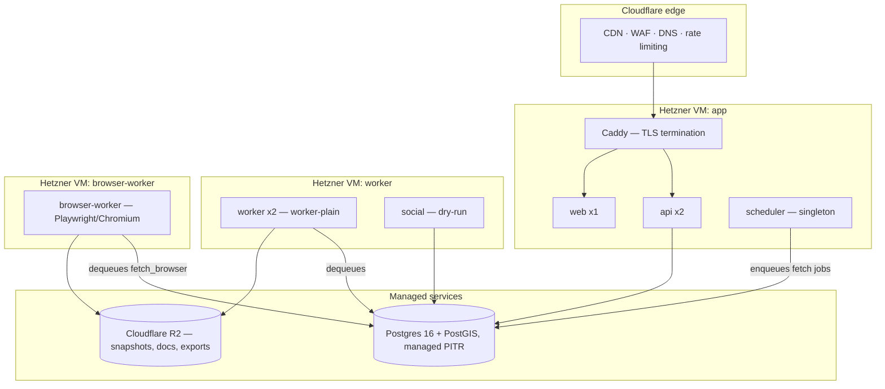

# Deployment: infrastructure, environments, observability, backups, runbooks

**Status:** Sprint 2 deliverable, v1 · 2026-09-13 · devops-engineer · reviewed by: solutions-architect
(`docs/04` R-2)
**Authority:** `docs/adr/0005-hosting-and-iac.md` (Accepted 2026-09-12) is the decision; this document is its
implementation and operating manual. Where the two disagree, the ADR wins and this document is wrong.
**Inputs:** `docs/20-architecture.md` §4 (run-time topology), §6 (cost metering), §10 (observability), §11
(security), §12 (failure modes), §14 (cost estimate), §15 (technology rows); `docs/04-standards.md` §7
(O-1…O-9) and §3 (E-2, E-8, E-10, E-11, E-15, E-19, E-20); `docs/adr/0003` (datastore), `docs/adr/0004`
(queue); `data/sources.yaml` (cadence field); `services/README.md`, `pipeline/README.md`,
`services/social/README.md`, `web/README.md` (what actually runs and its known gaps).
**Implements:** `infra/terraform/`, `infra/compose/`, `infra/docker/`, `infra/scheduler/`, `infra/sops/`,
`infra/scripts/`, `.github/workflows/ci.yml`, `.github/workflows/connectors-nightly.yml`, the top-level
`Makefile`.

Assumptions carried from open owner questions are marked **[B-n]** and listed in §12, continuing the
lettering scheme `docs/20` §16 uses for its own assumptions (that document is up to **A-11**).

## 1. Posture, in one paragraph

Three small Hetzner Cloud VMs in a US region (`ash`), running Docker Compose, behind Cloudflare's edge
(CDN/WAF/DNS) and Cloudflare R2 (object storage), against a managed Postgres provider (PITR, ADR 0003).
One container image family with per-process entrypoints (`docs/20` §4.1): `api`, `web`, `scheduler`,
`worker`, `browser-worker`, `social`. Everything is reproducible from this repo (`docs/04` O-2): OpenTofu
provisions the VMs/DNS/R2 bucket, Compose files define the services, SOPS+age encrypts the secrets that
configure them, and one script (`infra/scripts/deploy.sh`) drives a deploy in the order `docs/04` O-4
specifies. See `docs/adr/0005-hosting-and-iac.md` for why (VMs+Compose over a managed container platform;
Hetzner over DigitalOcean; Cloudflare kept for DNS/storage even though compute moved to Hetzner).

## 2. Run-time topology as deployed


```mermaid
flowchart TB
  subgraph edge[Cloudflare edge]
    CF[CDN · WAF · DNS · rate limiting]
  end
  subgraph vmapp[Hetzner VM: app]
    CADDY[Caddy — TLS termination]
    API[api x2]
    WEB[web x1]
    SCHED[scheduler — singleton]
  end
  subgraph vmworker[Hetzner VM: worker]
    WRK[worker x2 — worker-plain]
    SOC[social — dry-run]
  end
  subgraph vmbrowser[Hetzner VM: browser-worker]
    BRW[browser-worker — Playwright/Chromium]
  end
  subgraph managed[Managed services]
    PG[(Postgres 16 + PostGIS, managed PITR)]
    R2[(Cloudflare R2 — snapshots, docs, exports)]
  end
  CF --> CADDY
  CADDY --> API
  CADDY --> WEB
  API --> PG
  SCHED -->|enqueues fetch jobs| PG
  WRK -->|dequeues| PG
  BRW -->|dequeues fetch_browser| PG
  WRK --> R2
  BRW --> R2
  SOC --> PG
```

One process per Compose service (`infra/compose/docker-compose.yml`), matching `docs/20` §2's component
table and the task brief's list: `postgres` (local/dev/CI only — see §3), `api`, `web`, `scheduler`,
`worker`, `browser-worker`, `social`, plus `caddy` in `infra/compose/compose.prod.yml`.

| Service | VM | Replicas | Image target | Notes |
|---|---|---|---|---|
| `caddy` | app | 1 | `caddy:2.8-alpine` | TLS via Let's Encrypt; only public port on the app VM; fixed address `172.30.53.2` on the Compose network (below) |
| `api` | app | 2 | `infra/docker/Dockerfile` `api` | `docs/20` §4.1; one uvicorn worker per replica, 1 GB each (memory below) |
| `web` | app | 1 | `infra/docker/Dockerfile` `web` | server-rendered, `docs/20` §15 |
| `scheduler` | app | 1 (singleton) | `infra/docker/Dockerfile` `worker` | leader-lock semantics — see §6 |
| `worker` | worker | 2 | `infra/docker/Dockerfile` `worker` | `worker-plain`, `docs/20` §4.1 |
| `social` | worker | 1 | `infra/docker/Dockerfile` `worker` | dry-run only, `services/social/README.md` |
| `browser-worker` | browser-worker | 1 | `infra/docker/Dockerfile.browser-worker` | Playwright Chromium, `docs/20` §4.1 |
| `postgres` | app (local profile only) | 1 | `postgis/postgis:16-3.4` | `local`/`dev`/CI only, see §3 |

**Routing, host names and the client address (2026-09-30; devops audit F1–F4, architect A3/A7/A8,
PM-3).** `infra/compose/Caddyfile` sends `/v1/*`, `/admin/v1/*`, `/feeds/*` and `/webhooks/*` to `api` and
every other path to `web`, the admin UI at `/admin/<page>` included. Before, `/admin/*` went to the API, so the
admin UI was unreachable, and the RSS feeds went to web and 404ed. `/webhooks/*` is on the list as well as
the three prefixes the audits named, because the Stripe and Attio webhooks live there
(`app.openapi()`). `infra/test_caddyfile.py` fails if the API gains a path outside the four. Host names come
from `ENVIRONMENT` and match `infra/terraform/dns.tf`:

| Environment | Site | Admin | API | `www` |
|---|---|---|---|---|
| production | `{DOMAIN}` | `admin.{DOMAIN}` | `api.{DOMAIN}` | `www.{DOMAIN}` → 301 to the apex |
| staging | `staging.{DOMAIN}` | `admin-staging.{DOMAIN}` | `api-staging.{DOMAIN}` | none (no DNS record) |

The admin host serves the web app with `/admin/v1/*` to the API, and redirects `/` to `/admin`. The API host
sends every path to the API. It had no DNS record and no Caddy block, but it is the server in
`api/openapi.yaml`, the Attio webhook target (`docs/34` §6), and the host of export download links,
unsubscribe links and every problem `type` URI (`services/api/common.py` `API_HOST`; QA audit QA-2). Both
now exist (`infra/terraform/dns.tf` `cloudflare_record.api`). The apex keeps serving the same API prefixes,
so either base URL works. `API_HOST` itself is still the hard-coded `api.infraque.com` placeholder
(`docs/04` §0.6), not derived from `DOMAIN`; it changes when the product is named. The web admin
pages call the API server-side with the operator's cookie (`web/admin/shell.py`), so the browser never needs
the API on that host.

The address a per-address rate limit sees is established one hop at a time. Each hop trusts only the one
before it:

1. Caddy believes `CF-Connecting-IP` only from Cloudflare's published ranges. The ranges are vendored in the
   Caddyfile from https://www.cloudflare.com/ips-v4 and /ips-v6, retrieved 2026-09-30; re-check them at
   each §10.5 rotation. Caddy then *overwrites* `X-Forwarded-For` with that one address, or with the real
   peer for anyone who is not Cloudflare. It strips `X-Internal-Token` and `X-Visitor-IP` from every inbound
   request.
2. uvicorn believes `X-Forwarded-For` and `X-Forwarded-Proto` from Caddy's fixed address only
   (`FORWARDED_ALLOW_IPS`, `infra/entrypoint.py`; `*` is refused). The Compose network is pinned to
   `172.30.53.0/24`, with dynamic addresses from `.128/25` only, so no other container can take `.2`.
3. `web` sends each visitor's address to the API as `X-Visitor-IP` (`web/api_client.py`). The API believes
   it only alongside a valid `X-Internal-Token` (`services/api/client_ip.py`).

Every per-address limiter keys on the result: the public bucket, login, registration, resend, intake,
UI events, unsubscribe and privacy requests. IPv6 callers are grouped by /64. A credential that does not
resolve is charged to the caller's public bucket on every route; before, that happened only on routes
that asked for an `AuthContext` (backend audit F8). A valid credential is charged to its own tier's bucket
on every route, keyed by API key or user, at `docs/23` §6's figures. A signed-in account without a paid plan
counts as `free_account` (300 an hour), and the `RateLimit-*` headers go on every response. Before, the main
read routes did not meter a valid credential at all: a free account pulled 150 pages with no headers
(QA audit QA-3). The bulk streams keep their own bucket. `web`'s own internal-token calls stay exempt from
every bucket, as before. Measured end to end through Caddy 2.8.4, the real api and the real web (lane P1, 2026-09-30):

- three visitors each started at 59 remaining;
- one visitor rotating `X-Forwarded-For` counted 58, 57, 56;
- a direct client forging `CF-Connecting-IP`, `X-Forwarded-For` and `X-Visitor-IP` stayed in one bucket;
- 61 junk-bearer calls to `/v1/assets` and to `/v1/organizations` returned 60 × 200 and 1 × 429;
- through the site, one visitor's 21st failed login was 429 while a second visitor's first was 401.

A side effect is that the site's same-origin check on its forms (`web/auth.py::_is_same_origin`) now sees
the `https` scheme the visitor used. Before, it would have seen `http` behind Caddy and refused every login.
That part is inference: the check compares against `request.url.scheme`, and `infra/test_entrypoint.py`
shows uvicorn keeping `http` for an untrusted peer. For the same reason, `compose.prod.yml` sets
`SESSION_COOKIE_SECURE=true` on api: web reaches api over plain HTTP.

**API memory (devops audit F4, architect A8).** Two uvicorn workers in one api container peaked at
1,182 MB (563 + 590 MB) against the 1 GB limit, because each process builds its own geo and asset indexes
(the asset index alone is +158 MB per process). The fix is the smaller of the two options: one worker per
container (`infra/entrypoint.py` default, and `WEB_CONCURRENCY: "1"` in `compose.prod.yml`), keeping the
1 GB limit and the two replicas. The auditor's probe, re-run against one worker on the same full dev
store: each run is two rounds of 24 geo calls (three layers at zooms 3–10) and 12 list calls, then 8 site
pages and a sitemap render. The worker peaked at 606 MB after one run and 638 MB after a second, which leaves
about 37 % headroom. Raising the limit to 1.5 GB was the alternative. It
would have kept four processes, and so four independent in-memory limiter buckets instead of two, and
used 1 GB more of the app VM for parallelism that Cloudflare's cache of public GETs mostly absorbs. The base
file's api limit moved from 512 MB to 1 GB for the same reason (local Compose on the full store). Not
changed here: the index itself (A8's PostGIS/PMTiles fix). At 10× assets one worker will not fit either.

`worker-model` (`docs/20` §4.1's fourth pool, enrichment/adjudication) is not a separate Compose service
this sprint: `services/modelgw` (the model-call gateway, `docs/20` §4.5) does not exist yet
(`services/README.md` scope is public-tier store + API only), so there is nothing for a dedicated
model-worker container to run. The `worker` service's queue list already includes `enrich`
(`infra/scheduler/app.py`'s `run_connector` only handles `fetch`; a `worker-model` split is a one-line
Compose addition — a new service with `--queues enrich` — once `services/modelgw` and its job handler
exist. Flagged here rather than built against nothing.

## 3. Environments

Per `docs/04` O-1:

| Environment | Where | Database | Outbound | Notes |
|---|---|---|---|---|
| `local` | operator's machine, `make dev` | SQLite loaded from `data/eval/` | none | no Docker required; see Makefile §9 |
| `dev` | `infra/compose/docker-compose.yml --profile local` | Postgres container (`local` profile) | none | Compose smoke-test environment; also what CI's connector-fixture jobs run against when a database is needed |
| `preview` | one per PR (stubbed, see `ci.yml`) | seeded fixture Postgres | none — social/CRM adapters dry-run | design-review surface (`docs/04` D-36) and CWV measurement point (D-31); not yet wired to a real ephemeral host — see §11 gaps |
| `staging` | Hetzner VMs, `staging` Tofu workspace | managed Postgres, `staging` project | ≤ 5 open sources at real cadence, social/CRM dry-run | rollback rehearsed here every sprint (`docs/04` O-5) |
| `production` | Hetzner VMs, `production` Tofu workspace | managed Postgres, `production` project | full `data/sources.yaml`, real cadence | |

Twelve-factor: every environment difference is an environment variable (`infra/compose/.env.example`
lists every one used), never a code path (`docs/04` O-1).

## 4. Provider choice and monthly cost

**Compute: Hetzner Cloud.** `docs/20` §14 already prices the app+worker VMs against "Hetzner Cloud or
equivalent, US region"; Hetzner's Terraform/OpenTofu provider (`hetznercloud/hcloud`) is mature and
supports the private networks and firewalls the egress-control design needs (`docs/20` §4.3, §11). Not
DigitalOcean: at the `cx32` (4 vCPU/8 GB) size Hetzner lists lower and its `ash` (Ashburn, VA) location
satisfies the US-region assumption (**[A-3]**) as directly as DO's comparable droplet.
**DNS and object storage stay on Cloudflare**, not Hetzner — see `docs/adr/0005-hosting-and-iac.md`'s
Decision section for why this is not a contradiction of "pick a named provider."
**Managed Postgres: Neon** (ADR 0003 names Neon/Crunchy Bridge/provider-managed; Neon is picked here for
its native branch-per-preview-environment fit with the `preview` row in §3). Neon's pricing moved to
usage-based billing in 2026 (Compute-Unit-hours plus a PITR GB-month charge for retained WAL), not a flat
monthly tier, so the figure below is an estimate at MVP traffic, not a quoted price.

| Line item | Provider | Basis | Est. USD/mo | Source |
|---|---|---|---|---|
| Compute: 1 app VM (`cx32`, 4 vCPU/8 GB) | Hetzner Cloud, `ash` | list price | 7.69 | [vpsbenchmarks CX32](https://www.vpsbenchmarks.com/hosters/hetzner/plans/cx32), retrieved 2026-09-13 |
| Compute: 1 worker VM (`cx32`) | Hetzner Cloud | list price | 7.69 | same |
| Compute: 1 browser-worker VM (`cx32`) | Hetzner Cloud | list price | 7.69 | same |
| Managed Postgres 16 + PostGIS, PITR (7-day window) | Neon, Launch plan | ~0.5 CU average (mostly idle worker traffic) × 730 h × $0.106/CU-h + PITR on a small (~5 GB) change-rate database | 35–55 | [Neon new usage-based pricing](https://neon.com/blog/new-usage-based-pricing), retrieved 2026-09-13; moderate confidence — re-measure after 30 days of real traffic (**[B-1]**) |
| Object storage (raw snapshots, docs, exports), ~200 GB | Cloudflare R2 | $0.015/GB-month standard storage + Class A/B ops, 10 GB free tier | 3–6 | [Cloudflare R2 pricing](https://egresscost.com/cloudflare/), retrieved 2026-09-13 |
| Edge: DNS, CDN, WAF, rate limiting | Cloudflare Free/Pro | unchanged from `docs/20` §14 | 0–20 | `docs/20` §14 (not re-verified this sprint) |
| Transactional email (alerts, magic links, digests) | Resend | unchanged from `docs/20` §14 | 20–40 | `docs/20` §14 (not re-verified) |
| Error tracking + logs/metrics | Sentry free tier + Grafana Cloud free tier | unchanged | 0–30 | `docs/20` §14 |
| CI/CD | GitHub Actions | free minutes at this volume | 0 | — |
| Domain, certificates, secrets tooling | — | Let's Encrypt is free; SOPS/age are free | 5 | `docs/20` §14 |
| Model calls (extraction, adjudication, drafting) | provider API via gateway | unchanged — `services/modelgw` does not exist yet, so this is $0 today and the `docs/20` §14 figure once it ships | 0 today / 60–150 once `services/modelgw` ships | `docs/20` §14 |
| **Core total (today, `services/modelgw` not yet built)** | | | **≈ 80–170** | |
| **Core total (once model gateway ships)** | | | **≈ 140–320** | |
| X posting at 50 link posts/day (optional, capped) | `docs/32` §4.7 | unchanged | 250 (cap, not the `docs/20` §14 estimate — `docs/04` §10 pick 8) | `docs/04` §10 item 8 |

Both totals sit inside the `docs/04` O-8 ceiling (≤ USD 415/month core infrastructure). The gap between
today's real total and `docs/20` §14's ≈195–415 estimate is mostly the model-gateway line, which is
genuinely zero until `services/modelgw` exists — not a hidden saving. **[B-1]**: re-price the Neon line
from actual Grafana Cloud/Sentry usage after the first month in `staging`, and correct this table rather
than trusting the estimate past one billing cycle.

## 5. Secrets

SOPS + age (ADR 0005). Full mechanics, bootstrapping and the "try it now" example are in
`infra/sops/README.md`; do not duplicate that content here — the "Rotate a secret" runbook (§10.5) is the
operational half of the same design.

**How a secret reaches a container (fixed 2026-09-19, audit §3.1).** `deploy.sh` decrypts
`infra/sops/secrets.<env>.enc.yaml` with `sops -d --output-type dotenv` into `/opt/infraque/secrets/.env`
(0600) on every VM. That one file is both Compose's interpolation source (`--env-file`) and every
service's `env_file:` (`infra/compose/docker-compose.yml` `x-env-file`; `compose.prod.yml` `!override`s it
to the same path with `required: true`, so production refuses to start without it). Before this, only
`DATABASE_URL` reached a container; everything else in the file was dropped. `API_INTERNAL_TOKEN` is set
on both `api` and `web` explicitly. `infra/test_compose.py` checks both files statically and, where the
Compose CLI exists, renders them with `docker compose config` and asserts `SESSION_SECRET` from a fake env
file lands in all five app services.

**`SESSION_SECRET`.** `services/api/auth.py::session_secret()` returns the committed dev constant only when
`ENVIRONMENT` is unset or one of `dev`/`development`/`local`/`test`/`ci` (`services/environment.py`). For
any other value (`staging` or `production`, which `deploy.sh` writes into the env file; `preview`; a typo) an unset or shorter-than-32-character
`SESSION_SECRET` raises `RuntimeError` at import, so the api container exits at startup with the reason
instead of signing cookies with a public string (`tests/test_session_secret.py`). Generate one per
environment with `python -c "import secrets; print(secrets.token_urlsafe(48))"`.

**`TURNSTILE_SECRET_KEY` / `TURNSTILE_SITE_KEY`** (added 2026-09-26; docs/40 §6 item 1). The secret key
belongs in `secrets.<env>.enc.yaml` and reaches the `api` container like any other key in §5; when it is set,
`services/api/captcha.py` verifies every intake `captcha_token` against Cloudflare Turnstile and rejects on
failure or on an unreachable Cloudflare (fail closed). Unset — the state of every environment today — intake
accepts the token unverified and the api logs one warning per process. The site key is public, not a secret,
and has no consumer until a `/submit` page renders the widget (`docs/30` §4.5 designs it; nothing under `web/`
does yet). Both are commented placeholders in `infra/compose/.env.example`.

**`SNAPSHOT_STORE` and the R2 variables** (added 2026-09-26; `docs/20` §2, §12; `docs/40` §6 item 13). The
connector store (`pipeline/connectors/store.py`, backends in `pipeline/connectors/objectstore.py`) writes
snapshots, normalised and event parquet, held rows and run records either to local files or to the
environment's R2 bucket. Fetch (`run_connector`) and load (`load_source`) run on different worker hosts with no
shared filesystem, so `staging` and `production` need `s3`. The R2 names are the ones `infra/scripts/backup.sh`
already reads, and the same scoped token can serve both: snapshots go under `data/`, backups under `postgres/`.

| Variable | Secret | Read by | Value |
|---|---|---|---|
| `SNAPSHOT_STORE` | no | connector CLI, `load_source`, `resolve_tick`, `fetch_outcome` | `local` (default when unset) or `s3`. Any other value, or `s3` with a setting below missing, is a startup error (`StoreConfigError`, CLI exit 1). There is no silent fallback to local disk. |
| `R2_BUCKET` | no | same, and `backup.sh` | the per-environment `object_storage` bucket (`infra/terraform/storage.tf`: `${r2_bucket_name}-${environment}`) |
| `R2_ACCOUNT_ID` | no | same | builds the endpoint `https://<account>.r2.cloudflarestorage.com`, as `backup.sh` does |
| `R2_ENDPOINT` | no | connector store only | optional override of that endpoint (another S3-compatible server; the local proof used `http://127.0.0.1:9599`) |
| `R2_ACCESS_KEY_ID` / `R2_SECRET_ACCESS_KEY` | yes | same, and `backup.sh` | R2 API token with Object Read & Write on that bucket |
| `SNAPSHOT_STORE_PREFIX` | no | connector store only | key prefix inside the bucket, default `data/` (keys then mirror the repo's `data/` tree) |

The two credentials belong in `secrets.<env>.enc.yaml`, and they reach every container through the single
`.env` file described above. The non-secret names are in `infra/compose/.env.example` (local) and in
`infra/sops/secrets.example.plain.yaml` (staging and production) since 2026-09-30. `deploy.sh` refuses a
staging or production file whose `SNAPSHOT_STORE` is not `s3`.

**Every key a staging or production file must carry (2026-09-30; devops audit F3).** The audit rendered
the Compose files with a secrets file written from the old documented list. The result had no `DOMAIN`, so
Caddy did not start. It had no `PLATFORM_POSTURE`, so the posture silently became `commercial`. It had no
`MAP_TILE_URL`, `AUDIT_HASH_PEPPER` or sender identity, and it said `ENVIRONMENT: production` on staging.
The complete list is now one file, `infra/sops/secrets.example.plain.yaml`, with every key marked
`required` or `optional` and `secret` or `config`. Non-secret configuration lives in the same SOPS file,
because it is the only channel to the hosts. Three layers refuse a bad file, each before the next can
misbehave:

| Layer | Refuses | Where |
|---|---|---|
| `deploy.sh`, before touching any host | any `required` key empty or missing (all named at once); `PLATFORM_POSTURE` other than `commercial`/`noncommercial`; `SNAPSHOT_STORE` other than `s3`; an `ENVIRONMENT` line that disagrees with the argument | `REQUIRED_KEYS`, kept identical to the template by `infra/test_scripts.py` |
| `docker compose` (render time) | empty or unset `ENVIRONMENT`, `DOMAIN`, `PLATFORM_POSTURE`, `MAP_TILE_URL` | `${VAR:?}` in `compose.prod.yml`; `infra/test_compose.py` renders it with the documented keys |
| The processes, at import | `SESSION_SECRET` (as before) and now `PLATFORM_POSTURE`, outside the development environments | `services/api/auth.py`, `services/posture.py` |

`ENVIRONMENT` is not in the file. `deploy.sh` appends `ENVIRONMENT=<staging|production>` from its own
argument to the env file it ships, so `compose.prod.yml` no longer names an environment. `docker-compose.yml`
header and this section used to say staging ran the base file alone. It never did: `deploy.sh` always applies
both files.

### 5.1 Platform posture (data-licensing configuration, not a secret)

`PLATFORM_POSTURE` (`commercial` | `noncommercial`; `services/posture.py`, `docs/26-platform-posture.md`)
reaches every container like any other key: from the environment's SOPS file, decrypted by `deploy.sh`
into the one env file (§5). It carries no credential, but it lives in the SOPS file because that file is the
only channel to the hosts. **Corrected 2026-09-30:** this section used to say `deploy.sh` copies
`infra/compose/.env.example` to the hosts. It never did. A file without the key therefore ran as
`commercial`, silently (devops audit F3). `.env.example` is the local template only.

**There is no default outside development.** In staging and production, `services/posture.py` raises at
the first read when the value is unset, empty or not one of the two postures. Every service reads it at
import, so `api`, `web`, the workers and the scheduler refuse to start rather than publish a different
source set. In `dev`/`local`/`test`/`ci` the code default stays `commercial`, fail-closed, as before.
`deploy.sh` and `compose.prod.yml` refuse the same file earlier (§5 table). Editing either template
changes no running environment. To change a live posture, edit that environment's SOPS file
(`sops infra/sops/secrets.<env>.enc.yaml`) and redeploy.

**Changing it is a three-service restart, together, not a rolling one.** `api`, the ingest runner and every
`worker` each read `PLATFORM_POSTURE` once per process at import (`docs/26` §1), so a deploy that restarts
`api`/`web` first and workers later runs briefly with one posture answering `GET /v1/health` while ingested
writes still gate under the other. Restart all three in the same step, not across a rolling deploy window:
`docker compose up -d --no-deps api web scheduler worker browser-worker` on every host after the `.env`
change, mirroring §10.1's ordering rather than the incremental per-service restarts that step otherwise
allows. Before flipping any real environment's value, read `docs/26` §3's three preconditions and §6's
record of what this repository can and cannot confirm about them as of 2026-09-26 — (ii), specifically, was
not found resolved in the decisions log by the lane that last touched this setting.

### 5.2 Local file stores (paths, not secrets)

Two API features write or read files on local disk until the R2 object store (docs/20 §4.1) is wired
(lane E6b, 2026-09-26). Neither variable carries a credential; both are read per request, so a change needs
only an `api` restart.

| Variable | Read by | Default | What lives there | Production note |
|---|---|---|---|---|
| `EXPORT_DIR` | `services/api/exports.py::export_dir` | `data/exports/` under the repository | Generated CSV exports, one `<export id>.csv` per `export` row, downloadable by their owner for 24 h (US-603) | Mount a persistent volume at the path, or exports vanish on every container replace; expired files are deleted lazily when their row is next read, so the directory needs no sweep yet. Follow-up: R2 keys with pre-signed links. |
| `DOCUMENT_DIR` | `services/api/documents.py::document_dir` | `data/documents/` under the repository | Stored document copies keyed by `document.object_key` (US-302 AC1); only `storage_policy = stored` rows whose licence allows raw publication are ever served | Nothing writes document rows yet, so the directory can be absent; a missing file means `download_url` is `null`, never an error. |

## 6. Scheduling per source cadence

`infra/scheduler/` (Procrastinate, ADR 0004) reads `data/sources.yaml`'s `cadence` field for every source
that has a connector and buckets it into one of six cron-expressible schedules (`infra/scheduler/cadence.py`
— 15-min/daily/weekly/monthly/quarterly/annual, always rounding to the more frequent bucket on an ambiguous
string like `"quarterly (scorecard); monthly (Generation Information)"`, and never less often than weekly
even for `varies`/`per-auction` cadences, so a source is never silently unscheduled). The `scheduler` service
runs only the periodic ticks (one per bucket); `worker`/`browser-worker` consume the `fetch`/`fetch_browser`
queues those ticks enqueue into, routed by `data/sources.yaml`'s `access` field until DA-12's proposed
`egress` field exists (`infra/scheduler/cadence.py`'s `queue_for_source` prefers `egress` the moment it
does). See `infra/scheduler/app.py`'s module docstring for why running the tick task in more than one
process is safe (Procrastinate dedupes at the database level), which is what makes the "singleton,
leader-lock" requirement (`docs/20` §4.2) achievable without a hand-rolled Postgres advisory lock.

Per-host politeness limits (FERC ≤ 0.5 rps, PJM 6/min, GDELT 1 per 5 s) and the per-source/browser job
timeouts (10 min / 5 min, `docs/20` §4.2) are enforced inside `pipeline/connectors` and
`infra/scheduler/app.py`'s `run_connector` respectively — the scheduler does not duplicate that logic, only
decides *when* to enqueue.

### 6.1 Alert cycle and social draft generation (Sprint 3 item 4)

Three more periodic jobs follow the same tick-defers-a-job split as the bucket ticks above, each a single
unit of work per firing rather than a per-source fan-out:

| Job | Cron | Queue | `queueing_lock` | Timeout | Calls |
|---|---|---|---|---|---|
| `alert_tick` | `*/15 * * * *` (US-502 AC1: alerts fire within 15 minutes) | `alert` | `alert_tick` | 10 min | `services.alerts.worker.run_alert_tick` |
| `post_draft_tick` | `7 * * * *` (hourly, off the hour so it never collides with a fetch bucket's top-of-hour jitter offset, `infra/scheduler/cadence.py`'s `CRON_BY_BUCKET`) | `post_draft` | `post_draft_tick` | 10 min | `services.social.worker.draft_posts_tick` |
| `visibility_audit_tick` | `52 4 * * *` (nightly, after the daily fetch bucket at 03:07 and the 04:37 resolve tick that follows its loads) | `audit` | `visibility_audit_tick` | 30 min (`VISIBILITY_AUDIT_TIMEOUT_S`; 3.2 s measured on the 2026-09-26 dev store) | `services.visibility_audit.run.run_audit` — the M-11 audit (`docs/04` R-4, S-9); persists one `event` row per run, read at `GET /admin/v1/visibility-audits`; the job fails (`VisibilityAuditBreach`) when M-11 > 0, after persisting |

All three carry `retry=0`: the next periodic tick is the retry, so a Procrastinate-managed retry would only race
it. `queueing_lock` guarantees an overlapping tick is refused (`AlreadyEnqueued`, logged and dropped) rather
than double-run, the same guarantee `queueing_lock_for` gives each source's `fetch` job above. The
timeout (10 minutes; 30 for the audit) is enforced in `infra/scheduler/app.py`'s `_run_with_timeout` — the same discipline as
`run_connector`'s `subprocess.run(timeout=...)`, but implemented with a bounded `Future.result()` instead,
because these jobs call an in-process Python function rather than shelling out (there is no subprocess
for the OS to kill on timeout; a thread-based Python timeout abandons a hung call rather than interrupting
it, which is a known limitation but still lets the job fail promptly so the next tick can retry).

The tick itself (`tick_alert`/`tick_post_draft`/`tick_visibility_audit`) runs on `SCHEDULER_ONLY_QUEUE` like every bucket tick,
so it only ever executes inside the `scheduler` service; the deferred job (`alert_tick`/`post_draft_tick`)
runs on the `alert`/`post_draft` queue, which the `worker` service already consumes
(`infra/compose/docker-compose.yml`'s `worker` command). Both job bodies live in `infra/scheduler/jobs.py`,
kept separate from `app.py`'s Procrastinate registrations so that module stays importable without Postgres
and lazily imports `services.alerts.worker`/`services.social.worker` only when a tick actually runs.

To run either job by hand (bypassing the scheduler, e.g. to backfill or debug):

```
python -m services.alerts.worker
python -m services.social.worker
python -m services.visibility_audit.run   # exit 1 when M-11 > 0; --no-persist, --json, --posture, --sample
```

The `audit` queue is consumed by the `worker` service (`infra/compose/docker-compose.yml`), added to its `--queues` list with this job.

## 7. Observability

| Signal | Mechanism | Where |
|---|---|---|
| Structured logs | JSON to stdout, `docs/04` E-18 keys: `infra/logging_config.py` (stdlib only) emits one object per record with the standard fields **plus every `extra=` field**, which the previous `%(message)s` format dropped. `infra/entrypoint.py` installs it before importing the service, so each service's own `logging.basicConfig` is a no-op (`infra/test_logging_config.py` proves the claim in-process and in a bare interpreter) | every service (all Compose commands and Dockerfile CMDs run `python -m infra.entrypoint api|web|worker|scheduler`); Compose `logging.driver: json-file` caps local disk (`infra/compose/compose.prod.yml`); shipping to Grafana Cloud Loki (14-day retention, `docs/20` §10) — **not wired**, see §11 gaps |
| Per-source success/latency/row-count | `source_run` rows (`pipeline/connectors`) | Grafana dashboard reading Postgres directly (no separate metrics pipeline needed at this scale, `docs/20` §10) — **dashboard not built this sprint**, see §11 |
| Cost per model call | `model_call` rows (`docs/20` §4.5) | same Grafana dashboard, once `services/modelgw` exists |
| Uptime | Caddy healthchecks + an external uptime check (UptimeRobot free tier or Grafana Cloud synthetic monitoring) hitting `/v1/health` and `/health` | alerts to the owner's email + chat channel on 2 consecutive failures |
| Certificate expiry | Caddy auto-renews; alert if a renewal has not happened in 60 days (Let's Encrypt certs are 90-day) | same channel |
| Backup age | `/opt/infraque/backups/last-success` (written by `infra/scripts/backup.sh` on success), checked by a scheduled GitHub Actions job or a Grafana Cloud check | alert if > 26 h (`docs/04` O-7) — **check not wired**, see §11 |
| Errors | Sentry free tier via `infra/observability.py::init_error_tracking(service)`: a no-op unless `SENTRY_DSN` is set (dev, CI, tests); with it set, `sentry-sdk` (pinned in `requirements.txt`) is initialised once per process with `environment=ENVIRONMENT`, `release=SENTRY_RELEASE` (= `IMAGE_TAG`, set by Compose), `send_default_pii=False`, tracing off, and a `service` tag (`infra/test_observability.py`, `infra/test_entrypoint.py` with a fake SDK and a stub DSN) | every service, DSN from `infra/sops/secrets.<env>.enc.yaml`; a Sentry project does not exist yet (§11 item 7) |

Compose healthchecks (`infra/compose/docker-compose.yml`) are the first line of defense regardless of the
dashboard gap: `api`/`web` fail their healthcheck and get restarted by Docker's `restart: unless-stopped`
policy before an external monitor would even notice.

## 8. Backups and restore drills

- **Primary:** the managed Postgres provider's own daily snapshot + PITR (RPO ≤ 1 h, ADR 0003) — no script,
  it is a property of the managed service.
- **Secondary:** `infra/scripts/backup.sh` runs `pg_dump` and uploads to a *different* account
  (Cloudflare R2), so a compromised or suspended Postgres provider account is not also a total-loss event.
  **Scheduled (2026-09-19)** by the systemd units `infra/terraform/cloud-init/app.yaml` writes on the app
  VM: `infraque-backup.timer` (nightly 03:17 UTC, up to 10 min jitter, `Persistent=true`) runs
  `infraque-backup.service` (`EnvironmentFile=/opt/infraque/secrets/.env`,
  `ExecStart=/opt/infraque/scripts/backup.sh`; `deploy.sh` ships the script there on every deploy, and
  `ConditionPathExists` skips rather than fails until the first deploy). The same cloud-init installs the
  tools the script needs: `postgresql-client-16` from the PGDG apt repository (the script refuses to run
  if `pg_dump`'s major is older than the server's) and `awscli` for the S3-compatible upload.
  **Retention:** local dumps `BACKUP_RETENTION_DAYS` (35, matching `infra/terraform/variables.tf`
  `backup_retention_days`); on R2 the script keeps every daily dump for 14 days plus each Sunday dump for
  8 weeks and deletes the rest — this replaces the "indefinite until a lifecycle rule exists" promise the
  previous version of this section made, because the pinned Cloudflare provider has no R2 lifecycle
  resource (§11 item 8). `infra/test_scripts.py` runs the script against `pg_dump`/`psql`/`aws` shims and
  asserts the upload, the two prune classes and the `last-success` stamp.
- **Restore drill:** `infra/scripts/restore_drill.sh`, run monthly by hand (`docs/04` O-7; not on a timer,
  because it needs a Docker daemon and an operator to read the counts), downloads the latest R2 dump,
  restores it into a throwaway local Postgres+PostGIS container, runs row-count sanity checks against
  `proposal`/`opportunity`/`organization`/`event`, and prints a ready-to-paste row for §10.3's
  "Last executed" line. Needs the four `R2_*` variables in the shell; `docker rm -f` on exit is trapped.

## 9. CI/CD

`.github/workflows/ci.yml` implements the `docs/04` O-3 blocking gates; `.github/workflows/release.yml`
(added 2026-09-19) builds and pushes the four images on every push to `main` and every `v*` tag to
`ghcr.io/tobombadil/bankable-{api,web,worker,browser-worker}`, tagged `sha-<7-char sha>` always, `latest`
on `main`, and the tag name on tags, using the workflow's `GITHUB_TOKEN` (`packages: write`); those are
the exact names `infra/compose/docker-compose.yml` references (`IMAGE_REGISTRY`/`IMAGE_TAG`, default
`latest`) and `deploy.sh` pulls (`infra/test_compose.py` checks the two agree). `.github/workflows/
connectors-nightly.yml` runs the fixture-only connector suite daily (`docs/04` O-3's E2E/E-12 intent,
never against live sources in CI, `docs/20` §3.1). See each file's header comment for the job list; this
section only records what devops-engineer could and could not validate in the sandbox this sprint —
`docs/CHANGELOG.md` and the task's final summary have the same list, this is the durable copy.

**Gate status (measured 2026-09-18/19).** The 80 % coverage floor is a real gate (88 % measured over
`pipeline/*,services/*`). Two gates stay report-only, each printing its measured gap on every run rather
than an unconditional failure: the visibility predicate at 100 % branches (`services/api/visibility.py`
measured 96 %, one statement missed, line 164 — the opportunity arm of `event_visibility_filter`) and
"generated spec == committed spec" (the app implements 120 of the 135 committed path operations; the step
lists the 15 missing and fails hard on any operation the app serves that the spec lacks — 0 today). There
is no evaluation-threshold gate to switch on: `ci.yml` never had one, `services/resolve/report.py` is a
measurement driver without thresholds, and adding one is a `pipeline/`/`services/` change (E-12, DA-9).
The `preview-deploy` stub is `continue-on-error` and exits 0 when `PREVIEW_DEPLOY_TOKEN` is absent, so it
cannot redden a PR.

**Validated here:** workflow YAML parses (`actionlint` — see §11); `tofu fmt`/`validate`/`init` succeed
against the real OpenTofu and provider plugins (both installed from GitHub releases into this sandbox,
since neither ships by default — see §11); `docker compose config` (Compose v5.1.1, no daemon) renders the base file alone, the base file with
`--profile local`, and base + prod override — the base file alone failed before 2026-09-19 with
`service "api" depends on undefined service "postgres": invalid compose project`, fixed by marking the
`postgres` dependency `required: false` (Compose ≥ 2.20; `env_file` long syntax needs ≥ 2.24);
`infra/scheduler`'s pure functions have a full green pytest run; every shell script in `infra/scripts/`
passes `bash -n` and `shellcheck` with only two informational (not warning-level) notes.

**Measured 2026-09-26 on a real Docker engine (29.3.1, Compose v5.1.1; local, not a cloud host).** All
four images build from the two Dockerfiles and the whole Compose stack runs: images, migrations on
PostGIS, a full data load, health, the E-10 smoke, the CI axe scan, workers and a dump/restore drill. §11
item 9 has the numbers and the defects the run found; the ones it left open were fixed on 2026-09-27 and
re-measured on the same kind of stack (§11 item 10). Until
2026-09-19 this paragraph read "no `docker build` of any Dockerfile" (no daemon then; `hadolint` was the
only check).

**Still not validated:** `tofu apply` against real Hetzner/Cloudflare accounts — `tofu plan` was
exercised far enough to reach real provider authentication (confirms the configuration is structurally
complete) but no real cloud resources were created, and no HCLOUD_TOKEN/CLOUDFLARE_API_TOKEN exists in
this sandbox to go further; a `release.yml` run and GHCR push; `deploy.sh` against real hosts. These are
§11 items 1 and 9 with the exact commands to run once real credentials exist.

### 9.1 Basemap tile refresh

Added 2026-09-15 (`docs/adr/0007-basemap-protomaps-on-r2.md`; `docs/40` §2.7). A fourth workflow,
`.github/workflows/basemap.yml`, separate from the three above because its trigger (monthly cron +
manual dispatch) and its dependency (`go` for `go install`ing the `pmtiles` CLI, not the Python
toolchain the others use) are both different in kind:

- **What it does:** runs `infra/scripts/build_basemap.sh` against the `production` GitHub
  Environment's R2 secrets, then verifies the uploaded object is range-request-capable.
- **The script:** extracts a single region (contiguous US + Great Britain, `--maxzoom=12`) from the
  current Protomaps weekly planet build, uploads it to a dated key on the tiles R2 bucket
  (`infra/terraform/storage.tf`'s `cloudflare_r2_bucket.tiles`, output as `tiles_bucket_name`), then
  promotes that key to the canonical `basemap.pmtiles` name — the same "never half-replace the live
  artefact" discipline §10.1's deploy runbook uses for the database, applied here to a static file
  instead of a migration.
- **Measured in this sandbox** (real, non-dry-run extracts against the 2026-09-14 planet build):
  the combined US+GB region at `--maxzoom=12` is 3,892,675,048 bytes, extracted via HTTP range
  requests in 28.1 s wall-clock with 8 download threads; a smaller sanity check (Texas alone,
  `--maxzoom=10`) was 19,897,851 bytes in 4.1 s. Both are network-bound measurements against this
  task's sandbox bandwidth, not a production-network guarantee, but they establish the order of
  magnitude the monthly job actually moves — a few GB, well under any GitHub Actions job timeout.
- **Validated here:** the script end-to-end (real `pmtiles extract`/`verify` against the live
  Protomaps build, a faked `aws` in `PATH` standing in for the real upload so the logic runs without
  real R2 credentials) — see `docs/CHANGELOG.md`; `bash -n` and `shellcheck` clean; the workflow
  YAML passes `actionlint`.
- **Not validated here:** an actual upload to a real R2 bucket (no `R2_ACCOUNT_ID`/credentials exist
  in this sandbox — the same gap as §11 item 1); the manual custom-domain and CORS dashboard/API
  steps `infra/terraform/storage.tf`'s comment block documents (nothing to click against without a
  real zone and bucket yet).

## 10. Runbooks

Format per `docs/04` O-9. Kept as sections of this file rather than one file each under `docs/6x-runbooks/`
— five runbooks, under the "until there are more than ten" allowance.

### 10.1 Deploy

**Trigger / symptom:** a tag is pushed to `main`, or the operator runs a manual deploy.
**Severity:** routine.
**Preconditions and access:** SSH access to the target VMs (the key in
`infra/terraform/variables.tf`'s `ssh_public_key`); the environment's `SOPS_AGE_KEY`;
`APP_HOST`/`WORKER_HOSTS`/`BROWSER_WORKER_HOST` from `tofu output` (`infra/terraform/outputs.tf`);
`release.yml` pushed the image and its `sha-<short sha>` tag is known; while the GHCR packages are private,
`GHCR_USER`/`GHCR_READ_TOKEN` (a read-only token) so the VMs can pull.
**Steps:**
1. `export APP_HOST=... WORKER_HOSTS="..." BROWSER_WORKER_HOST=... SOPS_AGE_KEY="$(cat path/to/key)"`
2. `infra/scripts/deploy.sh <staging|production> sha-<short sha>` (the tag defaults to `$IMAGE_TAG`, then
   `latest`; set `DEPLOY_REF=<sha>` to ship that commit's compose files via `git show` instead of the
   working tree's).
3. The script (order rewritten 2026-09-19, queue-schema step and token check added 2026-09-27;
   `infra/test_scripts.py` asserts it against ssh/scp/sops shims): decrypts the secrets once and **refuses
   to deploy** if `API_INTERNAL_TOKEN` or any other key the template marks `required` is empty or missing, or a
value is wrong (§5; before any host is touched), and appends `ENVIRONMENT=<environment>` to what it ships → syncs compose
   files, Caddyfile, `backup.sh` and the decrypted `.env` to **every** host → `docker compose pull` on
   every host → stops `worker`/`browser-worker` on the worker VMs and `scheduler` on the app VM → runs
   migrations once in a one-off container of the **same** api image (`run --rm --no-deps api alembic
   upgrade head`, expand phase, `docs/04` E-11) → installs or upgrades Procrastinate's job-queue schema once,
   in a one-off `scheduler` container of the same tag (`infra/scheduler/queue_schema.py ensure`: applies
   `schema.sql` when absent, the shipped migrations between the recorded and the installed version on an
   upgrade, nothing when current; an image older than the module skips the step, so a rollback to it still
   works) → `up -d --no-build caddy api web` → waits up to `HEALTH_TIMEOUT_SECONDS` (180) until every
   api/web replica's Docker healthcheck is `healthy` and `GET http://api:8000/v1/health` answers from inside
   the network **with `checks.queue: true`** (the API exposes `/v1/health`, the web app `/health`; there is
   no `/healthz`) → starts the workers → starts the scheduler last → records the tag in
   `/opt/infraque/current-tag`.
4. Any failure after the workers are stopped triggers `rollback.sh <env> <previous tag>` automatically
   (once — the rollback runs with `INFRAQUE_NO_AUTO_ROLLBACK=1`); a failure before that (sync, pull) just
   exits, nothing has changed.
5. It appends a row to `infra/deploy-log.md` (timestamp, environment, tag, deployer, commit).
**Verification:** `curl https://infraque.com/health` and `curl https://infraque.com/v1/health` return 200; the
E-10 Playwright smoke suite passes against the environment; `infra/deploy-log.md`'s new row looks right;
`systemctl list-timers infraque-backup.timer` on the app VM shows the next run.
**Rollback:** see 10.2.
**Escalation:** if migrations fail, do not proceed to step 3 — fix forward or roll back the migration per
its own reversibility docstring (E-11); page the owner if a production deploy has been mid-rollout for more
than 15 minutes.
**Last executed:** not yet — no real Hetzner/Postgres environment exists this sprint (see §11 item 1).

### 10.2 Rollback

**Trigger / symptom:** a deploy is bad (5xx spike, failing health check, a source silently breaking that
correlates with the deploy time).
**Severity:** S2 by default (`docs/04` S-9); S1 if gated/restricted data is now visible (unpublish first,
per the S-9 runbook, before rolling back the deploy itself).
**Preconditions and access:** same as 10.1, plus the previous image tag (kept ≥ 5 back, `docs/04` O-5).
**Steps:**
1. `infra/scripts/rollback.sh <staging|production> <previous-image-tag>` — re-runs the deploy script
   against the older tag.
2. Only pass `--downgrade-migration` if the migration being rolled back from documents itself as
   reversible (E-11); otherwise the old image runs against the new-but-compatible schema (expand/contract).
3. If entity tables need repair after a bad merge/write during the bad window, run the `docs/21` §6.5
   `replay` procedure next.
**Verification:** same checks as 10.1's verification step, against the restored tag.
**Rollback (of the rollback):** re-run `deploy.sh` forward once the underlying bug is fixed.
**Escalation:** owner, immediately, if a rollback does not clear the symptom within 15 minutes.
**Last executed:** not yet — rehearsed on `staging` every sprint per `docs/04` O-5 once `staging` exists.

### 10.3 Restore from backup

**Trigger / symptom:** monthly scheduled drill, or an actual data-loss incident.
**Severity:** routine (drill) or S1 (real incident — data loss is an availability/integrity event).
**Preconditions and access:** for a **real** restore: the managed Postgres provider's console/API access
and its own PITR restore flow (provider-specific — Neon's is "create a branch as of a timestamp", not a
destructive in-place restore, which is why it is safe to rehearse against production data without an
outage). For the **drill**: `R2_BUCKET`/`R2_ACCOUNT_ID`/`R2_ACCESS_KEY_ID`/`R2_SECRET_ACCESS_KEY` and a
local Docker daemon.
**Steps (drill):**
1. `infra/scripts/restore_drill.sh`
2. It downloads the latest `infra/scripts/backup.sh` dump from R2, restores it into a throwaway local
   Postgres+PostGIS container, and runs row-count sanity checks against `proposal`/`opportunity`/
   `organization`/`event`.
3. Paste the script's printed line into this runbook's "Last executed" field below.
**Steps (real incident):** use the managed provider's PITR restore to a new branch/instance at the target
timestamp; point a **new** `DATABASE_URL` at it; verify with the same row-count checks before cutting
`DATABASE_URL` over in `infra/sops/secrets.<env>.enc.yaml` and redeploying (10.1).
**Verification:** row counts are non-zero and plausible against the known pre-incident scale (`docs/20` §13:
~10⁵ entities); the E-9 integration fixtures pass against the restored database if this is a real incident,
not just the drill's four-table spot check.
**Rollback:** none — a restore drill targets a throwaway container; a real restore's rollback is "restore
again from a different point."
**Escalation:** owner immediately for a real incident (`docs/04` S-9 S1); a failed *drill* is S3 (fix the
script/credentials, does not mean data is unsafe — the provider's own PITR is still intact).
**Last executed:** not yet — no managed Postgres/R2 account exists this sprint (§11 item 1); run this the
first month `staging` is live and record the result here.

### 10.4 A source breaks

**Trigger / symptom:** `source.health = failing` (`docs/20` §4.2, five consecutive job failures), a DQ hold
(`docs/04` DA-6), or a `blocked` classification (challenge page / 403).
**Severity:** S3 by default (`docs/04` S-9); escalate to S2 if the source is on the critical path for a
paying customer's saved search.
**Preconditions and access:** admin panel source-health view (`docs/20` §8 item 1) once it exists; until
then, `python -m pipeline.connectors list` and `data/runs/<source_id>/` on the worker VM.
**Steps:**
1. Confirm the failure mode against `docs/20` §12's table (layout change vs blocked vs DQ hold vs
   HTTP-200-with-error-body).
2. **Layout change:** the connector's fixtures under `pipeline/connectors/<source_id>/fixtures/` need a new
   sample; open a fixture+parser-fix PR (this is the supervision Routine's job per `docs/03` §1 once that
   exists; until then, a human does it).
3. **Blocked:** do not retry beyond the normal schedule; do not attempt a challenge bypass (`docs/04` S-5);
   escalate an egress-class change (e.g. to `browser` or `residential`) only with legal-compliance sign-off.
4. **DQ hold:** the run's snapshot is stored but its diff was not applied — release it from the admin queue
   (`docs/20` §12, US-907) once that surface exists, or manually inspect `data/held/<source_id>/` and confirm
   before re-running with the hold's cause fixed.
5. Whatever the cause, the source keeps serving its last-good published data throughout (`docs/20` §12) — no
   emergency unpublish is needed for a fetch failure alone.
**Verification:** the next scheduled run for that source completes with `status: ok` and a plausible row
count.
**Rollback:** n/a (nothing was deployed).
**Escalation:** legal-compliance for any egress-class change; owner if the source is contractually promised
to a customer.
**Last executed:** not yet — no connector has failed in production because there is no production
environment yet.

### 10.5 Rotate a secret

**Trigger / symptom:** scheduled (≤ 90 days, `docs/04` S-7), personnel change, suspected exposure, or a
vendor incident notice.
**Severity:** routine (scheduled) or S1/S2 (`docs/04` S-9, if the trigger is suspected exposure).
**Preconditions and access:** the environment's SOPS age key (§5, `infra/sops/README.md`); for an age-key
rotation itself (not a value inside the file), `infra/scripts/bootstrap_age_key.sh`.
**Steps (rotating a value — API key, DB password, webhook secret):**
1. `infra/scripts/rotate_secret.sh <environment> <KEY_NAME>` — opens `$EDITOR` on the decrypted file,
   re-encrypts on save, appends a row to `infra/secret-rotation-log.md`.
2. Redeploy (`10.1`) so running containers pick up the new value — the script prints this reminder.
3. Revoke the old value at the provider (API key deletion, DB user password change confirmed applied,
   webhook secret's old value removed from the sender's config) — this step is provider-specific and not
   scriptable generically; do it before closing the rotation.
**Steps (rotating the age key itself — rare, only after a suspected compromise of the key file):**
1. `infra/scripts/bootstrap_age_key.sh <environment>` generates a new keypair.
2. Update `infra/sops/.sops.yaml`'s recipient for that environment to the new public key.
3. `sops updatekeys infra/sops/secrets.<environment>.enc.yaml` re-encrypts to the new recipient.
4. Distribute the new private key (password manager + CI environment secret); destroy the old one
   everywhere it was stored.
**Verification:** `sops -d` the file with only the new key present and confirm it still decrypts; the next
deploy succeeds.
**Rollback:** keep the previous SOPS-encrypted file's git history — `git show <commit>:infra/sops/secrets.
<env>.enc.yaml` recovers the prior ciphertext if the new value is wrong, decryptable with the *old* key
(kept until the rotation is confirmed good, then destroyed).
**Escalation:** owner for any S1/S2-triggered rotation (`docs/04` S-9); legal-compliance if the exposed
secret is a data-source credential covered by a licence term.
**Last executed:** not yet — see `infra/secret-rotation-log.md` (empty until a real environment exists).

## 11. What is unvalidated here, and the exact next steps

In the order the owner needs to act, per the task brief:

1. **No real cloud accounts exist.** Create the Hetzner Cloud project and the Cloudflare account/zone (or
   confirm the one already fronting bankablehq.com can host a new zone), issue `HCLOUD_TOKEN` and
   `CLOUDFLARE_API_TOKEN`, store them as GitHub Actions environment secrets for `staging` and `production`,
   then `cd infra/terraform && tofu init && tofu plan -var-file=terraform.tfvars` (copy
   `terraform.tfvars.example` first) to see the real plan before `tofu apply`.
2. **No managed Postgres project exists.** Create a Neon project (or Crunchy Bridge, ADR 0003 names both),
   enable the `postgis`/`pg_trgm`/`btree_gin`/`pgcrypto` extensions, and run
   `alembic -c services/db/migrations/alembic.ini upgrade head` against it — never yet run against a managed
   provider; it has run clean against PostGIS 16/3.4 in a local container (2026-09-26, item 9).
3. **Generate the real per-environment age keys** (`infra/scripts/bootstrap_age_key.sh dev|staging|
   production`) and fill in `infra/sops/.sops.yaml`'s three `REPLACE_WITH_*` placeholders, then create the
   real `secrets.<env>.enc.yaml` files (they do not exist yet — only the throwaway `secrets.dev.example.
   enc.yaml` does).
4. **Postgres driver: resolved.** `requirements.txt` carries `psycopg[binary]>=3.1,<4` since 2026-09-26, and
   on 2026-09-27 both Dockerfiles dropped the duplicate `"psycopg[binary]>=3.1,<4"` argument they had
   installed as a stopgap. Rebuilt images (all four): `psycopg 3.3.6` (binary implementation, bundled libpq 18.6),
   `procrastinate 3.9.0`. Every test suite still runs on SQLite (`services/README.md`); the driver is
   exercised by the Compose stack and by the Postgres-gated tests (`POSTGIS_TEST_URL`).
5. **`services/modelgw` does not exist yet** (§2, §4's cost table) — the `worker-model` pool has no code to
   run. Not a DevOps gap: the model gateway is `docs/20` §2's `backend-developer`-owned component and has
   not been built in any sprint so far.
6. **Preview-per-PR is stubbed, not wired**, per the task's own instruction ("a preview deploy job stubbed
   behind an environment secret"). `.github/workflows/ci.yml`'s `preview-deploy` job is a real job with a
   real `environment:` gate but its steps are commented placeholders — there is no ephemeral-host
   provisioning (a Fly.io/Hetzner-per-PR VM, or a shared preview VM with per-PR ports) implemented, because
   that is itself a small design decision (shared host with path-based routing vs. one VM per PR) the owner
   has not made. Recorded here rather than guessed at silently.
7. **Grafana Cloud/Sentry accounts do not exist**, so §7's dashboards and alert routing are designed, not
   built. The code side is now wired: set `SENTRY_DSN` in the secrets file and every process reports
   (`infra/observability.py`); `GRAFANA_CLOUD_API_KEY` still has no consumer.
8. **R2 backup retention is done by the script, not a lifecycle rule** (§8: 14 daily + 8 weekly). A bucket
   lifecycle rule via `infra/terraform/storage.tf` would be the belt-and-braces once the Cloudflare provider
   is upgraded; the pinned v4 provider has no such resource.
9. **Local container run, measured 2026-09-26** (Docker 29.3.1, Compose v5.1.1, containerd snapshotter;
   one sandbox host, not a cloud VM). Commands and logs are in the lane's handback; the numbers:
   - **Images** (content size as pushed / Docker's on-disk figure): `api` 327.3 MB / 1.40 GB, `web`
     331.3 MB / 1.41 GB, `worker` 327.3 MB / 1.40 GB, `browser-worker` 1,052.9 MB / 3.81 GB. A cold build of
     all four took 278 s; a rebuild that changes only `GIT_SHA` takes 6 s (dependency layers cached). This
     sandbox re-terminates TLS with a private CA, so pip failed (`CERTIFICATE_VERIFY_FAILED`) until both
     Dockerfiles gained an optional `ca_bundle` build secret. The secret is mounted for the pip/Playwright step
     only, and when it is absent (release.yml never passes it) the build installs exactly what it did before.
   - **Compose**: `--profile local up -d postgres api web` with the `env_file` long syntax works; `api` and
     `web` report healthy about 8 s after start; `/v1/health` and `/health` answer 200.
   - **Migrations, first run on PostGIS** (`postgis/postgis:16-3.4`: PostgreSQL 16.4, PostGIS 3.4.3), in a
     one-off `api` container exactly as `deploy.sh` step 4 runs them, on a fresh volume: `upgrade head`
     (0001 → 0021, 21 revisions) exit 0 in 4.8 s; `downgrade -1` (0021 → 0020) exit 0 in 2.2 s; `upgrade head`
     exit 0 in 1.9 s.
   - **Data load** from the host into that database (the `web/dev_up.py` loaders, no `create_all`, against the
     migrated schema): 228 s; `asset` 17,871, `proposal` 10,409, `opportunity` 707, `organization` 8,374,
     `asset_owner` 9,346, `asset_source` 388, `event` 0 (the dev loaders write no events; the resolve, social
     and API paths do), `source`/`licence` 22 each; database 114 MB.
   - **Browser checks** on the containerised `web`: the E-10 smoke (`web/test_e2e.py`'s paths, driven against
     :8001) 19/19 checks at 1440 and 400 px; `npx axe` (axe-core 4.13.0, the `a11y-and-performance` job's
     command and URLs) 0 violations on `/`, `/proposals` and `/about`. Findings are in `docs/40` §6 item 4.
   - **Workers**: `worker` ×2, `scheduler` and `browser-worker` start, then crash-loop (9 restarts in 45 s)
     on `psycopg.errors.UndefinedFunction: function procrastinate_prune_stalled_workers_v1(double precision)
     does not exist`. **Nothing in the repo applies Procrastinate's schema**: not Alembic, not `deploy.sh`, not
     the entrypoint. After a one-off `python -m procrastinate --app=infra.scheduler.app.app schema --apply`
     (exit 0, 2 s; 4 tables, 18 functions) all four ran 8 minutes with 0 restarts, and the scheduler
     deferred 18 due fetch jobs. The command is not idempotent: a second run exits 1 (`type
     "procrastinate_job_status" already exists`). The durable fix is an Alembic revision or a guarded
     `deploy.sh` step. Until then, run it once by hand before the first deploy (`docs/40` §3 step 7).
     `/v1/health` reports `"queue": true` unconditionally (`services/api/app.py`), so it cannot catch this.
     **Resolved 2026-09-27** by a guarded `deploy.sh` step, and `checks.queue` is now real (item 10).
   - **Connector runs cannot write their output in a container.** `pipeline/connectors/store.py` roots all
     output at `/app/data` (`DATA_DIR = ROOT / "data"`). The images create that directory root-owned and run as
     uid 10001, and no Compose file mounts a volume there. Every scheduled run therefore ends in
     `PermissionError: [Errno 13] Permission denied: '/app/data/runs'`. Separately, fetch and load jobs can land
     on different worker hosts, which share no filesystem. Open: this needs a decision between a per-host volume
     and object storage for snapshots. **Local mode resolved 2026-09-27** (a named volume, item 10). Object
     storage is the architecture's answer for more than one host (`docs/20` §2); that mode is the next bullet.
   - **Object-storage mode for the connector store (added 2026-09-26).** `docs/20` §2 already settles the
     cross-host half: stages talk through the database and object storage. `SNAPSHOT_STORE=s3` (§5) now sends
     every store read and write to the R2 bucket. That covers snapshots (immutable: different bytes under an
     existing key are refused, identical bytes are a no-op), normalised, event and held parquet, run records, and
     the per-source run listing. Keys mirror the local tree under `data/`. `load_source` and `resolve_tick` read
     through the same store, so a load no longer needs the fetch's host. Failure is closed (`docs/20` §12). An
     object-write error fails the run and deletes that run's normalised, events and held objects. The run record
     is written last and is the commit marker every reader starts from. If the bucket is unreachable even for
     that record, the CLI exits 1 with no result line, the scheduler records a crash, retries it, and defers no
     load. With the endpoint down, a run gave up after 18.7 s of botocore retries (5 attempts, `standard` mode).
     **Measured:** the store contract ran against the local backend, an in-memory S3 fake and a real
     S3-compatible server in a local container: RustFS 1.0.0 through boto3 1.43.103. Result: 59 of 59 passed
     (`tests/test_connector_store_backends.py`; the `live` cases run when `INFRAQUE_TEST_S3_ENDPOINT` is set).
     That includes the server returning 412 to `If-None-Match: *` on an existing key, and an ERCOT fixture fetched
     through one store and loaded (25 proposals) through a fresh one with no local files written. MinIO was the
     intended server, but its Docker Hub repository refused the pull, quay.io returned 401 and dl.min.io returned
     410. **Not validated:** a real R2 bucket, meaning its handling of `If-None-Match` on `PutObject`, R2 API token
     scopes, and latency from Hetzner `ash`. Also not built: the 24-month snapshot retention and monthly
     compaction (`docs/20` §3.2, A-7). Nothing writes the `snapshot` table yet either. `services/db/models.py`
     defines it, but today the object location lives only in the run record's `snapshot.object_key`.
   - **Fixed in this run:** (a) the footer read "Build unknown". `services/api/build_info.py` reads `GIT_SHA`,
     but neither release.yml nor the Dockerfile set it, and the image has no `.git`. The Dockerfile now takes
     `ARG GIT_SHA`, Compose passes `${GIT_SHA:-}`, and release.yml passes `github.sha`; `/v1/health` then
     reported `4b00378d4575` (source `GIT_SHA`). (b) `infra/scripts/restore_drill.sh`, run with an `aws` shim
     serving a `pg_dump` of the loaded database (R2 itself not reached), failed 2 of 2 runs at the restore step
     (exit 137). It probed readiness over the unix socket, which the image's temporary init-phase server
     answers, and it restored into a database whose pre-installed `tiger`/`topology` schemas make `pg_restore`
     exit 1. It now waits on TCP and restores into a `template0` clone: exit 0 in 16 s, with row counts equal
     to the source.
   - **Without `API_INTERNAL_TOKEN`** every server-side call `web` makes shares the 60-per-hour anonymous
     bucket. `/about` fans out about 20 calls, so a handful of page views turns into 429s, and `web` renders
     those as a 500 (`web/page.py` `get_platform_posture`). With the token set, 80 of 80 `/about` requests
     returned 200. It is in `docs/40` §2.6's secret list; treat it as required, not optional. **Resolved
     2026-09-27**: `deploy.sh` refuses an empty token, and `web` renders a 503 page instead of a 500 (item 10).

   **Still not verified** (needs real accounts): the cloud-init run (PGDG key import, `awscli` package name on
   the marketplace image's Ubuntu release, timer activation); `sops --output-type dotenv` against a real
   encrypted file; the GHCR push (a run of `release.yml` on `main`); `deploy.sh` against real hosts (only its
   order and rollback path are proven, against shims); `tofu apply`; `restore_drill.sh` against R2;
   migrations against a managed provider (item 2). Rehearse all of it on `staging` first (`docs/40` §3).

10. **Item 9's open defects, fixed and re-measured 2026-09-27** (same sandbox: Docker 29.3.1, Compose v5.1.1,
   `postgis/postgis:16-3.4`; images rebuilt from this tree; the deploy steps run by hand in `deploy.sh`'s
   order and with its exact container commands, since `deploy.sh` itself needs SSH hosts):
   - **Job-queue schema: a guarded `deploy.sh` step, not an Alembic revision.** `infra/scheduler/
     queue_schema.py ensure` runs once after Alembic and before any worker starts, from the tag's worker
     image. Procrastinate keeps no record of what is installed ("It's your responsibility to keep track of
     which migrations have been applied", its production migrations guide), so the step records the version
     in `infraque_queue_schema_version`. On a fresh database it applies the pinned version's `schema.sql`.
     On an upgrade it applies the shipped migration files between the recorded and the installed version,
     pre before post. That is the guide's "with service interruption" path, which `deploy.sh` already
     provides by stopping the workers and scheduler first. The step also adopts a schema someone applied
     by hand, but only when its functions match exactly, and otherwise refuses. It runs under an advisory
     lock and in one transaction. Why not Alembic: the queue schema follows the Procrastinate pin, not the
     domain schema. A revision that ran `schema.sql` would install whatever version the image carried. The
     alternative, vendored SQL, needs a hand-written revision per upgrade, and the Alembic chain also runs
     on SQLite in every test suite. Measured: `alembic upgrade head` 4.1 s; `ensure` on the fresh database
     took 1.4 s (`install`, 4 tables, 18 functions); a second `ensure` took 1.4 s (`noop`, exit 0).
     `procrastinate schema --apply` on top still exits 1, which is why the step is guarded. Upgrade path, in
     throwaway databases: Procrastinate 3.3.0's `schema.sql` recorded as 3.3.0, then `ensure` applied
     `03.04.00_01_pre_…` and `03.04.00_50_post_…`. Its 55 functions, columns and indexes are identical to a
     fresh 3.9.0 install. A hand-applied 3.9.0 schema was adopted and is also identical. An image built
     before the module prints "skipped" and exits 0, so a rollback to it still works.
   - **`/v1/health` `checks.queue`** is a `to_regclass('procrastinate_jobs')` lookup: `true` on the stack,
     `false` with the table renamed away (HTTP 200 and `status: ok` either way; the API serves reads without
     the queue), `null` on SQLite ("not applicable": no workers run there). `deploy.sh` now requires
     `"queue":true` in the in-network health answer before it starts a worker; a `false` fails the deploy
     and rolls back (`infra/test_scripts.py`).
   - **Workers**: `worker` ×2, `browser-worker` and `scheduler` ran 20 minutes (00:10:30–00:30:29 UTC) with
     0 restarts, no `UndefinedFunction` and no `PermissionError`; 4 rows in `procrastinate_workers`; two
     `tick_15min` firings, 30 fetch jobs finished and 3 waiting on retry backoff.
   - **Connector output, local mode**: `INFRAQUE_DATA_DIR` (default `data/` in a checkout, unchanged) picks
     the root in `pipeline/connectors/store.py`, and the load job reads the same variable. The images set it
     to `/var/lib/infraque/data`, created owned by `appuser`, and Compose mounts the named volume
     `connector_data` there for `worker` and `browser-worker`. It is not mounted at `/app/data`, where it
     would hide `sources.yaml`. Measured: a `gb.find_a_tender` run against its recorded fixture, inside
     `worker-1` through the runner and default store, ended `ok` with 8 rows and DQ `pass`. The
     `load_source` job it deferred ran on `worker-2`, the other replica, which found the file on the shared
     volume: 8 opportunities in 1.3 s, then `resolve_tick` (1.5 s) and `enrich_tick` succeeded. The
     scheduler's own 00:15 UTC `tick_15min` deferred 18 fetch jobs. 15 ended at once: unimplemented,
     gated or excluded sources are refused before any I/O. The 3 implemented sources wrote their run
     records to the volume and then failed at the network, because this sandbox gives containers no
     egress. They are retrying with backoff. There were 0 `PermissionError`s. Single host only: a
     multi-host deploy needs lane E10b's object-storage backend.
   - **Web without `API_INTERNAL_TOKEN`**: 30 `/about` views returned 200. Then the 60/hour anonymous
     bucket ran out: 61 API 429s. The next 60 views each returned a 503 "Temporarily unavailable" page
     with `Cache-Control: no-store`, and none returned a 500. With the token, 30 of 30 views returned 200
     before that, and 20 of 20 after the bucket was spent, from the same container IP. The 503 comes from one handler in `web/app.py` that
     covers any page data call answered with 429 or 5xx, or not answered at all. A failed `/v1/health`
     alone leaves the page at 200 with "Platform status unavailable" in place of the posture sentence;
     the page's own logic then assumes `commercial`. `deploy.sh` refuses an empty token before touching
     any host.
   - **Feeds**: every RSS item now carries an `<infraque:provenance>` element (`source_id`, `source_url`,
     `retrieved_at`, `licence`, `reuse_class`, `attribution`) and a `dc:source`, and the JSON Feed's
     `_platform.provenance` is filled; live, 50 of 50 items on `/feeds/opportunities.rss` and
     `/feeds/proposals.json`.
   - **axe** (axe-core 4.13.0 through Playwright, map rendered): 0 violations on `/proposals`, `/about`, a
     proposal detail page and two asset pages, including `/assets/grand-coulee-us-wa`, where
     `landmark-unique` fired before. The cause was MapLibre's own `canvas[role=region] "Map"`; the page's
     section is now "Location map". `/` showed 2 serious violations on this sampled data load:
     `color-contrast` on 19 `.chip--neutral .chip__label` nodes, and `list` on `#in-view-items`. They were
     not seen on 2026-09-26's full load, and are outside this change (`web/` home map).
   - **Images**: the duplicate psycopg argument is gone (item 4). A rebuild with no build cache took
     2 min 49 s for api/web/worker and 5 min 4 s for browser-worker. The sandbox disk filled on the first
     attempt ("no space left on device" extracting the Playwright layer), so the build cache was pruned.

## 12. Assumptions

| Id | Assumption made here | Depends on | Effect if wrong |
|---|---|---|---|
| B-1 | Neon's usage-based Postgres cost lands in the 35–55 USD/mo range at MVP traffic | actual 30-day usage once `staging` is live | Budget line changes, not architecture; re-measure and correct §4's table |
| B-2 | A shared preview host (not one VM per PR) is the right shape once preview deploy is unstubbed, to stay inside the cost ceiling | owner has not decided; item 6 in §11 | If the owner wants true per-PR isolation instead, that is a `hcloud_server` per PR via a Tofu workspace, at roughly $8/mo per concurrently-open PR |
| B-3 | `infra/scheduler`'s "route by `access: js_app`" heuristic correctly identifies every source that actually needs the browser pool until DA-12's `egress` field lands | `data/sources.yaml` gaining an explicit `egress` field (data-engineer, DA-12) | A source misrouted to the plain pool fails with a connector-level `blocked` classification (`docs/20` §12), which is safe (no bypass) but wastes a fetch cycle; misrouting the other way (browser pool for a plain source) just costs more RAM per fetch, no correctness issue |
| B-4 | Hetzner `cx32` (4 vCPU/8 GB) is large enough for the browser-worker's "max 3 pages, 2 GB RAM" budget (`docs/20` §4.1) with headroom for the OS and image pulls | measured once real Chromium fetch jobs run in `staging` | Bump to `cx42` (8 vCPU/16 GB) if OOM-killed; a one-line Tofu variable change (`browser_worker_server_type`) |
